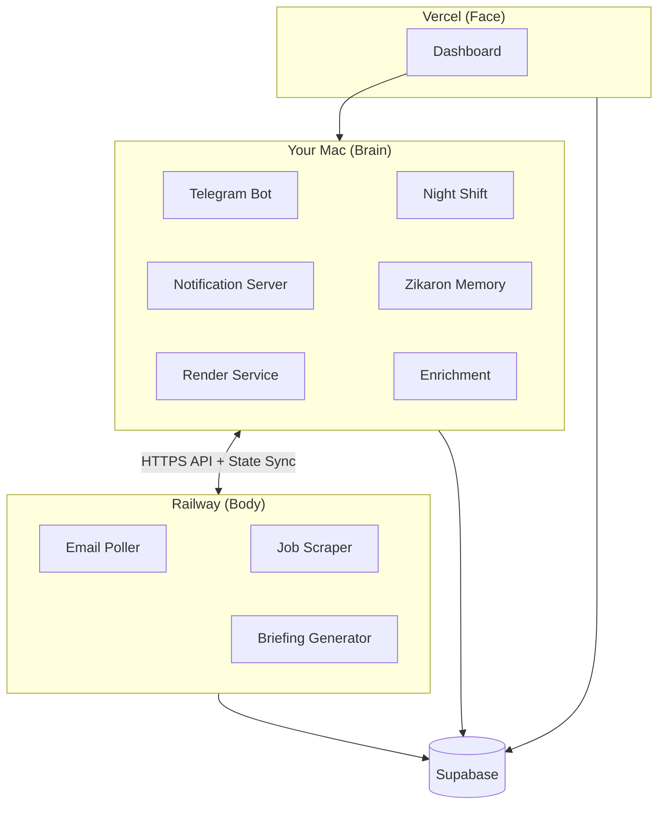
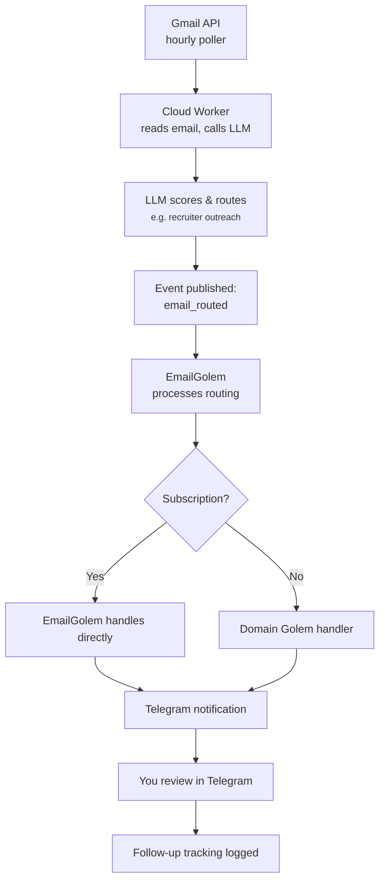
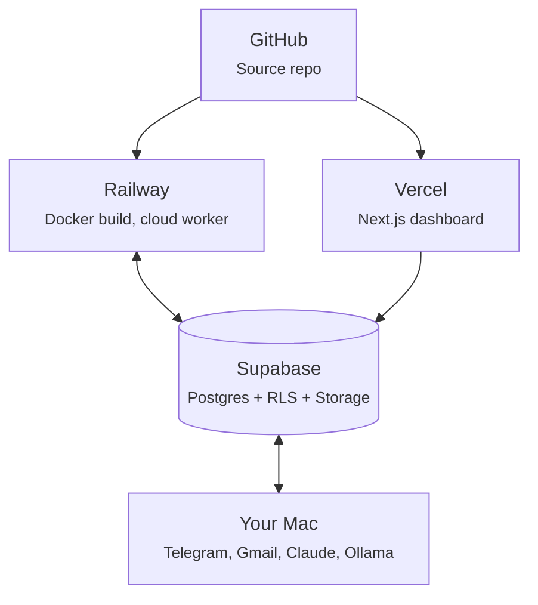

# Architecture


## 7 Golems + Infrastructure, 3 Environments

Golems is a **Bun workspace monorepo with 14 packages** — 7 golems (1 orchestrator + 6 domain experts) plus shared infrastructure. Work splits between your local Mac (cognitive tasks), Railway cloud (data collection), and Vercel (web dashboard).

| Package | Role |
|---------|------|
| `@golems/shared` | Foundation — Supabase, LLM, email, state, notifications |
| `@golems/claude` | Orchestrator — Telegram bot, command routing |
| `@golems/recruiter` | Outreach, contacts, interview practice (Elo) |
| `@golems/teller` | Finance, tax categorization, spending reports |
| `@golems/jobs` | Job scraping, matching, MCP tools |
| `@golems/content` | Visual content factory (Remotion, ComfyUI, dataviz) + text publishing |
| `@golems/coach` | Whoop biometrics, Huberman protocols, daily planning |
| `@golems/services` | Night Shift, Briefing, Cloud Worker, Wizard, Doctor |
| `@golems/orchestrator` | n8n orchestration, render microservice |
| `dashboard` | Next.js web dashboard (brain view, ops, backlog, content, tokens) |
| `golems-tui` | React Ink terminal dashboard |
| `tax-helper` | Schedule C transaction categorization (Sophtron MCP) |
| `ralph` | Autonomous coding loop (PRD execution) |
| `zikaron` | Memory layer (Python, 260K+ chunks, sqlite-vec) |

## Mac = Brain, Railway = Body



## Cloud Worker Schedule

The Railway cloud worker runs these jobs on a timer:

| Job | Interval | What | Model |
|-----|----------|------|-------|
| Email Poller | Hourly (6am-7pm, skip noon, +10pm) | Fetch Gmail, route to Golems | Gemini Flash-Lite |
| Job Scraper | 6am, 9am, 1pm Sun-Thu | Find relevant jobs, score | Gemini Flash-Lite |
| Whoop Sync | 5x daily (7am, 10am, 2pm, 5pm, 8pm) | Sync biometrics to Supabase | — |
| Briefing | 8:00 AM | Daily Telegram summary | Gemini Flash-Lite |

Cloud jobs use **Gemini 2.5 Flash-Lite** (free tier) for cost efficiency. Each job publishes events to Supabase that trigger Mac-side Golems.

## Local Services (Mac)

Your Mac runs these always-on services:

| Service | What | Tech |
|---------|------|------|
| **Telegram Bot** | Receive commands, send notifications | grammy.js |
| **Night Shift** | Scan repos for improvements, auto-commit | Claude + Ralph |
| **Notification Server** | Queue and send Telegram messages | HTTP server |
| **Zikaron Memory** | Semantic search over past conversations | FastAPI + sqlite-vec |
| **Render Service** | Remotion video rendering microservice | Bun + Remotion |
| **Enrichment** | Process Zikaron chunks (tags, summaries) | GLM-4.7-Flash via Ollama |

The local services have **direct compute access** — they run local GLM-4.7-Flash (via Ollama) or cloud models when needed.

## Event Flow

When an email arrives:



## Environment Variables (Dual Mode)

Golems supports **dual mode** — run cloud or local via three env vars:

```bash
# LLM Backend: where LLM calls happen
export LLM_BACKEND=gemini     # Cloud: Gemini Flash-Lite (free, default)
export LLM_BACKEND=ollama     # Local: Ollama on Mac (for testing)
export LLM_BACKEND=haiku      # Cloud: Haiku (paid fallback, optional)

# State Storage: where data lives
export STATE_BACKEND=supabase # Cloud: Supabase database
export STATE_BACKEND=file     # Local: ~/.golems-zikaron/

# Notifications: where Telegram messages go
export TELEGRAM_MODE=direct   # Cloud worker sends directly
export TELEGRAM_MODE=local    # Mac notifier (HTTP) sends
```

## Switching Modes

### Full Cloud Mode (Production)
```bash
export LLM_BACKEND=gemini
export STATE_BACKEND=supabase
export TELEGRAM_MODE=direct
# Deploy to Railway, monitor /api/usage for token counts
```

### Full Local Mode (Testing)
```bash
export LLM_BACKEND=ollama    # Run: ollama pull mistral
export STATE_BACKEND=file
export TELEGRAM_MODE=local
# Run Mac services: bun src/telegram-bot.ts
```

### Hybrid Mode (Development)
```bash
export LLM_BACKEND=gemini     # Use cloud LLM (free Gemini Flash-Lite)
export STATE_BACKEND=file     # Store locally for iteration
export TELEGRAM_MODE=local    # Debug Telegram messages
# Perfect for testing new features before cloud deploy
```

## Rollback

If something breaks in cloud, roll back in **under 1 minute**:

```bash
# Switch back to local-only (everything still works)
export LLM_BACKEND=ollama
export STATE_BACKEND=file
export TELEGRAM_MODE=local

# Restart Mac services
golems latest

# Check status
golems status
```

No data loss, no disruption. The state in Supabase is still there for when you re-enable cloud.

## API Cost Tracking

All LLM calls are logged to a JSONL file:

```bash
# Location (Mac):
cat ~/.golems-zikaron/api_costs.jsonl

# Location (Cloud):
curl https://your-service.up.railway.app/usage
```

**Format:**
```json
{"timestamp": "2026-02-06T10:30:45Z", "model": "claude-haiku-4-5-20251001", "source": "email-poller", "input_tokens": 1240, "output_tokens": 340, "cost_usd": 0.002352}
```

**Model Pricing:**
- Gemini Flash-Lite: Free tier (current cloud default)
- GLM-4.7-Flash: Free (local via Ollama)
- Haiku 4.5: $0.80 / $4.00 per 1M tokens (paid fallback)

## Database Schema

### Supabase Tables (Cloud Backend)

| Table | Purpose |
|-------|---------|
| `emails` | Routed emails, drafts, follow-ups |
| `email_senders` | Sender profiles with category and action |
| `subscriptions` | Email subscription tracking |
| `payments` | Payment/transaction tracking |
| `golem_state` | State storage for golems |
| `golem_events` | Audit log of all system events |
| `golem_jobs` | Job listings from scraper |
| `scrape_activity` | Scraping run logs |
| `outreach_contacts` | Recruiter targets, score, last contacted |
| `outreach_messages` | Generated outreach messages |
| `linkedin_connections` | LinkedIn network data |
| `practice_sessions` | Interview practice recordings |
| `practice_questions` | Interview practice questions |
| `backlog_items` | Kanban board items |
| `pipeline_runs` | Content pipeline execution logs |
| `llm_usage` | Token usage and cost tracking |
| `service_heartbeats` | Service health pings |
| `service_runs` | Cron job execution logs |

### Local File Storage (~/.golems-zikaron/)

| File | Purpose |
|------|---------|
| `state.json` | Current Night Shift target, system state |
| `event-log.json` | Local copy of recent events |
| `api_costs.jsonl` | Cost tracking (append-only) |
| `job-golem/seen-jobs.json` | Job scraper seen jobs tracking |
| `style/semantic-style-data.json` | Your writing style profile |

**Note:** `embeddings.db` belongs to the Zikaron package, not autonomous.

## Deployment Architecture



## Security

- **1Password for secrets** — never hardcode API keys
- **Supabase RLS** — row-level security on all tables
- **Separate API keys per project** — different keys for Golems vs SongScript
- **State sync over HTTPS** — encrypted Mac ↔ Railway communication
- **Event audit log** — all actions logged to `golem_events` table

## Next Steps

1. Read [Railway Deployment](./deployment/railway.md) to set up Supabase and Railway
2. Check [Golems](./golems/claude) to understand each domain expert
3. Review [Environment Variables](./configuration/env-vars.md) for env var reference
