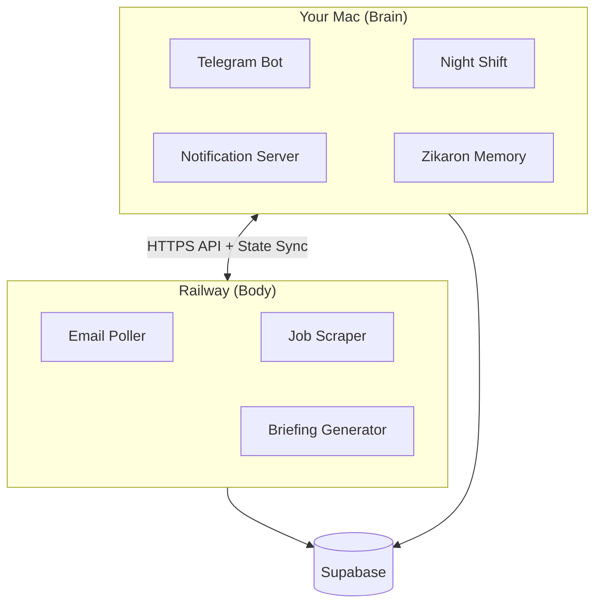
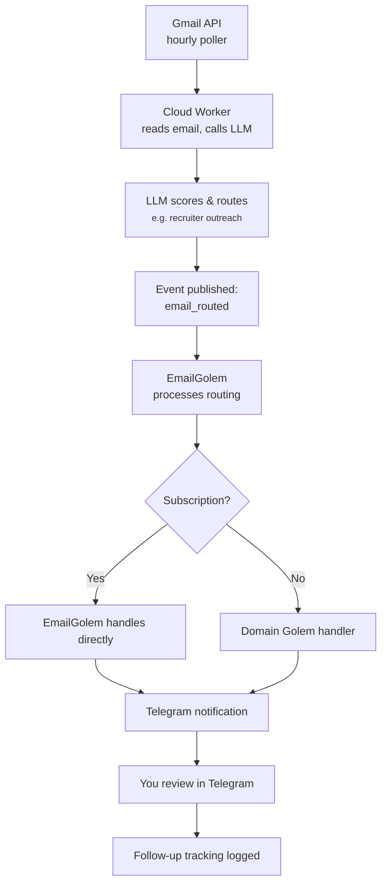
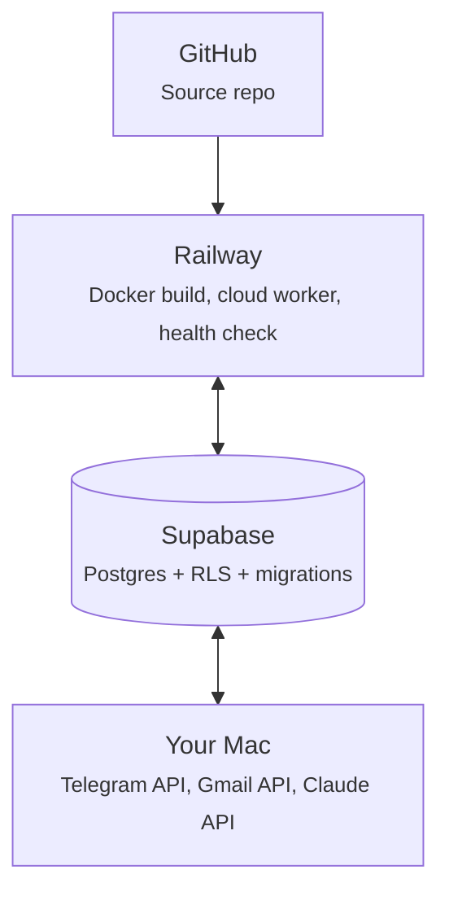

# Architecture

## Mac = Brain, Railway = Body


Golems splits work between your local Mac (cognitive tasks) and Railway cloud (data collection and polling).


```

## Cloud Worker Schedule

The Railway cloud worker runs these jobs on a timer:

| Job | Interval | What | Model |
|-----|----------|------|-------|
| Email Poller | Hourly (6am-7pm, skip noon, +10pm) | Fetch Gmail, route to Golems | Ollama/Haiku |
| Job Scraper | 6am, 9am, 1pm Sun-Thu | Find relevant jobs, score | Ollama/Haiku |
| Briefing | 8:00 AM | Daily Telegram summary | Ollama/Haiku |

Cloud jobs use **Ollama by default** (local models) or **Haiku when `LLM_BACKEND=haiku`** for cost efficiency. Each job publishes events to Supabase that trigger Mac-side Golems.

## Local Services (Mac)

Your Mac runs these always-on services:

| Service | What | Tech |
|---------|------|------|
| **Telegram Bot** | Receive commands, send notifications | grammy.js |
| **Night Shift** | Scan repos for improvements, auto-commit | Claude + Ralph |
| **Notification Server** | Queue and send Telegram messages | HTTP server |
| **Zikaron Memory** | Semantic search over past conversations | FastAPI + sqlite-vec |

The local services have **direct compute access** — they run Ollama or Haiku queries when needed for decisions.

## Event Flow

When an email arrives:



## Environment Variables (Dual Mode)

Golems supports **dual mode** — run cloud or local via three env vars:

```bash
# LLM Backend: where LLM calls happen
export LLM_BACKEND=haiku      # Cloud: Haiku via Railway
export LLM_BACKEND=ollama     # Local: Ollama on Mac (for testing)

# State Storage: where data lives
export STATE_BACKEND=supabase # Cloud: Supabase database
export STATE_BACKEND=file     # Local: ~/.golems-zikaron/

# Notifications: where Telegram messages go
export TELEGRAM_MODE=direct   # Cloud worker sends directly
export TELEGRAM_MODE=local    # Mac notifier (HTTP) sends
```

## Switching Modes

### Full Cloud Mode (Production)
```bash
export LLM_BACKEND=haiku
export STATE_BACKEND=supabase
export TELEGRAM_MODE=direct
# Deploy to Railway, monitor /api/usage for token counts
```

### Full Local Mode (Testing)
```bash
export LLM_BACKEND=ollama    # Run: ollama pull mistral
export STATE_BACKEND=file
export TELEGRAM_MODE=local
# Run Mac services: bun src/telegram-bot.ts
```

### Hybrid Mode (Development)
```bash
export LLM_BACKEND=haiku      # Use cloud LLM
export STATE_BACKEND=file     # Store locally for iteration
export TELEGRAM_MODE=local    # Debug Telegram messages
# Perfect for testing new features before cloud deploy
```

## Rollback

If something breaks in cloud, roll back in **under 1 minute**:

```bash
# Switch back to local-only (everything still works)
export LLM_BACKEND=ollama
export STATE_BACKEND=file
export TELEGRAM_MODE=local

# Restart Mac services
./packages/autonomous/bin/golems latest

# Check status
./packages/autonomous/bin/golems status
```

No data loss, no disruption. The state in Supabase is still there for when you re-enable cloud.

## API Cost Tracking

All LLM calls are logged to a JSONL file:

```bash
# Location (Mac):
cat ~/.golems-zikaron/api_costs.jsonl

# Location (Cloud):
curl https://your-service.up.railway.app/usage
```

**Format:**
```json
{"timestamp": "2026-02-06T10:30:45Z", "model": "claude-haiku-4-5-20251001", "source": "email-poller", "input_tokens": 1240, "output_tokens": 340, "cost_usd": 0.002352}
```

**Haiku 4.5 Pricing:**
- Input: $0.80 / 1M tokens
- Output: $4.00 / 1M tokens

## Database Schema

### Supabase Tables (Cloud Backend)

| Table | Purpose |
|-------|---------|
| `emails` | Routed emails, drafts, follow-ups |
| `subscriptions` | Email subscription tracking |
| `payments` | Payment/transaction tracking |
| `golem_state` | State storage for golems |
| `golem_events` | Audit log of all system events |
| `golem_seen_jobs` | Job scraper seen jobs tracking |
| `outreach_contacts` | Recruiter targets, score, last contacted |
| `outreach_messages` | Generated outreach messages |
| `outreach_companies` | Company research data |
| `practice_sessions` | Interview practice recordings |
| `practice_questions` | Interview practice questions |

### Local File Storage (~/.golems-zikaron/)

| File | Purpose |
|------|---------|
| `state.json` | Current Night Shift target, system state |
| `event-log.json` | Local copy of recent events |
| `api_costs.jsonl` | Cost tracking (append-only) |
| `job-golem/seen-jobs.json` | Job scraper seen jobs tracking |
| `style/semantic-style-data.json` | Your writing style profile |

**Note:** `embeddings.db` belongs to the Zikaron package, not autonomous.

## Deployment Architecture



## Security

- **1Password for secrets** — never hardcode API keys
- **Supabase RLS** — row-level security on all tables
- **Separate API keys per project** — different keys for Golems vs SongScript
- **State sync over HTTPS** — encrypted Mac ↔ Railway communication
- **Event audit log** — all actions logged to `golem_events` table

## Next Steps

1. Read [Railway Deployment](./deployment/railway.md) to set up Supabase and Railway
2. Check [Golems](./golems/claude) to understand each domain expert
3. Review [Environment Variables](./configuration/env-vars.md) for env var reference
