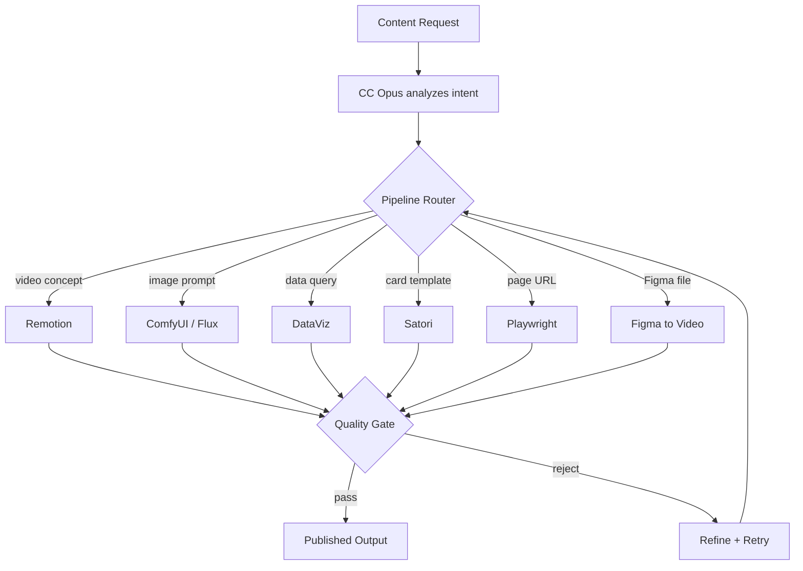
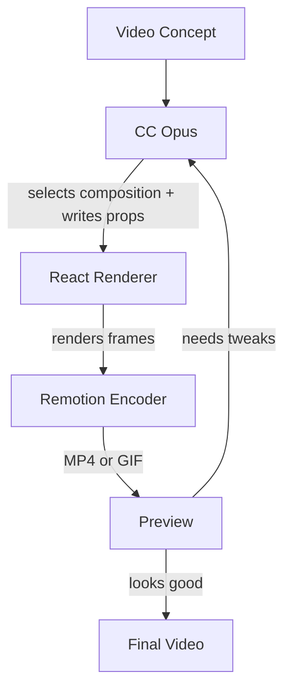
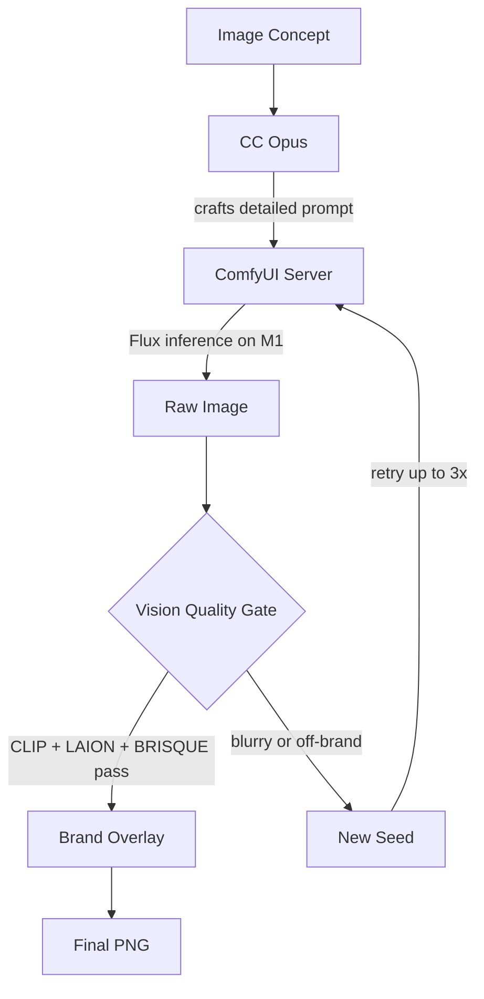
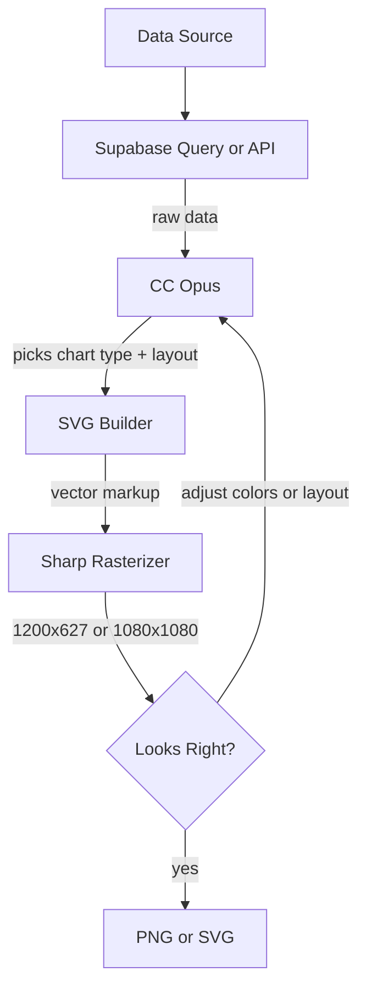
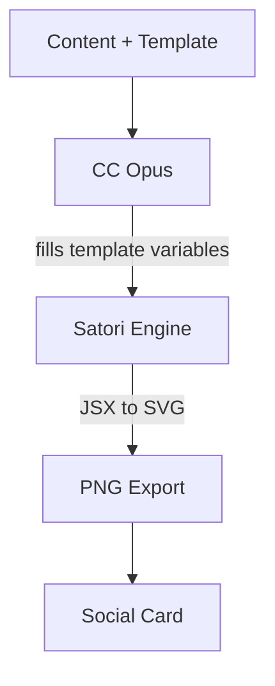
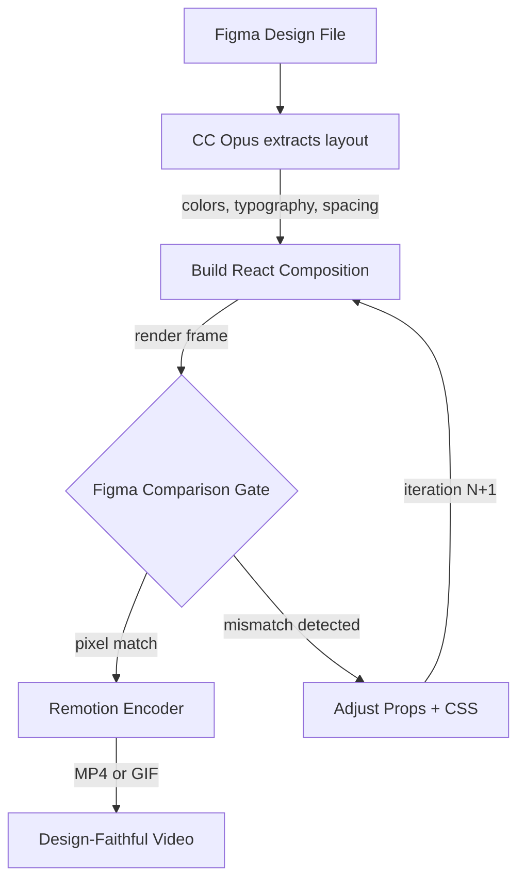
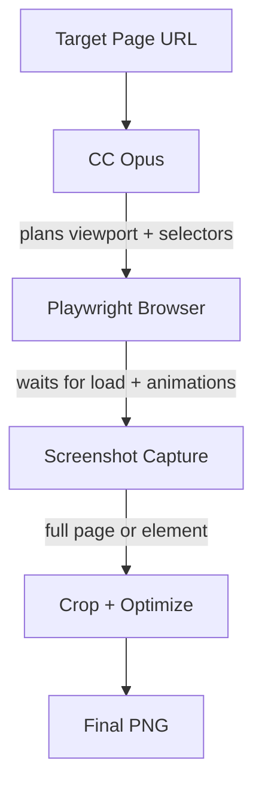

# Content Pipelines

ContentGolem orchestrates 5 visual content pipelines and a text publishing pipeline. Each pipeline follows the same pattern: idea in, Claude Code picks the right tool, output rendered.

## Pipeline Overview



## Pipelines

### Remotion Video

Renders React compositions into MP4/GIF videos using Remotion on the local Mac.



**Use cases:** Product demos, feature showcases, social video content.

### ComfyUI / Flux Image Gen

Generates images using Flux on Apple Silicon via ComfyUI with a vision-based quality gate.



**Use cases:** Blog headers, social media images, product mockups.

### DataViz Charts

Creates data visualizations from Supabase queries or API data, rendered as SVG/PNG.



**Use cases:** Token usage graphs, job match trends, ecosystem health dashboards.

### Satori Template Fill

Fills JSX templates with dynamic data and renders to social card PNGs via Satori.



**Use cases:** LinkedIn post cards, OG images, quote cards.

### Figma to Video

Design-validated video pipeline. CC extracts the target design from Figma, builds a Remotion composition, then iterates until the rendered output matches the Figma design 1:1.



**Example:** DomicaHero composition — went through 21 iterations to achieve 1:1 fidelity.

### Playwright Screenshots

Captures web page screenshots using Playwright browser automation.



**Use cases:** Portfolio screenshots, competitor analysis, visual regression.

## Routing

When a content request arrives, Claude Code (Opus) analyzes the request and routes to the appropriate pipeline. The routing decision considers:

- **Content type:** video vs image vs chart vs screenshot
- **Input data:** URL (Playwright), data (DataViz), concept (Remotion/Flux)
- **Output format:** MP4/GIF (Remotion), PNG (all others), SVG (DataViz)

## Pipeline Runs

Every pipeline execution is logged to the `pipeline_runs` Supabase table:

```sql
-- pipeline_runs table
pipeline    TEXT    -- remotion, comfyui, dataviz, satori, playwright
status      TEXT    -- pending, running, success, failed
input       JSONB   -- request parameters
output      JSONB   -- result metadata (file path, dimensions, duration)
duration_ms INTEGER -- execution time
error       TEXT    -- error message if failed
created_at  TIMESTAMP
```

View pipeline history and stats on the dashboard at `/content`.

## Text Publishing

Beyond visual content, ContentGolem handles text publishing:

- **LinkedIn posts** via the `/linkedin-post` skill (2026 algorithm optimization)
- **Soltome posts** via the Soltome API client (AI social network)
- **Ghostwriting** in the owner's Hebrew-English voice

Text content goes through a critique-waves quality process: parallel agents review, refine, and reach consensus before publishing.

## CC Skills

Content pipelines are invoked via Claude Code skills:

| Skill | Pipeline |
|-------|----------|
| `golem-powers/content/workflows/draft` | Text drafting + critique |
| `golem-powers/linkedin-post/workflows/draft` | LinkedIn-specific drafting |
| `golem-powers/linkedin-post/workflows/review` | Draft quality review |

## Dependencies

- **Remotion** — React video rendering (`@remotion/cli`, `@remotion/bundler`)
- **ComfyUI** — Flux image generation (local, Apple Silicon)
- **Sharp** — Image processing and rasterization
- **Satori** — JSX to SVG/PNG conversion
- **Playwright** — Browser automation for screenshots
- **Render Service** — Local Bun microservice for Remotion rendering (`launchd` managed)
