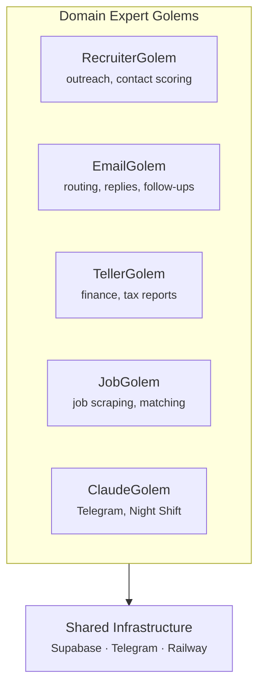

# Getting Started

## What is Golems?

Golems is an autonomous AI agent ecosystem built for Claude Code. It's a monorepo of domain-expert agents (RecruiterGolem, EmailGolem, TellerGolem, JobGolem, ClaudeGolem) powered by:

- **Infrastructure:** Supabase (data), Railway (cloud compute), Telegram (notifications), Zikaron (memory layer)
- **Local Engine:** Mac-based night shift, telegram bot, notification server
- **Cloud Worker:** Remote email polling, job scraping, briefing generation
- **Core Principle:** Golems are domain experts, not I/O channels — they own specific knowledge areas and produce specialized outputs

## Architecture Principle

A Golem is a domain expert focused on one area. It doesn't care about how messages arrive (Telegram, email, HTTP) — it cares about solving problems in its domain.



Each Golem operates independently. Multiple Golems can process the same event. The infrastructure handles routing and notifications.

## Prerequisites

Before you start, ensure you have:

- **Bun** (v1.0+) — runtime and package manager
- **Python** 3.10+ — required for Zikaron package (semantic search)
- **1Password CLI** (`op` command) — secret management
- **Claude Code** — the IDE
- **GitHub** — repo access (SSH key configured)
- **Node.js** 20+ (installed with Bun)

## Quick Start

### 1. Clone and Install

```bash
git clone https://github.com/YOUR_USERNAME/golems.git
cd golems
bun install
```

### 2. Configure Secrets

Store secrets in 1Password (not `.env`):

```bash
# Create 1Password items in your vault:
# - ANTHROPIC_API_KEY (can name it anything, e.g., "Golems Claude API")
# - SUPABASE_URL
# - SUPABASE_SERVICE_KEY (service role key for Email/Teller Golems)
# - TELEGRAM_BOT_TOKEN
# - TELEGRAM_CHAT_ID

# Load them into shell:
export ANTHROPIC_API_KEY=$(op read op://YOUR_VAULT/YOUR_ANTHROPIC_ITEM/credential)
export SUPABASE_URL=$(op read op://YOUR_VAULT/YOUR_SUPABASE_ITEM/url)
export SUPABASE_SERVICE_KEY=$(op read op://YOUR_VAULT/YOUR_SUPABASE_ITEM/service_key)
# ... etc
```

### 3. Start Golems

```bash
# From golems root (CLI must be in PATH or use full path)
./packages/autonomous/bin/golems status

# Expected output:
# === GOLEMS STATUS ===
# Telegram Bot: [status]
# Ollama: [status]
# LaunchAgents: [status]
```

### 4. Run Your First Agent

```bash
# Navigate to autonomous package first
cd packages/autonomous

# Route an email through EmailGolem
bun src/email-golem/index.ts

# Start the Telegram bot
bun src/telegram-bot.ts

# Trigger night shift improvements
bun src/night-shift.ts
```

## Monorepo Structure

```
golems/
├── packages/
│   ├── autonomous/          ← Main app: Telegram bot, Golems, local runners
│   │   ├── src/
│   │   │   ├── email-golem/ ← Email routing, scoring, MCP server
│   │   │   ├── job-golem/   ← Job scraping, matching, MCP server
│   │   │   ├── recruiter-golem/ ← Outreach, contacts, practice
│   │   │   ├── teller-golem/ ← Finance, categorization, reports
│   │   │   ├── telegram-bot.ts ← Bot + notification server
│   │   │   ├── night-shift.ts  ← Autonomous improvements
│   │   │   └── cloud-worker.ts ← Railway cloud entry point
│   │   ├── tests/          ← Unit tests
│   │   └── src/lib/        ← Shared utilities
│   │
│   ├── ralph/              ← Claude Code autonomous loop
│   │   ├── skills/         ← 6 skill categories
│   │   └── src/            ← Loop runner, story parser
│   │
│   ├── zikaron/            ← Memory layer (semantic search)
│   │   ├── src/            ← FastAPI daemon + Python CLI
│   │   └── data/           ← sqlite-vec embeddings
│   │
│   └── docsite/            ← This site (Docusaurus)
│       └── docs/           ← Markdown files
│
│
├── packages/autonomous/supabase/
│   ├── migrations/         ← SQL schema changes
│   └── functions/          ← Edge Functions
│
└── packages/autonomous/Dockerfile              ← Railway cloud worker image
```

## Next Steps

1. **Read Architecture** — understand Mac vs Cloud split in `/docs/architecture.md`
2. **Configure Cloud** — set up Supabase and Railway in `/docs/deployment/railway.md`
3. **Environment Variables** — see `/docs/configuration/env-vars.md` and `/docs/configuration/secrets.md`
4. **Explore Golems** — dive into each domain expert in `/docs/golems/`
5. **Join Development** — run tests, create PRs, use Ralph for autonomous stories

## Troubleshooting

**Golems status shows disconnected:**

```bash
# Check env vars loaded
op read op://YOUR_VAULT/YOUR_TELEGRAM_ITEM/credential

# Restart a specific service
./packages/autonomous/bin/golems restart telegram

# Or restart all services (using the 'latest' command)
./packages/autonomous/bin/golems latest
```

**Tests failing:**

```bash
# Clear cache and reinstall
rm -rf bun.lockb node_modules
bun install
bun test
```

**Memory issues (Node.js OOM):**

```bash
# Increase heap limit for long-running sessions
export NODE_OPTIONS="--max-old-space-size=8192"
bun src/night-shift.ts
```

See `/docs/configuration/env-vars.md` and `/docs/configuration/secrets.md` for detailed setup guides.
