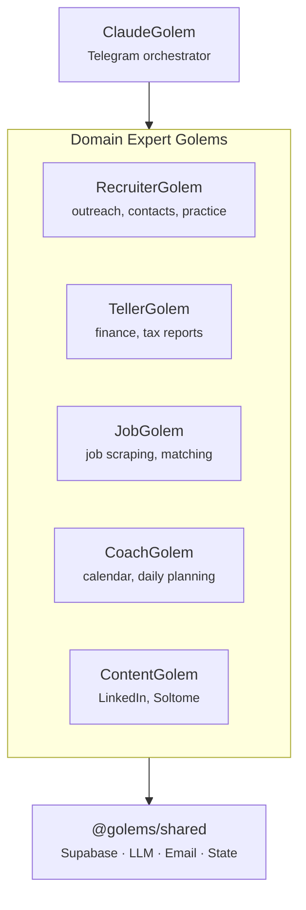

# Getting Started

## What is Golems?

Golems is an autonomous AI agent ecosystem built for Claude Code. It's a Bun workspace monorepo with **15 packages** — 5 domain golems (Recruiter, Teller, Job, Coach, Content), ClaudeGolem orchestrator, shared infrastructure, services, dashboard, orchestrator (n8n), tax-helper, golems-tui, Ralph, Zikaron, and legacy compat — each installable as a Claude Code plugin.

- **Orchestrator:** ClaudeGolem — Telegram bot that routes commands to the right golem
- **Domain Golems:** RecruiterGolem, TellerGolem, JobGolem, CoachGolem, ContentGolem — each owns a specific knowledge area
- **Infrastructure:** @golems/shared (foundation + email system), @golems/services (Night Shift, Cloud Worker, Briefing)
- **Tools:** Ralph (autonomous coding loop), Zikaron (238K+ chunk memory layer)
- **Core Principle:** Golems are domain experts, not I/O channels — they own specific knowledge areas and produce specialized outputs

## Architecture Principle

A Golem is a domain expert focused on one area. It doesn't care about how messages arrive (Telegram, email, HTTP) — it cares about solving problems in its domain.



Each golem operates independently and only depends on `@golems/shared`. ClaudeGolem routes Telegram commands to the appropriate domain golem.

## Prerequisites

Before you start, ensure you have:

- **Bun** (v1.0+) — runtime and package manager
- **Python** 3.10+ — required for Zikaron package (semantic search)
- **1Password CLI** (`op` command) — secret management
- **Claude Code** — the IDE
- **GitHub** — repo access (SSH key configured)
- **Node.js** 20+ (installed with Bun)

## Quick Start

### 1. Clone and Install

```bash
git clone https://github.com/YOUR_USERNAME/golems.git
cd golems
bun install
```

### 2. Configure Secrets

Store secrets in 1Password (not `.env`):

```bash
# Create 1Password items in your vault:
# - ANTHROPIC_API_KEY (can name it anything, e.g., "Golems Claude API")
# - SUPABASE_URL
# - SUPABASE_SERVICE_KEY (service role key for Email/Teller Golems)
# - TELEGRAM_BOT_TOKEN
# - TELEGRAM_CHAT_ID

# Load them into shell:
export ANTHROPIC_API_KEY=$(op read op://YOUR_VAULT/YOUR_ANTHROPIC_ITEM/credential)
export SUPABASE_URL=$(op read op://YOUR_VAULT/YOUR_SUPABASE_ITEM/url)
export SUPABASE_SERVICE_KEY=$(op read op://YOUR_VAULT/YOUR_SUPABASE_ITEM/service_key)
# ... etc
```

### 3. Start Golems

```bash
# From golems root (CLI must be in PATH or use full path)
golems status

# Expected output:
# === GOLEMS STATUS ===
# Telegram Bot: [status]
# Ollama: [status]
# LaunchAgents: [status]
```

### 4. Run Your First Agent

```bash
# Start the Telegram bot
bun packages/claude/src/telegram-bot.ts

# Route emails through the email system
bun packages/shared/src/email/index.ts

# Trigger night shift improvements
bun packages/services/src/night-shift.ts
```

## Monorepo Structure

```
golems/                              # Bun workspace monorepo
├── packages/shared/                 # @golems/shared — Supabase, LLM, email, state
├── packages/claude/                 # ClaudeGolem — Telegram orchestrator
├── packages/recruiter/              # RecruiterGolem — outreach, practice, contacts
├── packages/teller/                 # TellerGolem — finances, tax categorization
├── packages/jobs/                   # JobGolem — scraping, matching, MCP tools
├── packages/content/                # ContentGolem — LinkedIn, Soltome
├── packages/coach/                  # CoachGolem — calendar, daily planning
├── packages/services/               # Night Shift, Briefing, Cloud Worker, Wizard
├── packages/dashboard/              # Next.js web dashboard (Vercel)
├── packages/orchestrator/           # n8n orchestration + Bun render microservice
├── packages/tax-helper/             # Schedule C transaction categorization
├── packages/golems-tui/             # React Ink terminal dashboard
├── packages/autonomous/             # Legacy (1-line re-exports for compatibility)
├── packages/ralph/                  # Autonomous coding loop (Zsh)
│   └── skills/golem-powers/         # 30+ Claude Code skills
├── packages/zikaron/                # Memory layer (Python + sqlite-vec)
├── launchd/                         # macOS service plists
├── Dockerfile                       # Railway cloud worker image
└── supabase/migrations/             # SQL schema changes
```

## Next Steps

1. **Read Architecture** — understand Mac vs Cloud split in `/docs/architecture.md`
2. **Configure Cloud** — set up Supabase and Railway in `/docs/deployment/railway.md`
3. **Environment Variables** — see `/docs/configuration/env-vars.md` and `/docs/configuration/secrets.md`
4. **Explore Golems** — dive into each domain expert in `/docs/golems/`
5. **Join Development** — run tests, create PRs, use Ralph for autonomous stories

## Troubleshooting

**Golems status shows disconnected:**

```bash
# Check env vars loaded
op read op://YOUR_VAULT/YOUR_TELEGRAM_ITEM/credential

# Restart a specific service
golems restart telegram

# Or restart all services (using the 'latest' command)
golems latest
```

**Tests failing:**

```bash
# Clear cache and reinstall
rm -rf bun.lockb node_modules
bun install
bun test
```

**Memory issues (Node.js OOM):**

```bash
# Increase heap limit for long-running sessions
export NODE_OPTIONS="--max-old-space-size=8192"
bun src/night-shift.ts
```

See `/docs/configuration/env-vars.md` and `/docs/configuration/secrets.md` for detailed setup guides.
