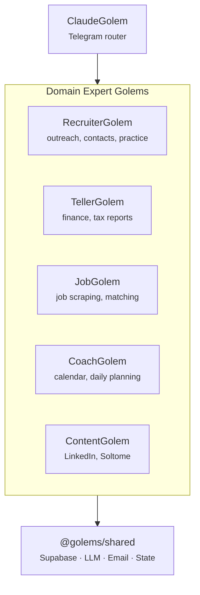

# Getting Started

## What is Golems?

Golems is a Bun monorepo of AI-agent packages, command-line tooling, and evaluated workflow skills. The source is public at [github.com/EtanHey/golems](https://github.com/EtanHey/golems) under the Apache-2.0 license.

Two terms carry most of the weight:

- A **golem** is a domain-focused agent package: code, prompts, and integrations that work together for a bounded job such as recruiting, finance, scheduling, job search, or content.
- A **skill** is a `SKILL.md` workflow that an AI coding agent such as Claude Code can load and follow. Skills may also ship scripts, references, adapters, fixtures, and executable evals.

At the time of writing the tree has **13 workspace packages** and **88 skills** with a top-level `SKILL.md` under `skills/golem-powers/`. That directory also holds shared, archived, and scaffolding entries that are not installable skills, so re-derive the count from a checkout instead of trusting this page:

```bash
node scripts/check-skill-library.mjs
```

**Core principle:** golems are domain experts, not I/O channels. A golem does not care whether a request arrives by Telegram, email, or HTTP. It cares about solving problems in its domain.

## Architecture Principle


```mermaid
flowchart TD
    subgraph golems["Domain Expert Golems"]
        RG["RecruiterGolem<br/><small>outreach, contacts, practice</small>"]
        TG["TellerGolem<br/><small>finance, tax reports</small>"]
        JG["JobGolem<br/><small>job scraping, matching</small>"]
        CG["CoachGolem<br/><small>calendar, daily planning</small>"]
        XG["ContentGolem<br/><small>LinkedIn, Soltome</small>"]
    end
    CL["ClaudeGolem<br/><small>Telegram router</small>"] --> golems
    golems --> infra["@golems/shared<br/><small>Supabase · LLM · Email · State</small>"]
```

The golem packages depend on `@golems/shared` for Supabase, LLM, email, and state utilities. `@golems/claude` (ClaudeGolem) is the Telegram bot that routes commands to the domain golems.

## Prerequisites

- **Bun** — runtime and package manager
- **Git**
- **Claude Code**, or another AI coding agent, if you want to run the skills
- **1Password CLI** (`op`) — optional; the secrets step below uses it, but any secret store works

## Quick Start

### 1. Clone, install, test

```bash
git clone https://github.com/EtanHey/golems.git
cd golems
bun install
bun test
```

The [README](https://github.com/EtanHey/golems#development) records the current test totals, including known failures that show up on a clean clone.

### 2. Check your environment

```bash
bun packages/golems-cli/src/index.ts setup --check
```

This reports whether `bun`, `git`, and `claude` are installed and where they were found.

### 3. List and install skills

```bash
bun packages/golem-skills/src/index.ts skills list
bun packages/golem-skills/src/index.ts skills install <skill-name>
```

Both commands read `skills/golem-powers/` on `master` through the GitHub API, so they need network access and report what is published rather than what is in your working tree. The list includes helper directories such as `_shared` and `_archive` that are not installable skills.

### 4. Configure secrets (golem packages only)

Skills run inside your coding agent. The golem packages additionally read their credentials from environment variables, for example `ANTHROPIC_API_KEY`, `SUPABASE_URL`, `SUPABASE_SERVICE_KEY`, `TELEGRAM_BOT_TOKEN`, and `TELEGRAM_CHAT_ID`. One way to load them is from 1Password:

```bash
export ANTHROPIC_API_KEY=$(op read op://YOUR_VAULT/YOUR_ANTHROPIC_ITEM/credential)
export SUPABASE_URL=$(op read op://YOUR_VAULT/YOUR_SUPABASE_ITEM/url)
export SUPABASE_SERVICE_KEY=$(op read op://YOUR_VAULT/YOUR_SUPABASE_ITEM/service_key)
export TELEGRAM_BOT_TOKEN=$(op read op://YOUR_VAULT/YOUR_TELEGRAM_ITEM/credential)
export TELEGRAM_CHAT_ID=$(op read op://YOUR_VAULT/YOUR_TELEGRAM_ITEM/chat_id)
```

See [Environment Variables](/golems/docs/configuration/env-vars) and [Secrets](/golems/docs/configuration/secrets) for the full list.

### 5. Run a golem

```bash
# Telegram bot (ClaudeGolem)
bun packages/claude/src/telegram-bot.ts

# Email routing
bun packages/shared/src/email/index.ts

# Night Shift runner
bun packages/services/src/night-shift.ts
```

Each of these expects the environment variables from step 4.

## Monorepo Structure

```
golems/
├── packages/claude/             # Telegram notification bot and orchestration adapters
├── packages/coach/              # Calendar, planning, and coaching primitives
├── packages/content/            # Content pipelines and Remotion infrastructure
├── packages/golem-skills/       # Skill installer and update CLI
├── packages/golems-cli/         # Environment setup CLI
├── packages/golems-tui/         # React Ink terminal interface
├── packages/green-invoice-mcp/  # Invoice MCP integration
├── packages/jobs/               # Job collection and matching
├── packages/mock-mcp/           # MCP test fixtures
├── packages/recruiter/          # Outreach and interview-practice workflows
├── packages/services/           # Briefing, scheduler, doctor, and local services
├── packages/shared/             # Shared state, LLM, email, and notification utilities
├── packages/teller/             # Finance and transaction categorization
├── skills/golem-powers/         # 88 skills, each with a SKILL.md
├── scripts/                     # Launchers, CI gates, skill-library check
├── launchd/                     # macOS service plists
└── Dockerfile                   # Cloud worker image
```

## Next Steps

1. **Architecture** — how work splits between a local machine and cloud services: [Architecture](/golems/docs/architecture)
2. **Cloud deployment** — Supabase and Railway setup: [Railway](/golems/docs/deployment/railway)
3. **Configuration** — [Environment Variables](/golems/docs/configuration/env-vars) and [Secrets](/golems/docs/configuration/secrets)
4. **Skills** — browse the published skill pages at [/golems/skills](/golems/skills) or read the [Skills Library](/golems/docs/skills) doc
5. **Contributing** — [CONTRIBUTING.md](https://github.com/EtanHey/golems/blob/master/CONTRIBUTING.md) covers tests and pull requests

## Troubleshooting

**`setup --check` reports a missing dependency:** install the tool it names and rerun the check.

**Tests failing after a pull:**

```bash
rm -rf node_modules
bun install
bun test
```

**A golem exits immediately:** check that the environment variables from step 4 are set in the shell that launched it. See [Environment Variables](/golems/docs/configuration/env-vars).
