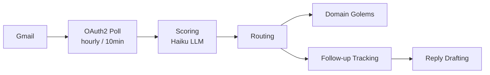

# EmailGolem

EmailGolem is the intake layer for all external communication. It polls Gmail on a schedule (hourly 6am-7pm in cloud with 12pm lunch skip and 10pm check, or every 10 minutes via local launchd), scores emails for urgency, routes them to domain experts, and manages reply drafting and follow-ups.

## Core Pipeline



### Scoring System (1-10)

- **10** — Instant Telegram alert (respond now)
- **7-9** — Morning briefing (check at 8am)
- **5-6** — Monthly tracking (archive, but revisit montly)
- **1-4** — Ignore (auto-archive)

Scoring is done via Ollama by default (or Haiku when `LLM_BACKEND=haiku`) analyzing subject, sender, and body context.

### Email Routing

Routes emails to domain golems based on content patterns:

| Email Type | Router | GolemActor | Notes |
|------------|--------|-----------|-------|
| Job offers, interview requests | Contact pattern + keywords | `recruitergolem` | Outreach DB updated |
| Subscription/billing | Domain `@stripe.com`, `@paddle.com`, etc | `tellergolem` | Expense categorization, payment alerts, reports |
| Tech updates, urgent notifications | `[urgent]` tag, mention of code/PR | `claudegolem` | Fast-track to ClaudeGolem |
| General | Fallback | EmailGolem queue | Score determines visibility, queryable via `email_getByGolem` |

## Files

**Core Engine:**
- `src/email-golem/index.ts` — Main entry point, Gmail client initialization
- `src/email-golem/gmail-client.ts` — OAuth2 auth, polling logic
- `src/email-golem/scorer.ts` — Ollama/Haiku scoring pipeline (no caching)
- `src/email-golem/db-client.ts` — Supabase adapter with offline queue
- `src/email-golem/mcp-server.ts` — MCP server (7 email tools + 2 teller tools)
- `src/email-golem/types.ts` — TypeScript interfaces

**Routing & Processing:**
- `src/email-golem/router.ts` — Domain golem routing logic
- `src/email-golem/draft-reply.ts` — Template-based reply generation with intents
- `src/email-golem/followup.ts` — Follow-up scheduling and tracking

## Key Features

### Reply Drafting

Auto-generate email replies with preset intents:

```typescript
// draft-reply.ts
const intents = [
  'accept',      // Yes, I'm interested
  'decline',     // No thanks
  'interested',  // Tell me more
  'followup',    // When can we talk?
  'acknowledge'  // Received, will review
];
```

Drafts are stored in the database and can be reviewed before sending via Telegram.

### Follow-up Tracking

Category-based due dates:

| Category | Due Date |
|----------|----------|
| Interview | 3 days |
| Job | 5 days |
| Urgent | 1 day |
| Tech-update | 7 days |
| Other | 7 days |

Follow-ups trigger alerts if not completed by due date.

## MCP Tools

Available via the `golems-email` MCP server (`email-golem/mcp-server.ts`):

- **`email_getRecent`** — Fetch last N emails from inbox
- **`email_search`** — Search emails by keyword (subject/sender, last 7 days only)
- **`email_subscriptions`** — Get subscription/billing emails (Stripe, Paddle, etc)
- **`email_urgent`** — Get emails flagged as urgent
- **`email_stats`** — Summary: total, by score, by routing
- **`email_getByGolem`** — Fetch emails routed to a specific golem
- **`email_draftReply`** — Generate reply draft for an email

## Environment Variables

```bash
# 1Password items (store in any vault)
export GMAIL_REFRESH_TOKEN=$(op read op://YOUR_VAULT/YOUR_GMAIL_ITEM/refresh_token)
export ANTHROPIC_API_KEY=$(op read op://YOUR_VAULT/YOUR_ANTHROPIC_ITEM/credential)
export SUPABASE_SERVICE_KEY=$(op read op://YOUR_VAULT/YOUR_SUPABASE_ITEM/service_key)

# Scoring model (Phase 2+)
export LLM_BACKEND=haiku  # or 'ollama' (default)
```

## Database Schema

```sql
-- Emails table
CREATE TABLE emails (
  id TEXT PRIMARY KEY,
  from_address TEXT,
  subject TEXT,
  body TEXT,
  score INTEGER (1-10),
  routing_golem TEXT,
  created_at TIMESTAMP,
  routed_at TIMESTAMP,
  follow_up_due_at TIMESTAMP
);

-- Subscriptions table (for TellerGolem)
CREATE TABLE subscriptions (
  id TEXT PRIMARY KEY,
  vendor TEXT,
  amount NUMERIC,
  category TEXT,
  created_at TIMESTAMP
);

-- Payments table (for TellerGolem)
CREATE TABLE payments (
  id TEXT PRIMARY KEY,
  vendor TEXT,
  amount NUMERIC,
  category TEXT,
  payment_date TIMESTAMP
);
```

## Running EmailGolem

```bash
cd packages/autonomous

# Manually trigger poll cycle (normally runs every 10min)
bun src/email-golem/index.ts

# Search emails (dry run mode)
bun src/email-golem/index.ts search --dry-run

# Limit processing to N emails
bun src/email-golem/index.ts --max 10
```

## Integration with Other Golems

- **RecruiterGolem** — Job emails trigger outreach DB updates
- **TellerGolem** — Subscription emails routed for expense categorization, payment alerts, and reports
- **ClaudeGolem** — Urgent emails fast-tracked to code/PR context
- **Telegram Bot** — High-score (10) emails sent as instant alerts

## Troubleshooting

**Emails not being scored:**

```bash
# Check LLM backend is running (Ollama or Haiku)
echo $LLM_BACKEND

# Check Gmail OAuth token
op read op://YOUR_VAULT/YOUR_GMAIL_ITEM/refresh_token
```

**Routing to wrong golem:**

```bash
# Review routing patterns in router.ts
# Router invokes handlers for each golem type (Recruiter, Teller, Claude)
```

**Follow-ups not triggering:**

```bash
# Check launchd job (runs via cron or launchd)
launchctl list | grep golems-email
cat ~/Library/LaunchAgents/golems-email.plist
```

See `/docs/configuration/env-vars.md` for Gmail OAuth setup.
