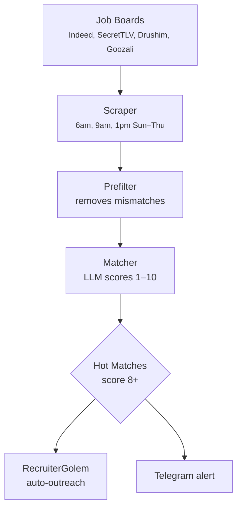

# JobGolem

JobGolem searches Israeli job boards, matches positions against your profile using LLM scoring, and filters for quality opportunities. High-scoring matches (8+) trigger automatic outreach via RecruiterGolem.

## Pipeline



## Scoring System (1-10)

JobGolem uses your profile and LLM matching to score each job:

- **8-10** — Great fit → Auto-outreach via RecruiterGolem
- **6-7** — Worth reviewing
- **3-5** — Possible match
- **1-2** — Poor fit → Auto-archive

Score considers:
- Skill overlap (primary vs secondary)
- Tech stack compatibility
- Location preference
- Seniority level and growth potential
- Company research (GitHub, job posting analysis)

## Profile Configuration

Edit `src/job-golem/profile.json`:

```json
{
  "yearsExperience": 5,
  "roles": ["Senior Engineer", "Tech Lead", "Staff Engineer"],
  "primarySkills": ["TypeScript", "React", "Node.js"],
  "secondarySkills": ["Go", "Python", "SQL"],
  "excludedCompanies": ["company1", "company2"],
  "excludedKeywords": ["onsite", "Java required"]
}
```

## Prefilter

JobGolem has a prefilter that excludes jobs matching:
- Company blocklist
- Required keywords (e.g., "onsite" if remote-preferred)
- Language mismatch (automatically detects Hebrew vs English)
- Extreme seniority mismatch (junior when you're senior, etc.)

## Integration with RecruiterGolem

When a job scores 8+:

1. **Company Research** — GitHub repos, tech stack, culture signals
2. **Contact Finder** — Discovers hiring managers via GitHub or LinkedIn
3. **Outreach Draft** — Generates personalized message using anti-AI style
4. **Database** — Stores contact + draft for manual review or auto-send

All integration happens automatically with `processHotMatches()` after scoring.

## Commands

```bash
# Manual job run (normally scheduled)
bun run src/job-golem/index.ts

# View results
cat ~/.golems-zikaron/job-golem/results/jobs-*.json

# View matches in Telegram
# /jobs command shows formatted list

# Manage blocklist
# Edit src/job-golem/profile.json excludeKeywords
```

## Environment Variables

```bash
# Optional: Use cloud-based LLM instead of Ollama
LLM_BACKEND=gemini  # or "ollama" (local), "haiku" (fallback)

# Supabase (for cloud deployment)
SUPABASE_URL=...
SUPABASE_SERVICE_KEY=...
```

## MCP Tools

JobGolem provides MCP tools for querying job data (via `golems-jobs` server):

```typescript
// Available tools
tools: [
  "jobs_getRecent",     // Recent matches (latest results file)
  "jobs_getHot",        // Hot matches (score 8+)
  "jobs_search",        // Search by keyword (no score filter)
  "jobs_watchlist",     // Company watchlist
  "jobs_stats"          // Stats: scraped, seen, hot/warm/cold counts
]
```

## Files

- `index.ts` — Main runner, scheduling, formatting
- `scraper.ts` — Job board scraper (Indeed, SecretTLV, Drushim, Goozali)
- `matcher.ts` — Ollama-based job matching (scores 1-10)
- `profile.json` — Your profile (skills, roles, preferences)
- `watchlist.ts` — Company watchlist and filtering
- `sync-to-supabase.ts` — Optional cloud sync
- `mcp-server.ts` — MCP tools for Claude Code

## Scheduling

Runs via cloud-worker.ts schedule:
- **6am** — Morning scan
- **9am** — Mid-morning scan
- **1pm** — Afternoon scan
- **Sun-Thu only** — Israeli work week

Scheduling logic in `src/cloud-worker.ts`.

## Data Storage

Results saved to `~/.golems-zikaron/job-golem/results/jobs-DATE-TIME.json`

Database tables (if using Supabase):
- `golem_jobs` — Job sync and storage
- `golem_seen_jobs` — Deduplication tracking

## Troubleshooting

**No jobs found:**
- Check profile.json is valid
- Verify network access to job boards
- Check logs: `tail -f /tmp/job-golem.log`

**Low scores on everything:**
- Profile may be too strict
- Ollama may be unavailable (fallback score = 5)
- Check `LLM_BACKEND` env var

**Not sending to RecruiterGolem:**
- Ensure RecruiterGolem db is initialized
- Check outreach-db.ts for connection errors
- Check integration in processHotMatches()
