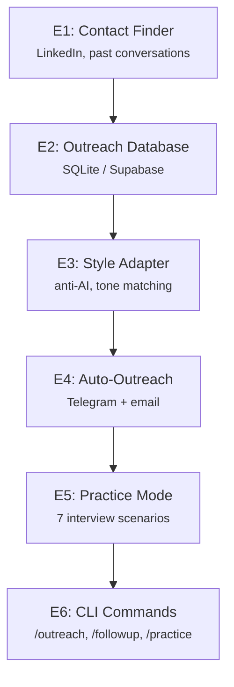

# RecruiterGolem

RecruiterGolem is the outreach and hiring domain expert. It maintains a contact database, personalizes outreach using anti-AI writing style, and provides interview practice modes.

## Pipeline Stages



## Core Components

### E1: Contact Finder

Discovers contacts from:
- GitHub profiles (URL → parsed)
- Exa (web search API)
- Hunter (email finder)
- Lusha (contact enrichment)
- Manual entry via CLI

```typescript
// contact-finder.ts
interface Contact {
  id: string;
  name: string;
  email: string;
  company: string;
  linkedin_url?: string;
  role_title: string;
  last_contacted?: Date;
  outreach_status: 'new' | 'contacted' | 'interested' | 'rejected';
}
```

### E2: Outreach Database

Stores contacts and conversation history (SQLite local or Supabase cloud):

**Local (SQLite):**
- `~/.golems-zikaron/recruiter/outreach.db`
- Local `outreach_contacts` table (maps to Supabase during cloud sync)
- Local `outreach_messages` table
- Local `practice_questions` table
- No automatic sync to Supabase

**Cloud (Supabase):**
- `outreach_contacts` table (cloud version of local contacts)
- `outreach_messages` table (per contact)
- `outreach_companies` table (cached research on companies)
- `practice_questions` table (interview practice questions)

### E3: Style Adapter

Generates anti-AI writing (no em dashes, natural tone, context-aware):

```typescript
// style-adapter.ts
interface StyleContext {
  recipient_name: string;
  company_name: string;
  recipient_role: string;
  tone: 'formal' | 'casual' | 'technical';
  language: 'en' | 'he';  // Hebrew + English support
}

// Generates personalized message matching recipient's LinkedIn style
const message = await adaptMessage(template, context);
```

**Style Adaptation:**
- Tweaks emoji usage
- Adjusts contractions
- Matches recipient's communication style
- Natural, human-like tone

### E4: Auto-Outreach

Batches outreach with guards against unreachable contacts.

Outreach status tracked:
- `sending` → `sent` → `replied` or `no-reply` (30d timeout)

### E5: Practice Mode

7 interview simulation modes:

```typescript
const practiceMode = [
  'leetcode',        // Coding problem solving
  'system-design',   // Architecture questions
  'debugging',       // Debug scenarios
  'code-review',     // Code review practice
  'behavioral',      // STAR method questions
  'optimization',    // Performance optimization
  'complexity'       // Algorithm complexity
];
```

Each mode uses Claude for interview simulation with Elo rating system and manual pass/fail evaluation.

### E6: CLI Commands

Telegram commands routed to RecruiterGolem:

- `/outreach` — Send personalized message to contact
- `/followup` — Follow up on previous outreach
- `/practice {mode}` — Start interview practice
- `/stats` — Outreach stats

## Files

- `src/recruiter-golem/contact-finder.ts` — Contact discovery and parsing
- `src/recruiter-golem/outreach-db.ts` — SQLite adapter for local dev
- `src/recruiter-golem/outreach-db-cloud.ts` — Supabase adapter (Phase 2+)
- `src/recruiter-golem/style-adapter.ts` — Anti-AI message generation
- `src/recruiter-golem/auto-outreach.ts` — Batch sending with rate limits
- `src/recruiter-golem/practice-db.ts` — Interview practice sessions (local)
- `src/recruiter-golem/practice-db-cloud.ts` — Interview practice sessions (Supabase)
- `src/recruiter-golem/outreach.ts` — Outreach message generation
- `src/recruiter-golem/company-research.ts` — Company research (GitHub, tech stack)
- `src/recruiter-golem/elo.ts` — ELO ranking for contacts
- `src/recruiter-golem/obsidian-export.ts` — Export contacts to Obsidian

## Database Schema

### SQLite (Local)

```sql
CREATE TABLE contacts (
  id TEXT PRIMARY KEY,
  name TEXT NOT NULL,
  email TEXT UNIQUE,
  company TEXT,
  role_title TEXT,
  linkedin_url TEXT,
  outreach_status TEXT,
  created_at TIMESTAMP,
  last_contacted_at TIMESTAMP
);

CREATE TABLE outreach_messages (
  id TEXT PRIMARY KEY,
  contact_id TEXT,
  message_body TEXT,
  intent TEXT,  -- 'introduction', 'followup', etc
  sent_at TIMESTAMP,
  replied_at TIMESTAMP,
  reply_body TEXT
);

CREATE TABLE company_research (
  id TEXT PRIMARY KEY,
  company_name TEXT UNIQUE,
  research_notes TEXT,
  funding TEXT,
  headcount TEXT,
  cached_at TIMESTAMP
);

CREATE TABLE practice_sessions (
  id TEXT PRIMARY KEY,
  mode TEXT,  -- 'leetcode', 'system-design', etc
  started_at TIMESTAMP,
  ended_at TIMESTAMP,
  score REAL,
  feedback TEXT
);
```

### Supabase (Cloud)

Same schema + RLS policies for data isolation per account.

## Environment Variables

```bash
# Contact finder APIs
export EXA_API_KEY=$(op read op://YOUR_VAULT/YOUR_EXA_ITEM/credential)

# Outreach DB
export LLM_BACKEND=haiku  # For style adaptation
export STATE_BACKEND=supabase  # Phase 2+ uses cloud
export SUPABASE_URL=$(op read op://YOUR_VAULT/YOUR_SUPABASE_ITEM/url)
export SUPABASE_SERVICE_KEY=$(op read op://YOUR_VAULT/YOUR_SUPABASE_ITEM/service_key)
```

## Running RecruiterGolem

```bash
cd packages/recruiter

# Use Telegram commands for outreach
# /outreach - Send personalized message
# /followup - Follow up on previous outreach
# /practice {mode} - Start interview practice
# /stats - View outreach statistics

# Or use the golems CLI
golems recruit --find
```

## Interview Practice

RecruiterGolem includes a full interview practice system with **7 modes** and Elo rating tracking. See the dedicated [Interview Practice guide](/golems/docs/interview-practice) for all modes, commands, and Elo details.

| Mode | Focus |
|------|-------|
| Leetcode | Coding problems, algorithm practice |
| System Design | Architecture, scaling, trade-offs |
| Debugging | Bug hunting, root cause analysis |
| Code Review | Review practice, pattern recognition |
| Behavioral | STAR format, leadership stories |
| Optimization | Performance tuning, bottleneck analysis |
| Complexity | Algorithm complexity, Big-O analysis |

## Integration Points

- **EmailGolem** — Detects job offers and interview requests, routes to RecruiterGolem
- **ClaudeGolem** — Provides writing feedback on outreach messages
- **Telegram Bot** — Handles `/outreach`, `/practice` commands
- **Zikaron** — Semantic search for past conversations with contacts

## Example: Full Outreach Workflow

```bash
# 1. Send outreach via Telegram
# /outreach

# 2. Follow up on previous outreach
# /followup

# 3. Check outreach statistics
# /stats

# 4. Practice interview for role
# /practice system-design
```

## Style Adaptation

RecruiterGolem adapts outreach style to match recipient communication patterns:

- Adjusts emoji usage based on recipient's style
- Modifies contractions naturally
- Matches tone (formal/casual/technical)
- Personalizes based on company/role context

## Troubleshooting

**Contacts not syncing to Supabase:**
```bash
# Phase 2+: run migration (from packages/autonomous directory)
bun scripts/migrate-to-supabase.ts --execute

# Check STATE_BACKEND env var
echo $STATE_BACKEND
```

**Practice mode issues:**
```bash
# Check Claude API access
echo $ANTHROPIC_API_KEY

# Practice uses Elo ratings, not automated scoring
```
