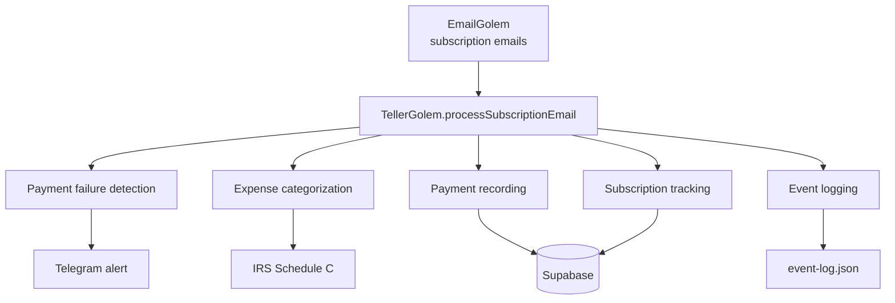

# TellerGolem

TellerGolem is the finance domain expert. It processes subscription emails routed from EmailGolem, categorizes expenses for IRS Schedule C tax purposes, detects payment failures, and generates financial reports (monthly and annual).

## Pipeline



## Core Features

### Payment Failure Detection

Regex pre-check + LLM confirmation for failed charges:

```typescript
// alerts.ts
const FAILURE_PATTERNS = [
  /payment\s+(failed|declined|unsuccessful)/i,
  /card\s+(declined|expired|rejected)/i,
  /billing\s+(issue|problem|error)/i,
  /unable\s+to\s+(charge|process|complete)/i,
  /action\s+required.*payment/i,
  /update.*payment\s+method/i,
];
```

When a failure is detected, TellerGolem sends a Telegram alert and logs an `email_alert` event.

### Expense Categorization

Uses LLM (via `runOllamaJSON`) to categorize emails into IRS Schedule C categories:

```typescript
// categorizer.ts — Valid categories
type TaxCategory =
  | "advertising" | "insurance" | "office" | "software"
  | "education" | "travel" | "meals"
  | "professional-services" | "other";
```

Returns a `CategorizedExpense` with category, confidence (0-1), reasoning, extracted amount, and vendor name.

### Monthly Reports

Queries the `payments` table in Supabase and aggregates by category and vendor:

```typescript
// report.ts
interface MonthlyReport {
  month: string;        // YYYY-MM
  totalSpend: number;
  byCategory: Record<TaxCategory, number>;
  byVendor: Record<string, number>;
  subscriptionCount: number;
}
```

### Tax Reports

Annual report with deductible totals and line items per category:

```typescript
interface TaxReport {
  year: number;
  totalDeductible: number;
  byCategory: Record<TaxCategory, {
    total: number;
    items: Array<{ vendor: string; amount: number }>;
  }>;
}
```

## Files

```text
src/teller-golem/
├── index.ts          — Main orchestrator, processSubscriptionEmail(), CLI
├── categorizer.ts    — LLM expense categorization into IRS Schedule C
├── alerts.ts         — Payment failure detection + Telegram alerts
├── report.ts         — Monthly and annual report generation
└── types.ts          — TypeScript interfaces (TaxCategory, MonthlyReport, etc.)
```

## MCP Tools

TellerGolem exposes two MCP tools via the `golems-email` MCP server (in `email-golem/mcp-server.ts`):

- **`teller_monthlyReport`** — Generate monthly spending report (by category and vendor)
- **`teller_taxSummary`** — Generate annual tax report with IRS Schedule C breakdown

## Running TellerGolem

```bash
cd packages/teller

# Monthly report (current month)
bun run src/index.ts --report

# Specific month
bun run src/index.ts --report --month 2026-02

# Tax report (current year)
bun run src/index.ts --report --tax

# Specific tax year
bun run src/index.ts --report --tax --year 2025
```

## Integration Points

- **EmailGolem** — Routes subscription emails via `router.ts` (category `subscription` -> `tellergolem`)
- **Event Logger** — Logs `email_routed` and `email_alert` events
- **Telegram** — Payment failure alerts sent via `telegram-direct.ts`
- **Supabase** — Payments and subscriptions stored via `db-client.ts`

## Environment Variables

```bash
# LLM for categorization
export LLM_BACKEND=haiku  # or 'ollama' for local

# Database
export SUPABASE_URL=...
export SUPABASE_SERVICE_KEY=...
```

## Roadmap

| Phase | Status | Scope |
|-------|--------|-------|
| Phase 1 | Done | Email routing to TellerGolem |
| Phase 2 | Done | Cloud offload, Supabase schema, state persistence |
| Phase 3 | Done | Categorizer, alerts, reports, types, MCP tools |
| Future | Planned | Budget forecasting, unused subscription detection, accounting integrations |
