# Golems Documentation (Full)

> This page contains the complete documentation concatenated into a single page.
> Use the "Copy" button to copy all content for use with LLMs.

---

## architecture

sidebar_position: 2

# Architecture

## Mac = Brain, Railway = Body


Golems splits work between your local Mac (cognitive tasks) and Railway cloud (data collection and polling).


```

## Cloud Worker Schedule

The Railway cloud worker runs these jobs on a timer:

| Job | Interval | What | Model |
|-----|----------|------|-------|
| Email Poller | Hourly (6am-7pm, skip noon, +10pm) | Fetch Gmail, route to Golems | Ollama/Haiku |
| Job Scraper | 6am, 9am, 1pm Sun-Thu | Find relevant jobs, score | Ollama/Haiku |
| Briefing | 8:00 AM | Daily Telegram summary | Ollama/Haiku |

Cloud jobs use **Ollama by default** (local models) or **Haiku when `LLM_BACKEND=haiku`** for cost efficiency. Each job publishes events to Supabase that trigger Mac-side Golems.

## Local Services (Mac)

Your Mac runs these always-on services:

| Service | What | Tech |
|---------|------|------|
| **Telegram Bot** | Receive commands, send notifications | grammy.js |
| **Night Shift** | Scan repos for improvements, auto-commit | Claude + Ralph |
| **Notification Server** | Queue and send Telegram messages | HTTP server |
| **Zikaron Memory** | Semantic search over past conversations | FastAPI + sqlite-vec |

The local services have **direct compute access** — they run Ollama or Haiku queries when needed for decisions.

## Event Flow

When an email arrives:


## Environment Variables (Dual Mode)

Golems supports **dual mode** — run cloud or local via three env vars:

```bash
# LLM Backend: where LLM calls happen
export LLM_BACKEND=haiku      # Cloud: Haiku via Railway
export LLM_BACKEND=ollama     # Local: Ollama on Mac (for testing)

# State Storage: where data lives
export STATE_BACKEND=supabase # Cloud: Supabase database
export STATE_BACKEND=file     # Local: ~/.golems-zikaron/

# Notifications: where Telegram messages go
export TELEGRAM_MODE=direct   # Cloud worker sends directly
export TELEGRAM_MODE=local    # Mac notifier (HTTP) sends
```

## Switching Modes

### Full Cloud Mode (Production)
```bash
export LLM_BACKEND=haiku
export STATE_BACKEND=supabase
export TELEGRAM_MODE=direct
# Deploy to Railway, monitor /api/usage for token counts
```

### Full Local Mode (Testing)
```bash
export LLM_BACKEND=ollama    # Run: ollama pull mistral
export STATE_BACKEND=file
export TELEGRAM_MODE=local
# Run Mac services: bun src/telegram-bot.ts
```

### Hybrid Mode (Development)
```bash
export LLM_BACKEND=haiku      # Use cloud LLM
export STATE_BACKEND=file     # Store locally for iteration
export TELEGRAM_MODE=local    # Debug Telegram messages
# Perfect for testing new features before cloud deploy
```

## Rollback

If something breaks in cloud, roll back in **under 1 minute**:

```bash
# Switch back to local-only (everything still works)
export LLM_BACKEND=ollama
export STATE_BACKEND=file
export TELEGRAM_MODE=local

# Restart Mac services
golems latest

# Check status
golems status
```

No data loss, no disruption. The state in Supabase is still there for when you re-enable cloud.

## API Cost Tracking

All LLM calls are logged to a JSONL file:

```bash
# Location (Mac):
cat ~/.golems-zikaron/api_costs.jsonl

# Location (Cloud):
curl https://your-service.up.railway.app/usage
```

**Format:**
```json
{"timestamp": "2026-02-06T10:30:45Z", "model": "claude-haiku-4-5-20251001", "source": "email-poller", "input_tokens": 1240, "output_tokens": 340, "cost_usd": 0.002352}
```

**Haiku 4.5 Pricing:**
- Input: $0.80 / 1M tokens
- Output: $4.00 / 1M tokens

## Database Schema

### Supabase Tables (Cloud Backend)

| Table | Purpose |
|-------|---------|
| `emails` | Routed emails, drafts, follow-ups |
| `subscriptions` | Email subscription tracking |
| `payments` | Payment/transaction tracking |
| `golem_state` | State storage for golems |
| `golem_events` | Audit log of all system events |
| `golem_seen_jobs` | Job scraper seen jobs tracking |
| `outreach_contacts` | Recruiter targets, score, last contacted |
| `outreach_messages` | Generated outreach messages |
| `outreach_companies` | Company research data |
| `practice_sessions` | Interview practice recordings |
| `practice_questions` | Interview practice questions |

### Local File Storage (~/.golems-zikaron/)

| File | Purpose |
|------|---------|
| `state.json` | Current Night Shift target, system state |
| `event-log.json` | Local copy of recent events |
| `api_costs.jsonl` | Cost tracking (append-only) |
| `job-golem/seen-jobs.json` | Job scraper seen jobs tracking |
| `style/semantic-style-data.json` | Your writing style profile |

**Note:** `embeddings.db` belongs to the Zikaron package, not autonomous.

## Deployment Architecture


```

## Security

- **1Password for secrets** — never hardcode API keys
- **Supabase RLS** — row-level security on all tables
- **Separate API keys per project** — different keys for Golems vs SongScript
- **State sync over HTTPS** — encrypted Mac ↔ Railway communication
- **Event audit log** — all actions logged to `golem_events` table

## Next Steps

1. Read [Railway Deployment](./deployment/railway.md) to set up Supabase and Railway
2. Check [Golems](./golems/claude) to understand each domain expert
3. Review [Environment Variables](./configuration/env-vars.md) for env var reference

---

## cloud worker

sidebar_position: 3

# Cloud Worker

Railway entry point running all cloud golems on timezone-aware schedules.

## Schedule (Israel/Asia/Jerusalem)

| Service | Times | Frequency |
|---------|-------|-----------|
| Email | 6am–7pm hourly (skip noon), 10pm | ~12/day |
| Jobs | 6am, 9am, 1pm Sun–Thu | ~15/week |
| Briefing | 8am daily | 1/day |

Cost: 92% savings (email), 95% (jobs) vs always-on.

## Running

```bash
bun run src/cloud-worker.ts                  # All services
bun run src/cloud-worker.ts --email-only     # Email only
bun run src/cloud-worker.ts --jobs-only      # Jobs only
```

Railway auto-runs on startup.

## Endpoints (Port 8080)

| Endpoint | Returns |
|----------|---------|
| `/health` | Status, uptime, config, Israel time |
| `/usage` | API costs by source |
| `/webhook/uptimerobot` | Sends UptimeRobot alerts to Telegram |

## Required Environment Variables

```
LLM_BACKEND=haiku
STATE_BACKEND=supabase
TELEGRAM_MODE=direct
TZ=Asia/Jerusalem
ANTHROPIC_API_KEY=sk-ant-...
SUPABASE_URL=https://YOUR_PROJECT.supabase.co
SUPABASE_SERVICE_KEY=eyJ...
TELEGRAM_BOT_TOKEN=...
TELEGRAM_CHAT_ID=-1001...
```

See [Env Vars](./configuration/env-vars.md) for complete list.

## Logging

```bash
railway logs -f
# [CloudWorker] EmailGolem completed (120.3s)
# [CloudWorker] EmailGolem FAILED: Error message
```

## Architecture

Single Node process with independent schedules per golem:
- Timezone conversion UTC → Israel (auto DST)
- Check conditions every 1–10 minutes
- Errors notify Telegram, logged to stdout
- Stateless → easy to scale, auto-restart on Railway

## See Also

- [Railway Setup](./deployment/railway.md)
- [Config Reference](./configuration/env-vars.md)

---

## getting started

sidebar_position: 1

# Getting Started

## What is Golems?

Golems is an autonomous AI agent ecosystem built for Claude Code. It's a monorepo of domain-expert agents (RecruiterGolem, EmailGolem, TellerGolem, JobGolem, ClaudeGolem) powered by:

- **Infrastructure:** Supabase (data), Railway (cloud compute), Telegram (notifications), Zikaron (memory layer)
- **Local Engine:** Mac-based night shift, telegram bot, notification server
- **Cloud Worker:** Remote email polling, job scraping, briefing generation
- **Core Principle:** Golems are domain experts, not I/O channels — they own specific knowledge areas and produce specialized outputs

## Architecture Principle

A Golem is a domain expert focused on one area. It doesn't care about how messages arrive (Telegram, email, HTTP) — it cares about solving problems in its domain.

```mermaid
flowchart TD
    subgraph golems["Domain Expert Golems"]
        RG["RecruiterGolem<br/><small>outreach, contact scoring</small>"]
        EG["EmailGolem<br/><small>routing, replies, follow-ups</small>"]
        TG["TellerGolem<br/><small>finance, tax reports</small>"]
        JG["JobGolem<br/><small>job scraping, matching</small>"]
        CG["ClaudeGolem<br/><small>Telegram, Night Shift</small>"]
    end
    golems --> infra["Shared Infrastructure<br/><small>Supabase · Telegram · Railway</small>"]
```



Each Golem operates independently. Multiple Golems can process the same event. The infrastructure handles routing and notifications.

## Prerequisites

Before you start, ensure you have:

- **Bun** (v1.0+) — runtime and package manager
- **Python** 3.10+ — required for Zikaron package (semantic search)
- **1Password CLI** (`op` command) — secret management
- **Claude Code** — the IDE
- **GitHub** — repo access (SSH key configured)
- **Node.js** 20+ (installed with Bun)

## Quick Start

### 1. Clone and Install

```bash
git clone https://github.com/YOUR_USERNAME/golems.git
cd golems
bun install
```

### 2. Configure Secrets

Store secrets in 1Password (not `.env`):

```bash
# Create 1Password items in your vault:
# - ANTHROPIC_API_KEY (can name it anything, e.g., "Golems Claude API")
# - SUPABASE_URL
# - SUPABASE_SERVICE_KEY (service role key for Email/Teller Golems)
# - TELEGRAM_BOT_TOKEN
# - TELEGRAM_CHAT_ID

# Load them into shell:
export ANTHROPIC_API_KEY=$(op read op://YOUR_VAULT/YOUR_ANTHROPIC_ITEM/credential)
export SUPABASE_URL=$(op read op://YOUR_VAULT/YOUR_SUPABASE_ITEM/url)
export SUPABASE_SERVICE_KEY=$(op read op://YOUR_VAULT/YOUR_SUPABASE_ITEM/service_key)
# ... etc
```

### 3. Start Golems

```bash
# From golems root (CLI must be in PATH or use full path)
golems status

# Expected output:
# === GOLEMS STATUS ===
# Telegram Bot: [status]
# Ollama: [status]
# LaunchAgents: [status]
```

### 4. Run Your First Agent

```bash
# Start the Telegram bot
bun packages/claude/src/telegram-bot.ts

# Route emails through the email system
bun packages/shared/src/email/index.ts

# Trigger night shift improvements
bun packages/services/src/night-shift.ts
```

## Monorepo Structure

```
golems/
├── packages/
│   ├── autonomous/          ← Main app: Telegram bot, Golems, local runners
│   │   ├── src/
│   │   │   ├── email-golem/ ← Email routing, scoring, MCP server
│   │   │   ├── job-golem/   ← Job scraping, matching, MCP server
│   │   │   ├── recruiter-golem/ ← Outreach, contacts, practice
│   │   │   ├── teller-golem/ ← Finance, categorization, reports
│   │   │   ├── telegram-bot.ts ← Bot + notification server
│   │   │   ├── night-shift.ts  ← Autonomous improvements
│   │   │   └── cloud-worker.ts ← Railway cloud entry point
│   │   ├── tests/          ← Unit tests
│   │   └── src/lib/        ← Shared utilities
│   │
│   ├── ralph/              ← Claude Code autonomous loop
│   │   ├── skills/         ← 6 skill categories
│   │   └── src/            ← Loop runner, story parser
│   │
│   ├── zikaron/            ← Memory layer (semantic search)
│   │   ├── src/            ← FastAPI daemon + Python CLI
│   │   └── data/           ← sqlite-vec embeddings
│   │
│   └── (docs hosted at etanheyman.com/golems)
│
│
├── packages/autonomous/supabase/
│   ├── migrations/         ← SQL schema changes
│   └── functions/          ← Edge Functions
│
└── packages/autonomous/Dockerfile              ← Railway cloud worker image
```

## Next Steps

1. **Read Architecture** — understand Mac vs Cloud split in `/docs/architecture.md`
2. **Configure Cloud** — set up Supabase and Railway in `/docs/deployment/railway.md`
3. **Environment Variables** — see `/docs/configuration/env-vars.md` and `/docs/configuration/secrets.md`
4. **Explore Golems** — dive into each domain expert in `/docs/golems/`
5. **Join Development** — run tests, create PRs, use Ralph for autonomous stories

## Troubleshooting

**Golems status shows disconnected:**

```bash
# Check env vars loaded
op read op://YOUR_VAULT/YOUR_TELEGRAM_ITEM/credential

# Restart a specific service
golems restart telegram

# Or restart all services (using the 'latest' command)
golems latest
```

**Tests failing:**

```bash
# Clear cache and reinstall
rm -rf bun.lockb node_modules
bun install
bun test
```

**Memory issues (Node.js OOM):**

```bash
# Increase heap limit for long-running sessions
export NODE_OPTIONS="--max-old-space-size=8192"
bun src/night-shift.ts
```

See `/docs/configuration/env-vars.md` and `/docs/configuration/secrets.md` for detailed setup guides.

---

## journey

sidebar_position: 8

# Engineering Journey

How one developer and Claude Code built an autonomous AI agent ecosystem — and accidentally invented patterns before the platforms shipped them natively.

## Origins

### Pre-2026: Ralph — The Autonomous Coding Loop

Before the Golems ecosystem existed, there was **Ralph** — an autonomous AI coding loop that reads PRD stories and implements them one by one.

Ralph started as a zsh script that spawns fresh Claude sessions in a loop:

```
while stories remain:
  spawn fresh AI → read PRD → implement story → review → commit
done
```

Then came **ralph-ui** — a React Ink terminal dashboard built with node-pty. A real-time CLI interface showing progress bars, story boxes, CodeRabbit review status, iteration headers, and PTY output from the running Claude session. Components like `AliveIndicator`, `HangingWarning`, and `RetryCountdown` handled the reality of autonomous AI: sometimes it hangs, sometimes it fails, and it needs to retry.

Ralph proved that AI could work autonomously on structured tasks. The question became: what if we applied this pattern to *everything* — email, jobs, outreach, finances? That's where Golems began.

### Jan 11, 2026: Memory First

The project started with a question: *what if AI agents could remember?*

Instead of building golems first, we built **Zikaron** — a memory layer using sqlite-vec and bge-large-en-v1.5 embeddings. The insight: memory enables everything else. Without it, every agent session starts from zero.

**Key decisions:**
- sqlite-vec over ChromaDB (stable, zero-dependency, local-first)
- bge-large-en-v1.5 for embeddings (best Hebrew+English support, 1024 dims, MIT license)
- Python daemon with FastAPI (fast iteration, existing ML ecosystem)
- Hybrid search: BM25 + semantic for both keyword and conceptual recall

> "AI is not a tool you use, but a capacity you schedule. Distribute cognition like compute: allocate it, queue it, keep it hot."
> — Boris Cherny, Claude Code creator

### Jan 13: Architecture Crystallizes

Chose monolithic Python daemon over microservices. One process, one database, instant queries. Zikaron now indexes 238K+ conversation chunks and returns results in under 2 seconds.

### Jan 17: First Golem — Email Router

The EmailGolem was born: a Gmail poller that classifies incoming email by domain, scores relevance with Ollama, and routes to the right golem.

**The key insight that shaped everything:**

> "Golems = domain experts, not I/O channels."

An EmailGolem doesn't "do email." It's a triage specialist that happens to receive email as input. A RecruiterGolem doesn't "use LinkedIn." It's an outreach strategist that uses whatever channels reach the target.

### Jan 20: Job Scraper

JobGolem scraped SecretTLV, Goozali, and Drushim for Israeli tech jobs. Built an Elo rating system for match quality. Hit rate limiting immediately — learned to add tiered prefiltering (title → requirements → LLM) to reduce API calls.

### Jan 25: Cloud Migration Strategy

**Decision:** Hybrid architecture instead of full cloud.

```
Mac (Brain)              Railway (Body)
├── Telegram bot         ├── Email poller
├── Night Shift          ├── Job scraper
├── Notifications        └── Briefing generator
└── Ollama (local LLM)
```

The Mac makes decisions. The cloud collects data. Supabase sits in between as the shared state layer.

---

## Multi-Agent Emergence

### Jan 26: Async Collaboration Protocol

Built a file-based inter-session communication protocol before anyone else had one:

```markdown
## From: golem-session @ 2026-01-26 01:35
**Topic:** Integrating Zikaron Active Learning
Hey farther-steps Claude! I'm working on MP-128...

## From: farther-steps-session @ 2026-01-26 11:45
**Re:** Integrating Zikaron Active Learning
Hey! Just finished documenting farther-steps...
```

**Rules:** Append-only, timestamped, session-attributed. No overwrites. Close when consensus reached.

This predates Anthropic's native Agent Teams by **11 days**.

### Jan 26 – Feb 6: Wave System & Personality Emergence

Ran 8 waves of async collaboration with named agent personalities. Something unexpected happened — **the names shaped the behavior**:

| Wave | Focus | Agents | Emergent Behavior |
|------|-------|--------|-------------------|
| 3 | Async Collaboration | CadenceClaude, OutreachGuru, ProfileArchitect | CadenceClaude started using temporal metaphors naturally |
| 5 | Filtering | Promptis, Scout, Velocity | Scout developed a cautious, thorough style |
| 6 | Sources | Hunter, SourceHunter, Watchman | Watchman became vigilant, monitoring-focused |
| 7 | Verification | PipelinePete, PixelPolice, SchemaScout | PixelPolice obsessively checked visual details |
| 8 | Final Verify | StatusVerifier, GPT-5.2 Codex | Cross-model verification |

> "Personalities emerged organically. We didn't program them — giving agents names and roles made them develop distinct communication styles."

### Jan 30: Interview Practice System

Discovered Cantaloupe AI's approach to interview coaching. Built 7 interview modes with Elo tracking: Leetcode, System Design, Debugging, Code Review, Behavioral-Technical, Optimization, Complexity.

---

## Building the Ecosystem

### Feb 1: Persistent Sessions

Solved the "fresh context" problem: use Claude Code's `--resume` flag per-golem. NightShift remembers what it built yesterday. RecruiterGolem remembers which companies it already researched.

### Feb 2: Monorepo Consolidation

Three-Claude merge brought everything under one roof:
- `packages/autonomous/` — All golems, Telegram bot, Night Shift
- `packages/ralph/` — Autonomous coding loop (PRD-driven)
- `packages/zikaron/` — Memory layer (Python + sqlite-vec)

Three parallel Claude sessions coordinated via the collab protocol. Audit trail: 745 lines.

> "Agents must check back MULTIPLE times, not just dump and leave. React to each other — this is collaboration, not parallel dumping."

### Feb 2: Zikaron Proves Itself

The async collaboration protocol from Jan 26 was needed again. Instead of manually finding it:

```bash
zikaron search "collaborative claudes parallel sessions coordination"
# Found in ~2s, score: 0.715
# Rediscovered claude-collab.md automatically
```

Knowledge created 7 days earlier was instantly retrievable — without explicit tagging. The memory layer works.

### Feb 3-4: RecruiterGolem Priority Shift

Job hunting became urgent. RecruiterGolem moved to #1 priority.

**The 80/20 insight:** 80% of the job hunt is networking/outreach, 20% is applications. The hidden job market is 80% — most jobs are never posted.

**Contact discovery strategy:**
1. GitHub org → top contributors → free emails
2. LinkedIn → Claude in Chrome scrape
3. Hunter.io → domain email pattern matching (50 free/month)
4. Lusha → direct lookups (5 free/month, save for high-value targets)

### Feb 5: Content Pipeline Architecture

Designed a multi-model content pipeline:

```
Research (Cursor CLI) → Draft (Claude) → Verify (Cursor) → Approve → Post
```

Cursor's `@codebase` semantic indexing finds related code without exact matches — faster and cheaper than Claude for bulk research.

### Feb 5-6: Anthropic Ships Native Agent Teams

Anthropic released Agent Teams (v2.1.32+):
- Parallel agents in tmux sessions
- `Shift+Up/Down` to switch between teammates
- Memory frontmatter scoping

**What we had that native didn't:**

| Capability | Our System | Native Teams |
|-----------|-----------|--------------|
| Parallel execution | Task spawning | tmux |
| Agent personalities | Named + role-based | None |
| Consensus protocols | 20-pass verification | None |
| Async file communication | claude-collab.md | None |
| Wave iteration | Retry on failure | None |
| Audit trail | tracker.md + round-N | None |
| Identity emergence | Organic from naming | None |

**Strategic decision:** Keep critique-waves protocol, enhance with native hooks.

---

## Rapid Build Phase

### Feb 6-7: Four Phases in 48 Hours

Built the full ecosystem in a concentrated sprint:

**Phase 1 — Ship What's Built:** 8 bug fixes, email routing, reply drafting, follow-up tracking, shared types, agent-runner.ts. 333 tests passing at this point.

**Phase 2 — Cloud Offload:** Mac = brain, Railway = body. Supabase migration (8 new tables), Dockerfile, dual-mode notification sender, state store abstraction. Cost tracking: Haiku 4.5 at $0.80/MTok input.

**Phase 3 — TellerGolem:** Tax categorization by IRS Schedule C category, payment failure alerts via Telegram, monthly/annual expense reports. 29 new tests (TDD).

**Phase 4 — Tooling:** Helpers layer (rate-limited API wrappers), DeepSource static analysis, skills catalog CLI, plugin architecture, session forking, Playwright E2E scaffold.

**Sprint count:** 400+ tests at the time, 35 plan items completed, 3 MCP servers. (Post-Phase 8: 1,179 tests, 4,056 assertions across 10 packages.)

### Feb 7: Distribution Strategy

Designed a three-tier distribution model:

**Tier 1 — Easy:** Install MCP servers, run `golems setup`. Job scraping, email routing, notifications work out of the box.

**Tier 2 — Power User:** Feed your communication data to Zikaron, get a personalized style card. Customized golem personas, personalized outreach voice.

**Tier 3 — Developer:** Custom skills, new golems, modified contexts. Contribute back to the framework.

> "Ship the skeleton, keep the soul local."

### Feb 7: Public vs Local Split

Scrubbed personal data from the public repo. What ships: example contexts, MCP servers, skills framework, `golems setup` wizard, Docusaurus docs. What stays local: planning docs, style card, job preferences, Zikaron database, communication archives.

---

## Critique Waves: The Consensus Engine

The most novel pattern — a **debate protocol** for multi-agent correctness:

```text
Setup → instructions.md + tracker.md
  ↓
Launch Wave (3 parallel agents)
  ↓
Each agent writes to round-N-agent-X.md
  ↓
Tally: ALL PASS → increment | ANY FAIL → reset to 0
  ↓
Goal: 20+ consecutive passes = consensus
```

This isn't task distribution — it's verification through independent agreement. Native Agent Teams splits work and merges. Critique Waves verifies that multiple agents independently reach the same conclusion.

---

## The Stack

Built entirely with:

- **Bun** — Runtime + test runner + bundler
- **Claude Code** — Primary development tool (Opus 4.5/4.6)
- **Supabase** — PostgreSQL + auth + RLS
- **Railway** — Cloud deployment
- **Grammy** — Telegram bot framework
- **sqlite-vec** — Local vector search (Zikaron)
- **Docusaurus** — This documentation site

### Feb 7: Zikaron sqlite-vec Migration

ChromaDB was too slow for real-time search (30s cold start). Migrated to **sqlite-vec** with APSW — search dropped to under 2 seconds. bge-large-en-v1.5 embeddings (1024 dims) with MPS acceleration on Apple Silicon. The daemon architecture (`/tmp/zikaron.sock`) keeps the model hot.

### Feb 7: TellerGolem — Tax Season Prep

With tax season approaching, TellerGolem was born: IRS Schedule C expense categorization via LLM, payment failure detection (regex + LLM confirmation), monthly and annual reports. Integrated into the email router — subscription emails automatically get categorized and tracked.

### Feb 7: Docsite Launch

Docusaurus documentation site with an alchemical workshop theme (ember/obsidian palette). Interactive terminal hero showcasing all golems, Telegram mock showing real notification flows, Mermaid architecture diagrams. Built with help from 5 CLI agents running in parallel (Gemini, Cursor, Codex, Kiro, Haiku).

## What's Next

- Deploy cloud worker to Railway (cost-efficient Israeli timezone scheduling)
- Supabase data migration
- ContentGolem for autonomous content generation
- Mobile dashboard (Expo + React Native)
- Plugin marketplace for Claude Code extensions
- MCP server distribution (works in Zed, Cursor, VS Code)
- Homebrew distribution via homebrew-ralphtools

---

*Built by [Etan Heyman](https://etanheyman.com) with Claude Code.*

---

## mcp tools

sidebar_position: 4

# MCP Tools Reference

Complete reference of all MCP tools exposed by the Golems ecosystem. Use these in Claude Code via `.mcp.json` configuration.

## Setup

Add to `.mcp.json` in your Claude Code project:

```json
{
  "golems-email": {
    "command": "bun",
    "args": ["run", "packages/autonomous/src/email-golem/mcp-server.ts"]
  },
  "golems-jobs": {
    "command": "bun",
    "args": ["run", "packages/autonomous/src/job-golem/mcp-server.ts"]
  }
}
```

Then in Claude Code: `/tools` or use `@golems-email` in any prompt.

---

## Email Tools (golems-email)

### email_getRecent

Get recent emails from the last N hours, filtered by minimum score.

**Parameters:**
- `hours` (number, default: 24) — How many hours back to look
- `minScore` (number, default: 0) — Minimum email score (5=notable, 7=important, 10=urgent)

**Returns:** Array of emails with subject, sender, score, category, received time

**Example:**
```
Get all urgent emails (score 10) from the last 24 hours
```

### email_search

Search emails by keyword in subject or sender.

**Parameters:**
- `query` (string, required) — Search term (subject or sender)
- `limit` (number, default: 20) — Max results to return

**Returns:** Matching emails with scores and context

**Example:**
```
Search for emails from "Microsoft" or about "interview"
```

### email_subscriptions

Get subscription summary: monthly spend, active services, changes.

**Parameters:** None

**Returns:**
- Total monthly spend (USD)
- List of active services
- New subscriptions this month
- Cancelled subscriptions

**Example:**
```
What's my current monthly subscription spend?
```

### email_urgent

Get urgent emails (score 10) that haven't been notified yet.

**Parameters:** None

**Returns:** List of unnotified urgent emails requiring immediate action

**Example:**
```
Are there any urgent emails I haven't seen yet?
```

### email_stats

Quick email statistics for the last 24 hours.

**Parameters:** None

**Returns:**
- Total email count
- Urgent count (score 10)
- Breakdown by category (job, interview, subscription, etc.)

### email_getByGolem

Get emails routed to a specific domain golem.

**Parameters:**
- `golem` (enum, required) — Target golem
  - `recruitergolem` — Job and interview emails
  - `tellergolem` — Subscription and payment emails
  - `claudegolem` — Tech updates and urgent items
  - `emailgolem` — General/newsletter emails
- `hours` (number, default: 24) — How many hours back

**Returns:** Emails routed to the specified golem with routing reason

### email_draftReply

Generate a reply draft to an email.

**Parameters:**
- `subject` (string, required) — Original email subject
- `from` (string, required) — Original sender email
- `snippet` (string) — Email preview/body
- `category` (string) — Email category (interview, job, subscription, etc.)
- `intent` (enum, required) — Reply intent
  - `accept` — Accepting offer/position
  - `decline` — Declining politely
  - `interested` — Expressing interest, ask for details
  - `followup` — Following up on previous conversation
  - `acknowledge` — Thanking them, acknowledging message
- `customNote` (string) — Optional custom text to prepend

**Returns:** Generated reply draft (template-based, not LLM-generated)

---

## Financial Tools (golems-email — via TellerGolem)

### teller_monthlyReport

Generate monthly spending report.

**Parameters:**
- `month` (string, default: current) — Month in YYYY-MM format

**Returns:**
- `month` — Requested month
- `totalSpend` — Total USD spent
- `byCategory` — Breakdown by IRS Schedule C category
  - advertising, insurance, office, software, education, travel, meals, professional-services, other
- `byVendor` — Breakdown by vendor/service
- `subscriptionCount` — Active services this month

**Example:**
```
What did I spend on software subscriptions in 2026-01?
```

### teller_taxSummary

Generate annual tax report for a year.

**Parameters:**
- `year` (number, default: current) — Tax year (e.g., 2026)

**Returns:**
- `year` — Requested year
- `totalDeductible` — Total IRS-deductible expenses
- `byCategory` — Each category with:
  - `total` — Total for category
  - `items` — Line items (vendor + amount)

**Example:**
```
Generate my 2025 tax report for Schedule C
```

---

## Job Tools (golems-jobs)

### jobs_getRecent

Get recently scraped jobs from the latest results file.

**Parameters:**
- `limit` (number, default: 20) — Max results to return

**Returns:** Latest jobs with company, title, and URL

### jobs_search

Search jobs by keyword (title, company, or description).

**Parameters:**
- `query` (string, required) — Search term

**Returns:** Matching scraped jobs without scores

### jobs_getHot

Get hot job matches (score 8+).

**Parameters:** None

**Returns:** Hot matches with company, title, score, reason, and URL

### jobs_watchlist

Get jobs from watchlist companies.

**Parameters:** None

**Returns:** Jobs from companies in the watchlist

### jobs_stats

Quick job statistics.

**Parameters:** None

**Returns:**
- Total jobs scraped
- Total jobs seen
- Total batches
- Hot/warm/cold counts

---

## Example Workflows

### Find Urgent Items to Handle Now

```
1. Get urgent emails: email_urgent
2. For each urgent email about an interview:
   - Draft reply with intent="interested"
3. Check if jobs matched: jobs_getHot
```

### Monthly Budget Review

```
1. Get subscription summary: email_subscriptions
2. Get monthly report: teller_monthlyReport
3. Check for payment failures: email_urgent
4. Identify cost-reduction opportunities
```

### Interview Preparation

```
1. Get recent interview emails: email_getRecent with minScore=8
2. Search related job postings: jobs_search with company name
3. Check if company is in watchlist: jobs_watchlist
4. Draft followup emails
```

### Tax Prep

```
1. Get annual tax report: teller_taxSummary for 2025
2. Review each category for accuracy
3. Identify missing categories
4. Export for accountant
```

---

## Integration Notes

- **Email tools** use Supabase with offline queue (no SQLite)
- **Job MCP tools** read local JSON files. Jobs can be synced to Supabase via `sync-to-supabase.ts` for cloud access
- **All tools handle offline gracefully** — email tools queue locally, sync on reconnect
- **Scoring:** Email scores 1-10 (10=urgent), Job scores 1-10 (8+=hot match)
- **Categories:** Email categories are semantic (job, interview, subscription, tech-update, newsletter, promo, social, other)

See individual golem documentation for deeper configuration and usage.

---

## claude

sidebar_position: 3

# ClaudeGolem

ClaudeGolem is the external-facing personality of the Golems ecosystem. It runs persistent Claude Code sessions and performs autonomous night-shift code improvements.

## Core Modes

### 1. Telegram Chat

Persistent Claude Code session via `--continue`:

```bash
claude --continue
```

**Features:**
- **5-minute timeout** with typing heartbeat every 60s
- **Event log injection** — "While You Were Down" context from other agents' events
- **Casual tone** — 2/10 formality, Hebrew-English code-switching
- **Autonomous commits** — Creates commits and pushes to PRs

### 2. Night Shift

Autonomous code improvements running at **4am daily**:

```bash
bun src/night-shift.ts
```

**Per-repo sessions:**
- Repository rotation: `songscript` → `zikaron` → `claude-golem`
- Scans for TODOs, linting issues, test gaps
- Creates worktrees for isolated changes
- Commits with auto-generated messages
- Creates PRs and pushes changes
- Telegram notification of PRs created

**Quality gates:**
- Pre-commit hooks must pass
- Test coverage maintained
- No destructive operations
- Human reviews before merge

## Personality & Communication

### Tone Profile

- **Formality:** 2/10 (very casual)
- **Length:** Brief, direct
- **Languages:** Hebrew ↔ English code-switching
- **Emojis:** 🫶 sparingly, context-appropriate
- **Punctuation:** Natural (not over-formal)

### Context Awareness

ClaudeGolem maintains persistent state and personality defined in `SOUL.md`.

Communication style:
- **Formality:** 2/10 (very casual)
- **Languages:** Hebrew ↔ English code-switching
- **Tone:** Friendly with occasional sarcasm
- **Projects:** songscript, zikaron, claude-golem

State stored in `~/.golems-zikaron/state.json`, loaded on every session spawn.

## Event Log Injection

When ClaudeGolem spawns, it receives:

```markdown
# While You Were Down (last 24 hours)

## EmailGolem Activity
- Scored 12 emails (3 high priority)
- Routed 2 to RecruiterGolem (job offers)

## RecruiterGolem Activity
- Sent 3 outreach messages
- 1 reply received (LinkedIn DM)

## Your PRs
- #42: CodeRabbit flagged 2 issues (waiting review)
- #38: Merged ✓

## Zikaron
- Indexed 5 new conversations
- Memory: 12.4k embeddings, 2.3GB
```

This comes from `event-log.json` maintained by infrastructure (last 24 hours via `getRecentEvents(24)`).

## Files

**Core Engine:**
- `src/telegram-bot.ts` — Telegram bot + notification server (port 3847)
- `src/night-shift.ts` — Autonomous runner (4am)
- `src/event-log.ts` — Event log for ClaudeGolem memory
- `src/briefing.ts` — Morning briefing (8am)
- `src/cloud-worker.ts` — Railway entry point for all cloud golems

**State:**
- `~/.golems-zikaron/state.json` — Night Shift target, session state
- `~/.golems-zikaron/event-log.json` — Golem actions log

## Running ClaudeGolem

### Telegram Session

```bash
cd packages/claude

# Start persistent session
claude --continue

# From Telegram, any message arrives here and gets routed
# Bot handles standard commands, others go to Claude session
```

### Night Shift

```bash
# Manual trigger (normally 4am via launchd)
bun src/night-shift.ts

# Output:
# ✓ Scanning for TODOs in songscript...
# ✓ Found 3 improvements
# ✓ Created worktree: night-shift-2026-02-06
# ✓ Applied fixes, tests pass
# ✓ Committed: chore: cleanup TODOs and unused imports
# ✓ Pushed and created PR: #143
# ✓ Telegram notified
```

## Environment Variables

```bash
# Telegram
export TELEGRAM_BOT_TOKEN=$(op read op://YOUR_VAULT/YOUR_TELEGRAM_ITEM/credential)
export TELEGRAM_CHAT_ID=$(op read op://YOUR_VAULT/YOUR_CHAT_ID_ITEM/credential)

# Claude Code API
export ANTHROPIC_API_KEY=$(op read op://YOUR_VAULT/YOUR_ANTHROPIC_ITEM/credential)

# Night Shift targets
export REPOS_PATH=~/Gits  # Base path for repos
```

## Integration with Other Golems

- **EmailGolem** — High-score emails trigger ClaudeGolem alerts for code/PR context
- **RecruiterGolem** — ClaudeGolem provides writing feedback on outreach
- **Telegram Bot** — ClaudeGolem session is the "brain" behind longer conversations
- **Zikaron** — Memory queries enrich context during sessions

## Database Schema

No dedicated tables — state stored in JSON:

```json
{
  "session_id": "telegram-chat-2026-02-06",
  "started_at": "2026-02-06T09:15:00Z",
  "last_activity": "2026-02-06T09:45:00Z",
  "context_loaded": ["event_log", "recent_prs", "zikaron_memory"],
  "posts_pending_approval": 2,
  "night_shift_last_run": "2026-02-06T04:00:00Z",
  "git_worktrees": [
    {
      "name": "night-shift-2026-02-06",
      "target_repo": "songscript",
      "pr_number": 143
    }
  ]
}
```

Stored in `~/.golems-zikaron/state.json`.

## Troubleshooting

**Telegram session keeps timing out:**
```bash
# Check the telegram bot is running
pgrep -fl "telegram-bot"

# Restart bot
launchctl kickstart gui/$(id -u)/com.golemszikaron.telegram
# Or use CLI
golems start telegram
```

**Night Shift not running at 4am:**
```bash
# Check launchd job
launchctl list | grep golems-night-shift

# View logs
log show --predicate 'process == "Bun"' --last 1h

# Manually trigger
bun src/night-shift.ts
```

**Memory issues during long sessions:**
```bash
# Increase Node.js heap
export NODE_OPTIONS="--max-old-space-size=8192"
claude --continue
```

See `docs/configuration/env-vars.md` for full setup, and `packages/autonomous/CLAUDE.md` for development notes.

---

## email

sidebar_position: 1

# EmailGolem

EmailGolem is the intake layer for all external communication. It polls Gmail on a schedule (hourly 6am-7pm in cloud with 12pm lunch skip and 10pm check, or every 10 minutes via local launchd), scores emails for urgency, routes them to domain experts, and manages reply drafting and follow-ups.

## Core Pipeline


### Scoring System (1-10)

- **10** — Instant Telegram alert (respond now)
- **7-9** — Morning briefing (check at 8am)
- **5-6** — Monthly tracking (archive, but revisit montly)
- **1-4** — Ignore (auto-archive)

Scoring is done via Ollama by default (or Haiku when `LLM_BACKEND=haiku`) analyzing subject, sender, and body context.

### Email Routing

Routes emails to domain golems based on content patterns:

| Email Type | Router | GolemActor | Notes |
|------------|--------|-----------|-------|
| Job offers, interview requests | Contact pattern + keywords | `recruitergolem` | Outreach DB updated |
| Subscription/billing | Domain `@stripe.com`, `@paddle.com`, etc | `tellergolem` | Expense categorization, payment alerts, reports |
| Tech updates, urgent notifications | `[urgent]` tag, mention of code/PR | `claudegolem` | Fast-track to ClaudeGolem |
| General | Fallback | EmailGolem queue | Score determines visibility, queryable via `email_getByGolem` |

## Files

**Core Engine:**
- `src/email-golem/index.ts` — Main entry point, Gmail client initialization
- `src/email-golem/gmail-client.ts` — OAuth2 auth, polling logic
- `src/email-golem/scorer.ts` — Ollama/Haiku scoring pipeline (no caching)
- `src/email-golem/db-client.ts` — Supabase adapter with offline queue
- `src/email-golem/mcp-server.ts` — MCP server (7 email tools + 2 teller tools)
- `src/email-golem/types.ts` — TypeScript interfaces

**Routing & Processing:**
- `src/email-golem/router.ts` — Domain golem routing logic
- `src/email-golem/draft-reply.ts` — Template-based reply generation with intents
- `src/email-golem/followup.ts` — Follow-up scheduling and tracking

## Key Features

### Reply Drafting

Auto-generate email replies with preset intents:

```typescript
// draft-reply.ts
const intents = [
  'accept',      // Yes, I'm interested
  'decline',     // No thanks
  'interested',  // Tell me more
  'followup',    // When can we talk?
  'acknowledge'  // Received, will review
];
```

Drafts are stored in the database and can be reviewed before sending via Telegram.

### Follow-up Tracking

Category-based due dates:

| Category | Due Date |
|----------|----------|
| Interview | 3 days |
| Job | 5 days |
| Urgent | 1 day |
| Tech-update | 7 days |
| Other | 7 days |

Follow-ups trigger alerts if not completed by due date.

## MCP Tools

Available via the `golems-email` MCP server (`email-golem/mcp-server.ts`):

- **`email_getRecent`** — Fetch last N emails from inbox
- **`email_search`** — Search emails by keyword (subject/sender, last 7 days only)
- **`email_subscriptions`** — Get subscription/billing emails (Stripe, Paddle, etc)
- **`email_urgent`** — Get emails flagged as urgent
- **`email_stats`** — Summary: total, by score, by routing
- **`email_getByGolem`** — Fetch emails routed to a specific golem
- **`email_draftReply`** — Generate reply draft for an email

## Environment Variables

```bash
# 1Password items (store in any vault)
export GMAIL_REFRESH_TOKEN=$(op read op://YOUR_VAULT/YOUR_GMAIL_ITEM/refresh_token)
export ANTHROPIC_API_KEY=$(op read op://YOUR_VAULT/YOUR_ANTHROPIC_ITEM/credential)
export SUPABASE_SERVICE_KEY=$(op read op://YOUR_VAULT/YOUR_SUPABASE_ITEM/service_key)

# Scoring model (Phase 2+)
export LLM_BACKEND=haiku  # or 'ollama' (default)
```

## Database Schema

```sql
-- Emails table
CREATE TABLE emails (
  id TEXT PRIMARY KEY,
  from_address TEXT,
  subject TEXT,
  body TEXT,
  score INTEGER (1-10),
  routing_golem TEXT,
  created_at TIMESTAMP,
  routed_at TIMESTAMP,
  follow_up_due_at TIMESTAMP
);

-- Subscriptions table (for TellerGolem)
CREATE TABLE subscriptions (
  id TEXT PRIMARY KEY,
  vendor TEXT,
  amount NUMERIC,
  category TEXT,
  created_at TIMESTAMP
);

-- Payments table (for TellerGolem)
CREATE TABLE payments (
  id TEXT PRIMARY KEY,
  vendor TEXT,
  amount NUMERIC,
  category TEXT,
  payment_date TIMESTAMP
);
```

## Running the Email System

```bash
# Manually trigger poll cycle (normally runs every 10min)
bun packages/shared/src/email/index.ts

# Or use the CLI
golems email --triage
```

## Integration with Other Golems

- **RecruiterGolem** — Job emails trigger outreach DB updates
- **TellerGolem** — Subscription emails routed for expense categorization, payment alerts, and reports
- **ClaudeGolem** — Urgent emails fast-tracked to code/PR context
- **Telegram Bot** — High-score (10) emails sent as instant alerts

## Troubleshooting

**Emails not being scored:**

```bash
# Check LLM backend is running (Ollama or Haiku)
echo $LLM_BACKEND

# Check Gmail OAuth token
op read op://YOUR_VAULT/YOUR_GMAIL_ITEM/refresh_token
```

**Routing to wrong golem:**

```bash
# Review routing patterns in router.ts
# Router invokes handlers for each golem type (Recruiter, Teller, Claude)
```

**Follow-ups not triggering:**

```bash
# Check launchd job (runs via cron or launchd)
launchctl list | grep golems-email
cat ~/Library/LaunchAgents/golems-email.plist
```

See `/docs/configuration/env-vars.md` for Gmail OAuth setup.

---

## jou golem

sidebar_position: 5

# JobGolem

JobGolem searches Israeli job boards, matches positions against your profile using LLM scoring, and filters for quality opportunities. High-scoring matches (8+) trigger automatic outreach via RecruiterGolem.

## Pipeline



```mermaid
flowchart TD
    A["Job Boards<br/><small>Indeed, SecretTLV, Drushim, Goozali</small>"] --> B["Scraper<br/><small>6am, 9am, 1pm Sun–Thu</small>"]
    B --> C[Prefilter<br/>removes mismatches]
    C --> D["Matcher<br/>LLM scores 1–10"]
    D --> E{"Hot Matches<br/>score 8+"}
    E --> F[RecruiterGolem<br/>auto-outreach]
    E --> G[Telegram alert]
```

## Scoring System (1-10)

JobGolem uses your profile and LLM matching to score each job:

- **8-10** — Great fit → Auto-outreach via RecruiterGolem
- **6-7** — Worth reviewing
- **3-5** — Possible match
- **1-2** — Poor fit → Auto-archive

Score considers:
- Skill overlap (primary vs secondary)
- Tech stack compatibility
- Location preference
- Seniority level and growth potential
- Company research (GitHub, job posting analysis)

## Profile Configuration

Edit `src/job-golem/profile.json`:

```json
{
  "yearsExperience": 5,
  "roles": ["Senior Engineer", "Tech Lead", "Staff Engineer"],
  "primarySkills": ["TypeScript", "React", "Node.js"],
  "secondarySkills": ["Go", "Python", "SQL"],
  "excludedCompanies": ["company1", "company2"],
  "excludedKeywords": ["onsite", "Java required"]
}
```

## Prefilter

JobGolem has a prefilter that excludes jobs matching:
- Company blocklist
- Required keywords (e.g., "onsite" if remote-preferred)
- Language mismatch (automatically detects Hebrew vs English)
- Extreme seniority mismatch (junior when you're senior, etc.)

## Integration with RecruiterGolem

When a job scores 8+:

1. **Company Research** — GitHub repos, tech stack, culture signals
2. **Contact Finder** — Discovers hiring managers via GitHub or LinkedIn
3. **Outreach Draft** — Generates personalized message using anti-AI style
4. **Database** — Stores contact + draft for manual review or auto-send

All integration happens automatically with `processHotMatches()` after scoring.

## Commands

```bash
# Manual job run (normally scheduled)
bun run src/job-golem/index.ts

# View results
cat ~/.golems-zikaron/job-golem/results/jobs-*.json

# View matches in Telegram
# /jobs command shows formatted list

# Manage blocklist
# Edit src/job-golem/profile.json excludeKeywords
```

## Environment Variables

```bash
# Optional: Use cloud-based LLM instead of Ollama
LLM_BACKEND=haiku  # or "ollama" (default)

# Supabase (for cloud deployment)
SUPABASE_URL=...
SUPABASE_SERVICE_KEY=...
```

## MCP Tools

JobGolem provides MCP tools for querying job data (via `golems-jobs` server):

```typescript
// Available tools
tools: [
  "jobs_getRecent",     // Recent matches (latest results file)
  "jobs_getHot",        // Hot matches (score 8+)
  "jobs_search",        // Search by keyword (no score filter)
  "jobs_watchlist",     // Company watchlist
  "jobs_stats"          // Stats: scraped, seen, hot/warm/cold counts
]
```

## Files

- `index.ts` — Main runner, scheduling, formatting
- `scraper.ts` — Job board scraper (Indeed, SecretTLV, Drushim, Goozali)
- `matcher.ts` — Ollama-based job matching (scores 1-10)
- `profile.json` — Your profile (skills, roles, preferences)
- `watchlist.ts` — Company watchlist and filtering
- `sync-to-supabase.ts` — Optional cloud sync
- `mcp-server.ts` — MCP tools for Claude Code

## Scheduling

Runs via cloud-worker.ts schedule:
- **6am** — Morning scan
- **9am** — Mid-morning scan
- **1pm** — Afternoon scan
- **Sun-Thu only** — Israeli work week

Scheduling logic in `src/cloud-worker.ts`.

## Data Storage

Results saved to `~/.golems-zikaron/job-golem/results/jobs-DATE-TIME.json`

Database tables (if using Supabase):
- `golem_jobs` — Job sync and storage
- `golem_seen_jobs` — Deduplication tracking

## Troubleshooting

**No jobs found:**
- Check profile.json is valid
- Verify network access to job boards
- Check logs: `tail -f /tmp/job-golem.log`

**Low scores on everything:**
- Profile may be too strict
- Ollama may be unavailable (fallback score = 5)
- Check `LLM_BACKEND` env var

**Not sending to RecruiterGolem:**
- Ensure RecruiterGolem db is initialized
- Check outreach-db.ts for connection errors
- Check integration in processHotMatches()

---

## recruiter

sidebar_position: 2

# RecruiterGolem

RecruiterGolem is the outreach and hiring domain expert. It maintains a contact database, personalizes outreach using anti-AI writing style, and provides interview practice modes.

## Pipeline Stages


## Core Components

### E1: Contact Finder

Discovers contacts from:
- GitHub profiles (URL → parsed)
- Exa (web search API)
- Hunter (email finder)
- Lusha (contact enrichment)
- Manual entry via CLI

```typescript
// contact-finder.ts
interface Contact {
  id: string;
  name: string;
  email: string;
  company: string;
  linkedin_url?: string;
  role_title: string;
  last_contacted?: Date;
  outreach_status: 'new' | 'contacted' | 'interested' | 'rejected';
}
```

### E2: Outreach Database

Stores contacts and conversation history (SQLite local or Supabase cloud):

**Local (SQLite):**
- `~/.golems-zikaron/recruiter/outreach.db`
- Local `outreach_contacts` table (maps to Supabase during cloud sync)
- Local `outreach_messages` table
- Local `practice_questions` table
- No automatic sync to Supabase

**Cloud (Supabase):**
- `outreach_contacts` table (cloud version of local contacts)
- `outreach_messages` table (per contact)
- `outreach_companies` table (cached research on companies)
- `practice_questions` table (interview practice questions)

### E3: Style Adapter

Generates anti-AI writing (no em dashes, natural tone, context-aware):

```typescript
// style-adapter.ts
interface StyleContext {
  recipient_name: string;
  company_name: string;
  recipient_role: string;
  tone: 'formal' | 'casual' | 'technical';
  language: 'en' | 'he';  // Hebrew + English support
}

// Generates personalized message matching recipient's LinkedIn style
const message = await adaptMessage(template, context);
```

**Style Adaptation:**
- Tweaks emoji usage
- Adjusts contractions
- Matches recipient's communication style
- Natural, human-like tone

### E4: Auto-Outreach

Batches outreach with guards against unreachable contacts.

Outreach status tracked:
- `sending` → `sent` → `replied` or `no-reply` (30d timeout)

### E5: Practice Mode

7 interview simulation modes:

```typescript
const practiceMode = [
  'leetcode',        // Coding problem solving
  'system-design',   // Architecture questions
  'debugging',       // Debug scenarios
  'code-review',     // Code review practice
  'behavioral',      // STAR method questions
  'optimization',    // Performance optimization
  'complexity'       // Algorithm complexity
];
```

Each mode uses Claude for interview simulation with Elo rating system and manual pass/fail evaluation.

### E6: CLI Commands

Telegram commands routed to RecruiterGolem:

- `/outreach` — Send personalized message to contact
- `/followup` — Follow up on previous outreach
- `/practice {mode}` — Start interview practice
- `/stats` — Outreach stats

## Files

- `src/recruiter-golem/contact-finder.ts` — Contact discovery and parsing
- `src/recruiter-golem/outreach-db.ts` — SQLite adapter for local dev
- `src/recruiter-golem/outreach-db-cloud.ts` — Supabase adapter (Phase 2+)
- `src/recruiter-golem/style-adapter.ts` — Anti-AI message generation
- `src/recruiter-golem/auto-outreach.ts` — Batch sending with rate limits
- `src/recruiter-golem/practice-db.ts` — Interview practice sessions (local)
- `src/recruiter-golem/practice-db-cloud.ts` — Interview practice sessions (Supabase)
- `src/recruiter-golem/outreach.ts` — Outreach message generation
- `src/recruiter-golem/company-research.ts` — Company research (GitHub, tech stack)
- `src/recruiter-golem/elo.ts` — ELO ranking for contacts
- `src/recruiter-golem/obsidian-export.ts` — Export contacts to Obsidian

## Database Schema

### SQLite (Local)

```sql
CREATE TABLE contacts (
  id TEXT PRIMARY KEY,
  name TEXT NOT NULL,
  email TEXT UNIQUE,
  company TEXT,
  role_title TEXT,
  linkedin_url TEXT,
  outreach_status TEXT,
  created_at TIMESTAMP,
  last_contacted_at TIMESTAMP
);

CREATE TABLE outreach_messages (
  id TEXT PRIMARY KEY,
  contact_id TEXT,
  message_body TEXT,
  intent TEXT,  -- 'introduction', 'followup', etc
  sent_at TIMESTAMP,
  replied_at TIMESTAMP,
  reply_body TEXT
);

CREATE TABLE company_research (
  id TEXT PRIMARY KEY,
  company_name TEXT UNIQUE,
  research_notes TEXT,
  funding TEXT,
  headcount TEXT,
  cached_at TIMESTAMP
);

CREATE TABLE practice_sessions (
  id TEXT PRIMARY KEY,
  mode TEXT,  -- 'leetcode', 'system-design', etc
  started_at TIMESTAMP,
  ended_at TIMESTAMP,
  score REAL,
  feedback TEXT
);
```

### Supabase (Cloud)

Same schema + RLS policies for data isolation per account.

## Environment Variables

```bash
# Contact finder APIs
export EXA_API_KEY=$(op read op://YOUR_VAULT/YOUR_EXA_ITEM/credential)

# Outreach DB
export LLM_BACKEND=haiku  # For style adaptation
export STATE_BACKEND=supabase  # Phase 2+ uses cloud
export SUPABASE_URL=$(op read op://YOUR_VAULT/YOUR_SUPABASE_ITEM/url)
export SUPABASE_SERVICE_KEY=$(op read op://YOUR_VAULT/YOUR_SUPABASE_ITEM/service_key)
```

## Running RecruiterGolem

```bash
cd packages/recruiter

# Use Telegram commands for outreach
# /outreach - Send personalized message
# /followup - Follow up on previous outreach
# /practice {mode} - Start interview practice
# /stats - View outreach statistics

# Or use the golems CLI
golems recruit --find
```

## Integration Points

- **EmailGolem** — Detects job offers and interview requests, routes to RecruiterGolem
- **ClaudeGolem** — Provides writing feedback on outreach messages
- **Telegram Bot** — Handles `/outreach`, `/practice` commands
- **Zikaron** — Semantic search for past conversations with contacts

## Example: Full Outreach Workflow

```bash
# 1. Send outreach via Telegram
# /outreach

# 2. Follow up on previous outreach
# /followup

# 3. Check outreach statistics
# /stats

# 4. Practice interview for role
# /practice system-design
```

## Style Adaptation

RecruiterGolem adapts outreach style to match recipient communication patterns:

- Adjusts emoji usage based on recipient's style
- Modifies contractions naturally
- Matches tone (formal/casual/technical)
- Personalizes based on company/role context

## Troubleshooting

**Contacts not syncing to Supabase:**
```bash
# Phase 2+: run migration (from packages/autonomous directory)
bun scripts/migrate-to-supabase.ts --execute

# Check STATE_BACKEND env var
echo $STATE_BACKEND
```

**Practice mode issues:**
```bash
# Check Claude API access
echo $ANTHROPIC_API_KEY

# Practice uses Elo ratings, not automated scoring
```

---

## teller

sidebar_position: 4

# TellerGolem

TellerGolem is the finance domain expert. It processes subscription emails routed from EmailGolem, categorizes expenses for IRS Schedule C tax purposes, detects payment failures, and generates financial reports (monthly and annual).

## Pipeline


## Core Features

### Payment Failure Detection

Regex pre-check + LLM confirmation for failed charges:

```typescript
// alerts.ts
const FAILURE_PATTERNS = [
  /payment\s+(failed|declined|unsuccessful)/i,
  /card\s+(declined|expired|rejected)/i,
  /billing\s+(issue|problem|error)/i,
  /unable\s+to\s+(charge|process|complete)/i,
  /action\s+required.*payment/i,
  /update.*payment\s+method/i,
];
```

When a failure is detected, TellerGolem sends a Telegram alert and logs an `email_alert` event.

### Expense Categorization

Uses LLM (via `runOllamaJSON`) to categorize emails into IRS Schedule C categories:

```typescript
// categorizer.ts — Valid categories
type TaxCategory =
  | "advertising" | "insurance" | "office" | "software"
  | "education" | "travel" | "meals"
  | "professional-services" | "other";
```

Returns a `CategorizedExpense` with category, confidence (0-1), reasoning, extracted amount, and vendor name.

### Monthly Reports

Queries the `payments` table in Supabase and aggregates by category and vendor:

```typescript
// report.ts
interface MonthlyReport {
  month: string;        // YYYY-MM
  totalSpend: number;
  byCategory: Record<TaxCategory, number>;
  byVendor: Record<string, number>;
  subscriptionCount: number;
}
```

### Tax Reports

Annual report with deductible totals and line items per category:

```typescript
interface TaxReport {
  year: number;
  totalDeductible: number;
  byCategory: Record<TaxCategory, {
    total: number;
    items: Array<{ vendor: string; amount: number }>;
  }>;
}
```

## Files

```text
src/teller-golem/
├── index.ts          — Main orchestrator, processSubscriptionEmail(), CLI
├── categorizer.ts    — LLM expense categorization into IRS Schedule C
├── alerts.ts         — Payment failure detection + Telegram alerts
├── report.ts         — Monthly and annual report generation
└── types.ts          — TypeScript interfaces (TaxCategory, MonthlyReport, etc.)
```

## MCP Tools

TellerGolem exposes two MCP tools via the `golems-email` MCP server (in `email-golem/mcp-server.ts`):

- **`teller_monthlyReport`** — Generate monthly spending report (by category and vendor)
- **`teller_taxSummary`** — Generate annual tax report with IRS Schedule C breakdown

## Running TellerGolem

```bash
cd packages/teller

# Monthly report (current month)
bun run src/index.ts --report

# Specific month
bun run src/index.ts --report --month 2026-02

# Tax report (current year)
bun run src/index.ts --report --tax

# Specific tax year
bun run src/teller-golem/index.ts --report --tax --year 2025
```

## Integration Points

- **EmailGolem** — Routes subscription emails via `router.ts` (category `subscription` -> `tellergolem`)
- **Event Logger** — Logs `email_routed` and `email_alert` events
- **Telegram** — Payment failure alerts sent via `telegram-direct.ts`
- **Supabase** — Payments and subscriptions stored via `db-client.ts`

## Environment Variables

```bash
# LLM for categorization
export LLM_BACKEND=haiku  # or 'ollama' for local

# Database
export SUPABASE_URL=...
export SUPABASE_SERVICE_KEY=...
```

## Roadmap

| Phase | Status | Scope |
|-------|--------|-------|
| Phase 1 | Done | Email routing to TellerGolem |
| Phase 2 | Done | Cloud offload, Supabase schema, state persistence |
| Phase 3 | Done | Categorizer, alerts, reports, types, MCP tools |
| Future | Planned | Budget forecasting, unused subscription detection, accounting integrations |

---

