# Golems — For LLMs

> This is a single concatenated page of all golems documentation, designed for LLM context windows.

---

# Architecture

## 7 Golems + Infrastructure, 3 Environments

Golems is a **Bun workspace monorepo with 14 packages** — 7 golems (1 orchestrator + 6 domain experts) plus shared infrastructure. Work splits between your local Mac (cognitive tasks), Railway cloud (data collection), and Vercel (web dashboard).

| Package | Role |
|---------|------|
| `@golems/shared` | Foundation — Supabase, LLM, email, state, notifications |
| `@golems/claude` | Orchestrator — Telegram bot, command routing |
| `@golems/recruiter` | Outreach, contacts, interview practice (Elo) |
| `@golems/teller` | Finance, tax categorization, spending reports |
| `@golems/jobs` | Job scraping, matching, MCP tools |
| `@golems/content` | Visual content factory (Remotion, ComfyUI, dataviz) + text publishing |
| `@golems/coach` | Calendar, daily planning, ecosystem status |
| `@golems/services` | Night Shift, Briefing, Cloud Worker, Wizard, Doctor |
| `@golems/orchestrator` | n8n orchestration, render microservice |
| `dashboard` | Next.js web dashboard (brain view, ops, backlog, content, tokens) |
| `golems-tui` | React Ink terminal dashboard |
| `tax-helper` | Schedule C transaction categorization (Sophtron MCP) |
| `ralph` | Autonomous coding loop (PRD execution) |
| `zikaron` | Memory layer (Python, 260K+ chunks, sqlite-vec) |

## Mac = Brain, Railway = Body


## Cloud Worker Schedule

The Railway cloud worker runs these jobs on a timer:

| Job | Interval | What | Model |
|-----|----------|------|-------|
| Email Poller | Hourly (6am-7pm, skip noon, +10pm) | Fetch Gmail, route to Golems | Gemini Flash-Lite |
| Job Scraper | 6am, 9am, 1pm Sun-Thu | Find relevant jobs, score | Gemini Flash-Lite |
| Briefing | 8:00 AM | Daily Telegram summary | Gemini Flash-Lite |

Cloud jobs use **Gemini 2.5 Flash-Lite** (free tier) for cost efficiency. Each job publishes events to Supabase that trigger Mac-side Golems.

## Local Services (Mac)

Your Mac runs these always-on services:

| Service | What | Tech |
|---------|------|------|
| **Telegram Bot** | Receive commands, send notifications | grammy.js |
| **Night Shift** | Scan repos for improvements, auto-commit | Claude + Ralph |
| **Notification Server** | Queue and send Telegram messages | HTTP server |
| **Zikaron Memory** | Semantic search over past conversations | FastAPI + sqlite-vec |
| **Render Service** | Remotion video rendering microservice | Bun + Remotion |
| **Enrichment** | Process Zikaron chunks (tags, summaries) | GLM-4.7-Flash via Ollama |

The local services have **direct compute access** — they run local GLM-4.7-Flash (via Ollama) or cloud models when needed.

## Event Flow

When an email arrives:


## Environment Variables (Dual Mode)

Golems supports **dual mode** — run cloud or local via three env vars:

```bash
# LLM Backend: where LLM calls happen
export LLM_BACKEND=gemini     # Cloud: Gemini Flash-Lite (free, default)
export LLM_BACKEND=ollama     # Local: Ollama on Mac (for testing)
export LLM_BACKEND=haiku      # Cloud: Haiku (paid fallback, optional)

# State Storage: where data lives
export STATE_BACKEND=supabase # Cloud: Supabase database
export STATE_BACKEND=file     # Local: ~/.golems-zikaron/

# Notifications: where Telegram messages go
export TELEGRAM_MODE=direct   # Cloud worker sends directly
export TELEGRAM_MODE=local    # Mac notifier (HTTP) sends
```

## Switching Modes

### Full Cloud Mode (Production)
```bash
export LLM_BACKEND=gemini
export STATE_BACKEND=supabase
export TELEGRAM_MODE=direct
# Deploy to Railway, monitor /api/usage for token counts
```

### Full Local Mode (Testing)
```bash
export LLM_BACKEND=ollama    # Run: ollama pull mistral
export STATE_BACKEND=file
export TELEGRAM_MODE=local
# Run Mac services: bun src/telegram-bot.ts
```

### Hybrid Mode (Development)
```bash
export LLM_BACKEND=gemini     # Use cloud LLM (free Gemini Flash-Lite)
export STATE_BACKEND=file     # Store locally for iteration
export TELEGRAM_MODE=local    # Debug Telegram messages
# Perfect for testing new features before cloud deploy
```

## Rollback

If something breaks in cloud, roll back in **under 1 minute**:

```bash
# Switch back to local-only (everything still works)
export LLM_BACKEND=ollama
export STATE_BACKEND=file
export TELEGRAM_MODE=local

# Restart Mac services
golems latest

# Check status
golems status
```

No data loss, no disruption. The state in Supabase is still there for when you re-enable cloud.

## API Cost Tracking

All LLM calls are logged to a JSONL file:

```bash
# Location (Mac):
cat ~/.golems-zikaron/api_costs.jsonl

# Location (Cloud):
curl https://your-service.up.railway.app/usage
```

**Format:**
```json
{"timestamp": "2026-02-06T10:30:45Z", "model": "claude-haiku-4-5-20251001", "source": "email-poller", "input_tokens": 1240, "output_tokens": 340, "cost_usd": 0.002352}
```

**Model Pricing:**
- Gemini Flash-Lite: Free tier (current cloud default)
- GLM-4.7-Flash: Free (local via Ollama)
- Haiku 4.5: $0.80 / $4.00 per 1M tokens (paid fallback)

## Database Schema

### Supabase Tables (Cloud Backend)

| Table | Purpose |
|-------|---------|
| `emails` | Routed emails, drafts, follow-ups |
| `email_senders` | Sender profiles with category and action |
| `subscriptions` | Email subscription tracking |
| `payments` | Payment/transaction tracking |
| `golem_state` | State storage for golems |
| `golem_events` | Audit log of all system events |
| `golem_jobs` | Job listings from scraper |
| `scrape_activity` | Scraping run logs |
| `outreach_contacts` | Recruiter targets, score, last contacted |
| `outreach_messages` | Generated outreach messages |
| `linkedin_connections` | LinkedIn network data |
| `practice_sessions` | Interview practice recordings |
| `practice_questions` | Interview practice questions |
| `backlog_items` | Kanban board items |
| `pipeline_runs` | Content pipeline execution logs |
| `llm_usage` | Token usage and cost tracking |
| `service_heartbeats` | Service health pings |
| `service_runs` | Cron job execution logs |

### Local File Storage (~/.golems-zikaron/)

| File | Purpose |
|------|---------|
| `state.json` | Current Night Shift target, system state |
| `event-log.json` | Local copy of recent events |
| `api_costs.jsonl` | Cost tracking (append-only) |
| `job-golem/seen-jobs.json` | Job scraper seen jobs tracking |
| `style/semantic-style-data.json` | Your writing style profile |

**Note:** `embeddings.db` belongs to the Zikaron package, not autonomous.

## Deployment Architecture


## Security

- **1Password for secrets** — never hardcode API keys
- **Supabase RLS** — row-level security on all tables
- **Separate API keys per project** — different keys for Golems vs SongScript
- **State sync over HTTPS** — encrypted Mac ↔ Railway communication
- **Event audit log** — all actions logged to `golem_events` table

## Next Steps

1. Read [Railway Deployment](./deployment/railway.md) to set up Supabase and Railway
2. Check [Golems](./golems/claude) to understand each domain expert
3. Review [Environment Variables](./configuration/env-vars.md) for env var reference

---

# Cloud Worker

Railway entry point running all cloud golems on timezone-aware schedules.

## Schedule (Israel/Asia/Jerusalem)

| Service | Times | Frequency | Model |
|---------|-------|-----------|-------|
| Email Poller | 6am–7pm hourly (skip noon), 10pm | ~12/day | Gemini Flash-Lite |
| Job Scraper | 6am, 9am, 1pm Sun–Thu | ~15/week | Gemini Flash-Lite |
| Briefing | 8am daily | 1/day | Gemini Flash-Lite |

Cloud jobs use **Gemini 2.5 Flash-Lite** (free tier) for cost efficiency. Each job publishes events to Supabase that trigger Mac-side Golems.

## Running

```bash
bun run src/cloud-worker.ts                  # All services
bun run src/cloud-worker.ts --email-only     # Email only
bun run src/cloud-worker.ts --jobs-only      # Jobs only
```

Railway auto-runs on startup.

## Endpoints (Port 8080)

| Endpoint | Returns |
|----------|---------|
| `/health` | Status, uptime, config, Israel time |
| `/usage` | API costs by source |
| `/webhook/uptimerobot` | Sends UptimeRobot alerts to Telegram |

## Required Environment Variables

```
LLM_BACKEND=gemini
STATE_BACKEND=supabase
TELEGRAM_MODE=direct
TZ=Asia/Jerusalem
GOOGLE_GENERATIVE_AI_API_KEY=...
SUPABASE_URL=https://YOUR_PROJECT.supabase.co
SUPABASE_SERVICE_KEY=eyJ...
TELEGRAM_BOT_TOKEN=...
TELEGRAM_CHAT_ID=-1001...
```

See [Env Vars](./configuration/env-vars.md) for complete list.

## Logging

```bash
railway logs -f
# [CloudWorker] EmailGolem completed (120.3s)
# [CloudWorker] EmailGolem FAILED: Error message
```

## Architecture

Single Bun process with independent schedules per golem:
- Timezone conversion UTC → Israel (auto DST)
- Check conditions every 1–10 minutes
- Errors notify Telegram, logged to stdout + Axiom telemetry
- Stateless → easy to scale, auto-restart on Railway
- Health endpoint at `/health` with uptime, config, and Israel time

## See Also

- [Railway Setup](./deployment/railway.md)
- [Config Reference](./configuration/env-vars.md)

---

# Environment Variables

All environment variables used by Golems v2. Store sensitive values in 1Password (see [Secrets Management](./secrets.md)).

## Core Configuration

| Variable | Default | Description | Required For |
|----------|---------|-------------|--------------|
| `LLM_BACKEND` | `ollama` | Which LLM to use: `gemini` (cloud, free), `haiku` (cloud, paid fallback), or `ollama` (local); cloud-worker sets `gemini` | Agent execution |
| `STATE_BACKEND` | `file` | State storage: `supabase` (cloud) or `file` (local) | Persistent state |
| `TELEGRAM_MODE` | `local` | Notification mode: `direct` (cloud) or `local` (launchd) | Telegram notifications |
| `TZ` | `UTC` | Timezone (only used in helpers-status.ts); cloud-worker hardcodes `Asia/Jerusalem` | Status display |
| `GOLEMS_STATE_DIR` | `~/.golems-zikaron` | Override state directory for tests or alternate environments | Test isolation |

## LLM Configuration

### Cloud Backend (Gemini)

| Variable | Default | Description | Required For |
|----------|---------|-------------|--------------|
| `GOOGLE_GENERATIVE_AI_API_KEY` | — | Google AI API key from 1Password | Cloud LLM calls (free Gemini Flash-Lite) |
| `ANTHROPIC_API_KEY` | — | Anthropic API key (paid Haiku fallback, optional) | Fallback LLM calls |
| `RAILWAY_URL` | `https://your-service.up.railway.app` | Cloud worker endpoint for health checks | Health monitoring |

### Local Backend (Ollama)

Requires Ollama running locally on `http://localhost:11434`.

## Database Configuration

| Variable | Default | Description | Required For |
|----------|---------|-------------|--------------|
| `SUPABASE_URL` | — | Your Supabase project URL (format: `https://YOUR_PROJECT.supabase.co`) | Cloud state backend |
| `SUPABASE_SERVICE_KEY` | — | Service role key (bypasses RLS, for cloud worker only) from 1Password | Cloud database access |
| `SUPABASE_ANON_KEY` | — | Anonymous key for job sync | Job golem sync |

## Gmail Configuration

| Variable | Default | Description | Required For |
|----------|---------|-------------|--------------|
| `GMAIL_CLIENT_ID` | — | OAuth 2.0 Client ID from Google Cloud Console | Email sync |
| `GMAIL_CLIENT_SECRET` | — | OAuth 2.0 Client Secret from Google Cloud Console | Email sync |
| `GMAIL_REFRESH_TOKEN` | — | Gmail refresh token (generate via oauth-cli) | Email sync |

## Telegram Configuration

| Variable | Default | Description | Required For |
|----------|---------|-------------|--------------|
| `TELEGRAM_BOT_TOKEN` | — | Bot token from @BotFather on Telegram | Telegram bot |
| `TELEGRAM_CHAT_ID` | — | Chat/group ID for notifications (negative number for groups) | Telegram messages |
| `TELEGRAM_TOPIC_ALERTS` | — | Topic ID for 🔔 Alerts (system notifications) | Alert routing |
| `TELEGRAM_TOPIC_NIGHTSHIFT` | — | Topic ID for 🌙 Night Shift (autonomous tasks) | Night Shift logs |
| `TELEGRAM_TOPIC_EMAIL` | — | Topic ID for 📧 Email (email events) | Email notifications |
| `TELEGRAM_TOPIC_JOBS` | — | Topic ID for 💼 Jobs (job scraper results) | Job notifications |
| `TELEGRAM_TOPIC_RECRUITER` | — | Topic ID for 👥 Recruiter (outreach events) | Recruiter notifications |
| `TELEGRAM_TOPIC_UPTIME` | — | Topic ID for ⏰ Uptime (health checks) | Uptime monitoring |

## Ollama Configuration

| Variable | Default | Description | Required For |
|----------|---------|-------------|--------------|
| `OLLAMA_MODEL` | `qwen2.5-coder:7b` (direct), `qwen3-coder-64k` (sandboxed) | Local Ollama model name | Email scoring, categorization |
| `OLLAMA_HOST` | `http://localhost:11434` | Ollama server URL | Local LLM calls |
| `OLLAMA_URL` | `http://127.0.0.1:11434` | Alias for `OLLAMA_HOST` (sandboxed mode) | Sandboxed execution |
| `OLLAMA_SANDBOXED` | — | Set to `1` to enable sandboxed Ollama execution | Sandboxed mode |
| `VALIDATION_DIR` | `~/.golems-zikaron/validation-queue` | Directory for sandboxed validation queue | Sandboxed execution |

## Job Scraper Configuration

| Variable | Default | Description | Required For |
|----------|---------|-------------|--------------|
| `SKIP_DRUSHIM` | — | Set to `1` to skip Drushim.co.il scraper | Job scraper |
| `SKIP_INDEED` | — | Set to `1` to skip Indeed scraper | Job scraper |
| `SKIP_SECRETLV` | — | Set to `1` to skip Secret Tel Aviv scraper | Job scraper |

## Recruiter Configuration

| Variable | Default | Description | Required For |
|----------|---------|-------------|--------------|
| `HUNTER_API_KEY` | — | Hunter.io API key for finding contact emails | Contact finder |
| `EXA_API_KEY` | — | Exa API key for web search and contact finding | Contact finder |

## Night Shift & Bot Configuration

| Variable | Default | Description | Required For |
|----------|---------|-------------|--------------|
| `REPOS_PATH` | `~/Gits` | Base path for git repositories | Night Shift |
| `ACTIVITY_DAYS_TO_KEEP` | `7` | Days of session history to retain | Session archiver |
| `TELEGRAM_ALLOWED_IDS` | — | Comma-separated Telegram user IDs allowed to interact | Telegram bot security |
| `OLLAMA_CHAT_BOT_TOKEN` | — | Separate bot token for Ollama chat bot | Ollama chat bot |

## Setup Examples

### Development (Local)

```bash
# Use local Ollama and file-based state
export LLM_BACKEND=ollama
export STATE_BACKEND=file
export TELEGRAM_MODE=local
export TZ=Asia/Jerusalem

# Gmail
export GMAIL_CLIENT_ID=your_client_id
export GMAIL_CLIENT_SECRET=your_client_secret
export GMAIL_REFRESH_TOKEN=your_refresh_token

# Telegram (get token from @BotFather, chat ID from your group)
export TELEGRAM_BOT_TOKEN=123456:ABC-DEF...
export TELEGRAM_CHAT_ID=-1001234567890
```

### Production (Railway)

```bash
# Use cloud LLM and Supabase
export LLM_BACKEND=gemini
export STATE_BACKEND=supabase
export TELEGRAM_MODE=direct

# All secrets from 1Password (handled by Railway)
# GOOGLE_GENERATIVE_AI_API_KEY, SUPABASE_URL, SUPABASE_SERVICE_KEY, etc.
```

## Loading Variables

Variables are loaded from:

1. **Environment** — System variables (highest priority)
2. **.env file** — Project root `.env` file (git-ignored)
3. **Defaults** — Built-in fallbacks

For launchd jobs, use `load-env.ts` at the entry point:

```typescript
import "../lib/load-env";  // MUST be first import
```

This ensures `.env` files are loaded before any code runs.

## API Cost Logging

All LLM calls are logged to `~/.golems-zikaron/api_costs.jsonl` as JSONL:

```json
{
  "timestamp": "2026-02-06T10:30:00Z",
  "model": "claude-haiku-4-5-20251001",
  "source": "email-golem",
  "input_tokens": 1250,
  "output_tokens": 342,
  "cost_usd": 0.002352
}
```

Pricing (Haiku 4.5):
- Input: $0.80/MTok
- Output: $4.00/MTok

## See Also

- [Secrets Management](./secrets.md) — How to store sensitive variables
- [Railway Deployment](../deployment/railway.md) — Production deployment guide

---

# Secrets Management

Golems uses **1Password** for secure secret storage. Never hardcode secrets or commit `.env` files to git.

## 1Password Setup

### Vault Items

Store your API keys in 1Password (in any vault you prefer):

| Secret Name | What to Store | Purpose |
|-------------|--------------|---------|
| `ANTHROPIC_API_KEY` | Your Anthropic API key | Claude LLM calls (name the 1Password item anything you want) |
| `SUPABASE_URL` | Your Supabase project URL | Database connection |
| `SUPABASE_SERVICE_KEY` | Your service role key | Cloud database access (service_role, bypasses RLS) |
| `GMAIL_CLIENT_ID` | Google Cloud OAuth client ID | Gmail API access |
| `GMAIL_CLIENT_SECRET` | Google Cloud OAuth secret | Gmail OAuth |
| `GMAIL_REFRESH_TOKEN` | OAuth refresh token | Persistent Gmail access |
| `TELEGRAM_BOT_TOKEN` | Bot token from @BotFather | Telegram bot auth |
| `TELEGRAM_CHAT_ID` | Your chat/group ID | Notification destination |

## Accessing Secrets

### With 1Password CLI

Install 1Password CLI:

```bash
brew install 1password-cli
```

Sign in:

```bash
op signin
```

Read a secret:

```bash
op read "op://YOUR_VAULT/YOUR_ITEM/credential"
```

### In Shell Profile

Source secrets in your shell profile (e.g., `~/.zshrc`):

```bash
# Load Golems secrets
export ANTHROPIC_API_KEY=$(op read "op://YOUR_VAULT/YOUR_ANTHROPIC_ITEM/credential")
export SUPABASE_SERVICE_KEY=$(op read "op://YOUR_VAULT/YOUR_SUPABASE_ITEM/service_key")
export GMAIL_CLIENT_SECRET=$(op read "op://YOUR_VAULT/YOUR_GMAIL_ITEM/client_secret")
export TELEGRAM_BOT_TOKEN=$(op read "op://YOUR_VAULT/YOUR_TELEGRAM_ITEM/credential")
```

### In Railway (Production)

Railway environment variables are **plain text** (not 1Password). Copy values manually:

1. Read from 1Password:
   ```bash
   op read "op://YOUR_VAULT/YOUR_ANTHROPIC_ITEM/credential"
   ```

2. Paste into Railway dashboard → `Settings` → `Variables`

3. Redeploy:
   ```bash
   railway up
   ```

## .env File (Local Development Only)

Create `.env` in project root for local development:

```bash
# .env (NEVER commit this)
LLM_BACKEND=ollama
STATE_BACKEND=file
TELEGRAM_MODE=local
TZ=Asia/Jerusalem

ANTHROPIC_API_KEY=sk-ant-...
GMAIL_CLIENT_ID=abc123.apps.googleusercontent.com
GMAIL_CLIENT_SECRET=GOCSPX-...
GMAIL_REFRESH_TOKEN=1//...

TELEGRAM_BOT_TOKEN=123456:ABC-DEF1234ghIkl-zyx57W2v1u123ew11
TELEGRAM_CHAT_ID=-1001234567890
```

Add to `.gitignore`:

```bash
.env
.env.local
.env.*.local
```

## Key Rotation

When rotating API keys:

1. **Generate new key** in Anthropic/Supabase/Gmail console
2. **Update 1Password** item with new value
3. **Redeploy Railway** with new variable
4. **Monitor logs** for successful auth
5. **Revoke old key** in console after 24 hours of successful operation

### Key Rotation Best Practices

After rotating keys:

1. Monitor logs for 1+ week to ensure new key works
2. Search for any hardcoded references to old keys
3. Revoke old key in provider console (Anthropic/Supabase/etc.)
4. Document the change in your internal changelog

## Security Best Practices

- ✅ Store all secrets in 1Password
- ✅ Use service roles for database access (service_role key for cloud worker)
- ✅ Rotate keys every 90 days
- ✅ Monitor API usage in dashboards (Anthropic, Supabase, Gmail, Telegram)
- ✅ Never log sensitive values
- ✅ Use different keys per deployment (dev, staging, prod)

- ❌ Never hardcode secrets in code
- ❌ Never commit `.env` files
- ❌ Never share tokens in Slack/email
- ❌ Never use user tokens where service tokens exist

## See Also

- [Environment Variables](./env-vars.md) — Complete variable reference
- [Railway Deployment](../deployment/railway.md) — Production setup

---

# Content Pipelines

ContentGolem orchestrates 5 visual content pipelines and a text publishing pipeline. Each pipeline follows the same pattern: idea in, Claude Code picks the right tool, output rendered.

## Pipeline Overview

```mermaid
flowchart LR
    I["Content Request"] --> R{"Router<br/><small>CC Opus</small>"}
    R --> P1["Remotion<br/><small>Video/GIF</small>"]
    R --> P2["ComfyUI/Flux<br/><small>AI Images</small>"]
    R --> P3["DataViz<br/><small>Charts</small>"]
    R --> P4["Satori<br/><small>Social Cards</small>"]
    R --> P5["Playwright<br/><small>Screenshots</small>"]
    R --> P6["Figma→Video<br/><small>Design-validated</small>"]
    P1 & P2 & P3 & P4 & P5 & P6 --> O["Output<br/><small>PNG/MP4/GIF/SVG</small>"]
```



## Pipelines

### Remotion Video

Renders React compositions into MP4/GIF videos using Remotion on the local Mac.

| Step | Component | What |
|------|-----------|------|
| 1 | Idea | Video concept description |
| 2 | CC (Opus) | Picks React composition, writes props |
| 3 | React | Renders animation frames |
| 4 | Remotion | Encodes MP4 or GIF |
| 5 | Output | Final video file |

**Use cases:** Product demos, feature showcases, social video content.

### ComfyUI / Flux Image Gen

Generates images using Flux on Apple Silicon via ComfyUI with a vision-based quality gate.

| Step | Component | What |
|------|-----------|------|
| 1 | Idea | Image concept description |
| 2 | CC (Opus) | Crafts Flux prompt |
| 3 | ComfyUI | Flux inference on Apple Silicon |
| 4 | Vision Gate | Quality review (auto-reject blurry/off-brand) |
| 5 | Output | PNG with brand overlay |

**Use cases:** Blog headers, social media images, product mockups.

### DataViz Charts

Creates data visualizations from Supabase queries or API data, rendered as SVG/PNG.

| Step | Component | What |
|------|-----------|------|
| 1 | Data | Supabase query or API fetch |
| 2 | CC (Opus) | Designs chart type and layout |
| 3 | SVG Builder | Generates vector markup |
| 4 | Sharp | Rasterizes to PNG |
| 5 | Output | PNG or SVG chart |

**Use cases:** Token usage graphs, job match trends, ecosystem health dashboards.

### Satori Template Fill

Fills JSX templates with dynamic data and renders to social card PNGs via Satori.

| Step | Component | What |
|------|-----------|------|
| 1 | Data | Content text + template selection |
| 2 | CC (Opus) | Fills template variables |
| 3 | Satori | JSX to SVG conversion |
| 4 | Output | Social card PNG |

**Use cases:** LinkedIn post cards, OG images, quote cards.

### Figma to Video

Design-validated video pipeline. CC extracts the target design from Figma, builds a Remotion composition, then iterates until the rendered output matches the Figma design 1:1. Includes a visual comparison gate that rejects renders that don't match.

| Step | Component | What |
|------|-----------|------|
| 1 | Figma | Source design file (exported or API) |
| 2 | CC (Opus) | Extracts layout, colors, typography, props |
| 3 | React | Renders Remotion composition |
| 4 | Figma Gate | Compares render to original design |
| 5 | Remotion | Encodes MP4/GIF once gate passes |
| 6 | Output | Design-faithful video |

**Use cases:** Product demos matching brand designs, Figma-to-animation, pixel-perfect animated previews.

**Example:** DomicaHero composition — went through 21 iterations comparing renders against the Figma design to achieve 1:1 element fidelity.

### Playwright Screenshots

Captures web page screenshots using Playwright browser automation.

| Step | Component | What |
|------|-----------|------|
| 1 | URL | Target page URL |
| 2 | CC (Opus) | Plans viewport, selectors, timing |
| 3 | Playwright | Browser renders and captures |
| 4 | Output | PNG screenshot |

**Use cases:** Portfolio screenshots, competitor analysis, visual regression.

## Routing

When a content request arrives, Claude Code (Opus) analyzes the request and routes to the appropriate pipeline. The routing decision considers:

- **Content type:** video vs image vs chart vs screenshot
- **Input data:** URL (Playwright), data (DataViz), concept (Remotion/Flux)
- **Output format:** MP4/GIF (Remotion), PNG (all others), SVG (DataViz)

## Pipeline Runs

Every pipeline execution is logged to the `pipeline_runs` Supabase table:

```sql
-- pipeline_runs table
pipeline    TEXT    -- remotion, comfyui, dataviz, satori, playwright
status      TEXT    -- pending, running, success, failed
input       JSONB   -- request parameters
output      JSONB   -- result metadata (file path, dimensions, duration)
duration_ms INTEGER -- execution time
error       TEXT    -- error message if failed
created_at  TIMESTAMP
```

View pipeline history and stats on the dashboard at `/content`.

## Text Publishing

Beyond visual content, ContentGolem handles text publishing:

- **LinkedIn posts** via the `/linkedin-post` skill (2026 algorithm optimization)
- **Soltome posts** via the Soltome API client (AI social network)
- **Ghostwriting** in the owner's Hebrew-English voice

Text content goes through a critique-waves quality process: parallel agents review, refine, and reach consensus before publishing.

## CC Skills

Content pipelines are invoked via Claude Code skills:

| Skill | Pipeline |
|-------|----------|
| `golem-powers/content/workflows/draft` | Text drafting + critique |
| `golem-powers/linkedin-post/workflows/draft` | LinkedIn-specific drafting |
| `golem-powers/linkedin-post/workflows/review` | Draft quality review |

## Dependencies

- **Remotion** — React video rendering (`@remotion/cli`, `@remotion/bundler`)
- **ComfyUI** — Flux image generation (local, Apple Silicon)
- **Sharp** — Image processing and rasterization
- **Satori** — JSX to SVG/PNG conversion
- **Playwright** — Browser automation for screenshots
- **Render Service** — Local Bun microservice for Remotion rendering (`launchd` managed)

---

# Railway Deployment

Golems Phase 2 runs on **Railway** as the cloud "body" while the Mac remains the "brain" (Telegram bot, Night Shift, notifications).

## Railway Project

Create a new project in Railway with these settings:

- **Organization:** Your Railway org
- **Project:** golems (or any name you choose)
- **Service:** golems
- **Region:** Any region (US West, Europe, etc.)
- **Root:** `packages/autonomous`
- **Builder:** Dockerfile

## Getting Started

### Install Railway CLI

```bash
brew install railway
```

### Authenticate

```bash
railway login
# Opens browser to authorize
```

### Link Project

From repo root or `packages/autonomous/`:

```bash
railway link
# Select your org
# Select your project
```

### Deploy

```bash
railway up
# Rebuilds Docker image and deploys
```

Watch logs:

```bash
railway logs -f
```

## Environment Variables

Set all 18 variables in Railway dashboard (`Settings` → `Variables`):

### Core Configuration

| Variable | Value | Notes |
|----------|-------|-------|
| `LLM_BACKEND` | `gemini` | Cloud execution (free Gemini Flash-Lite) |
| `STATE_BACKEND` | `supabase` | Cloud state |
| `TELEGRAM_MODE` | `direct` | Direct API calls |
| `TZ` | `Asia/Jerusalem` | Scheduling |

### API Keys (from 1Password)

| Variable | Source | Required |
|----------|--------|----------|
| `ANTHROPIC_API_KEY` | Your Anthropic Console | ✅ Yes |
| `SUPABASE_URL` | Your Supabase project (format: `https://YOUR_PROJECT.supabase.co`) | ✅ Yes |
| `SUPABASE_SERVICE_KEY` | Supabase dashboard → Settings → API | ✅ Yes |
| `GMAIL_CLIENT_ID` | Google Cloud Console → OAuth credentials | ✅ Yes |
| `GMAIL_CLIENT_SECRET` | Google Cloud Console | ✅ Yes |
| `GMAIL_REFRESH_TOKEN` | OAuth flow (see Gmail setup docs) | ✅ Yes |
| `TELEGRAM_BOT_TOKEN` | @BotFather on Telegram | ✅ Yes |
| `TELEGRAM_CHAT_ID` | Your Telegram group/chat ID | ✅ Yes |

### Telegram Topics

| Variable | Example Value | How to Get |
|----------|---------------|-----------|
| `TELEGRAM_TOPIC_ALERTS` | `3` | Create topic, send `/setup alerts` in that topic |
| `TELEGRAM_TOPIC_NIGHTSHIFT` | `4` | Create topic, send `/setup nightshift` in that topic |
| `TELEGRAM_TOPIC_EMAIL` | `5` | Create topic, send `/setup email` in that topic |
| `TELEGRAM_TOPIC_JOBS` | `7` | Create topic, send `/setup jobs` in that topic |
| `TELEGRAM_TOPIC_RECRUITER` | `126` | Create topic, send `/setup recruiter` in that topic |
| `TELEGRAM_TOPIC_UPTIME` | `282` | Create topic, send `/setup uptime` in that topic |

### Monitoring

| Variable | Value | Purpose |
|----------|-------|---------|
| `RAILWAY_URL` | Auto-populated by Railway | Health check endpoint |

## Health & Monitoring

### Health Check Endpoint

```
GET /health
```

Returns `200 OK` with:

```json
{
  "status": "ok",
  "uptime": 3600,
  "backend": "gemini",
  "stateBackend": "supabase",
  "telegramMode": "direct",
  "israelTime": "2026-02-06T12:30:00+02:00",
  "isWorkHours": true,
  "isWorkday": true
}
```

Railway automatically checks `/health` every 30 seconds.

### Usage Metrics Endpoint

```
GET /usage
```

Returns API cost stats:

```json
{
  "totalCalls": 145,
  "totalInputTokens": 28450,
  "totalOutputTokens": 12890,
  "estimatedCostUSD": 0.58,
  "recentCalls": [
    {
      "timestamp": "2026-02-06T10:30:00Z",
      "model": "claude-haiku-4-5-20251001",
      "source": "email-golem",
      "inputTokens": 1250,
      "outputTokens": 342
    }
  ],
  "bySource": {
    "email-golem": { "calls": 52, "cost": 0.23 },
    "job-golem": { "calls": 93, "cost": 0.35 }
  }
}
```

### Uptime Monitoring

Configure **UptimeRobot** (free tier):

1. Go to [uptimerobot.com](https://uptimerobot.com)
2. Add monitor: `https://your-service.up.railway.app/health`
3. Check every 5 minutes
4. Set webhook notification to Telegram (optional - configure bot webhook)
5. Receives alerts in Telegram `⏰ Uptime` topic

## Rollback Strategy

All configs are **environment-based** for quick rollback:

### Revert LLM Backend

If cloud LLM has issues:

```bash
railway variables set LLM_BACKEND=ollama
railway up
```

Then switch back:

```bash
railway variables set LLM_BACKEND=gemini
railway up
```

### Revert State Backend

If Supabase has issues:

```bash
railway variables set STATE_BACKEND=file
railway up
```

### Revert Telegram Mode

If direct notifications fail:

```bash
railway variables set TELEGRAM_MODE=local
railway up
```

## Database Migrations

Supabase migrations live in `packages/autonomous/supabase/migrations/`:

```bash
# List pending migrations
supabase migration list --linked

# Apply migration
supabase db push
```

Phase 2 migration: `003_cloud_offload.sql`

## Logs & Debugging

### View Logs

```bash
# Stream live logs
railway logs -f

# Last 100 lines
railway logs
```

### Common Issues

#### 502 Bad Gateway
- Check if service is running: `railway logs -f`
- Verify all required env vars are set
- Check SUPABASE_URL and SUPABASE_SERVICE_KEY

#### Telegram notifications not sending
- Verify TELEGRAM_BOT_TOKEN is correct
- Check TELEGRAM_CHAT_ID is negative (for groups)
- Verify topic IDs (TELEGRAM_TOPIC_*)

#### LLM calls failing
- Check ANTHROPIC_API_KEY is set
- Verify account has sufficient credits
- Check logs for rate limiting

### Debug Command

```bash
railway exec bash
# Now in Railway container
bun run src/cloud-worker.ts
```

## Cost Management

Monitor API costs in three places:

1. **Railway dashboard** — Compute (usually $5-10/month)
2. **Anthropic console** — LLM calls (`/usage` endpoint)
3. **Supabase dashboard** — Database queries

Haiku 4.5 pricing:
- Input: $0.80 per million tokens
- Output: $4.00 per million tokens

Typical monthly cost: $20-40 depending on activity.

## Scaling

### Horizontal

Railway auto-scales based on CPU/memory:

```bash
# Check current plan
railway environments list

# Upgrade to Pro for auto-scaling
# (requires paid Railway account)
```

### Vertical

Increase memory in `railway.json`:

```json
{
  "services": {
    "golems": {
      "runtime": "dockerfile",
      "memory": "512",
      "cpus": "1"
    }
  }
}
```

## See Also

- [Environment Variables](../configuration/env-vars.md) — Complete variable reference
- [Secrets Management](../configuration/secrets.md) — How to store API keys
- [Golems Architecture](../architecture.md) — System design

---

# FAQ

## Can I install just one golem?

Yes. Each package is self-contained with its own `plugin.json`. Install any golem as a Claude Code plugin without the rest of the ecosystem:

```bash
claude --plugin-dir ~/Gits/golems/packages/recruiter
```

The only hard dependency is `@golems/shared` for database and LLM access.

## What's the memory cost?

Zikaron uses sqlite-vec with bge-large-en-v1.5 embeddings. For 260K+ chunks, the database is approximately 1.4GB on disk. Queries run in under 2 seconds. The embedding model loads into ~1.5GB of RAM when indexing, but the MCP server uses the pre-built index (no model loaded at query time).

## Does it work without Railway?

Yes. Golems runs in three modes:

| Mode | LLM | State | Best For |
|------|-----|-------|----------|
| **Full Local** | Ollama | File-based | Testing, development |
| **Hybrid** | Gemini (cloud) | File-based | Development with better LLM |
| **Full Cloud** | Gemini (cloud) | Supabase | Production |

Set with env vars: `LLM_BACKEND`, `STATE_BACKEND`, `TELEGRAM_MODE`.

## How much does it cost to run?

Estimated monthly costs for production mode:

| Service | Cost | Notes |
|---------|------|-------|
| **Google (Gemini Flash-Lite)** | Free | Email scoring, job matching, drafts (default cloud backend) |
| **Anthropic (Haiku 4.5)** | ~$5-15/mo | Optional paid fallback. Input: $0.80/MTok, Output: $4.00/MTok |
| **Railway** | ~$5-10/mo | Cloud worker compute (email poller, job scraper, briefing) |
| **Supabase** | Free tier | Sufficient for personal use (500MB database, 50K auth users) |
| **Total** | ~$10-25/mo | Varies with usage volume |

Running fully local with Ollama costs $0/mo (just electricity).

## Can I customize the outreach style?

Yes. RecruiterGolem includes a style adapter that matches tone and formality to each recipient. Your base writing style is exported to JSON and can be edited:

- Style analysis from Zikaron session data
- Per-recipient adaptation (formal for enterprise, casual for startups)
- Anti-AI writing patterns to avoid generic-sounding messages

## How many tests does Golems have?

**1,179 tests** with **4,056 assertions** across 75+ test files. The test suite covers all packages — 6 golems plus shared infrastructure — and runs with `bun test` from the monorepo root.

## What's the tech stack?

| Layer | Technology |
|-------|-----------|
| **Runtime** | Bun (TypeScript) |
| **Bot Framework** | Grammy (Telegram) |
| **Database** | Supabase (PostgreSQL) |
| **Cloud Compute** | Railway (Docker) |
| **Local Services** | macOS launchd |
| **Memory** | Python + sqlite-vec + sentence-transformers |
| **LLM** | Gemini 2.5 Flash-Lite (cloud, free), Haiku 4.5 (fallback), Ollama (local) |
| **Autonomous Loop** | Zsh (Ralph) |
| **Secrets** | 1Password CLI |

## Can I use the skills without the full ecosystem?

Yes. The 30+ skills in `skills/golem-powers/` work as standalone Claude Code plugins. Install them individually:

```bash
# Just the commit skill
cp -r ~/Gits/golems/skills/golem-powers/commit .claude/commands/

# Or install all skills
claude --plugin-dir ~/Gits/golems/skills/golem-powers
```

## Is the repo public?

Yes. The full source is at [github.com/EtanHey/golems](https://github.com/EtanHey/golems). It's built by one developer (Etan Heyman) with Claude Code as the primary implementation tool.

## What Claude Code version do I need?

Claude Code v2.1 or later. The plugin system, skill loading, and MCP server support all require v2.1+.

---

# Getting Started

## What is Golems?

Golems is an autonomous AI agent ecosystem built for Claude Code. It's a Bun workspace monorepo with **10 packages** — 6 golems plus shared infrastructure, each installable as a Claude Code plugin.

- **Orchestrator:** ClaudeGolem — Telegram bot that routes commands to the right golem
- **Domain Golems:** RecruiterGolem, TellerGolem, JobGolem, CoachGolem, ContentGolem — each owns a specific knowledge area
- **Infrastructure:** @golems/shared (foundation + email system), @golems/services (Night Shift, Cloud Worker, Briefing)
- **Tools:** Ralph (autonomous coding loop), Zikaron (260K+ chunk memory layer with 10-field enrichment)
- **Core Principle:** Golems are domain experts, not I/O channels — they own specific knowledge areas and produce specialized outputs

## Architecture Principle

A Golem is a domain expert focused on one area. It doesn't care about how messages arrive (Telegram, email, HTTP) — it cares about solving problems in its domain.

```mermaid
flowchart TD
    subgraph golems["Domain Expert Golems"]
        RG["RecruiterGolem<br/><small>outreach, contacts, practice</small>"]
        TG["TellerGolem<br/><small>finance, tax reports</small>"]
        JG["JobGolem<br/><small>job scraping, matching</small>"]
        CG["CoachGolem<br/><small>calendar, daily planning</small>"]
        XG["ContentGolem<br/><small>LinkedIn, Soltome</small>"]
    end
    CL["ClaudeGolem<br/><small>Telegram orchestrator</small>"] --> golems
    golems --> infra["@golems/shared<br/><small>Supabase · LLM · Email · State</small>"]
```



Each golem operates independently and only depends on `@golems/shared`. ClaudeGolem routes Telegram commands to the appropriate domain golem.

## Prerequisites

Before you start, ensure you have:

- **Bun** (v1.0+) — runtime and package manager
- **Python** 3.10+ — required for Zikaron package (semantic search)
- **1Password CLI** (`op` command) — secret management
- **Claude Code** — the IDE
- **GitHub** — repo access (SSH key configured)
- **Node.js** 20+ (installed with Bun)

## Quick Start

### 1. Clone and Install

```bash
git clone https://github.com/YOUR_USERNAME/golems.git
cd golems
bun install
```

### 2. Configure Secrets

Store secrets in 1Password (not `.env`):

```bash
# Create 1Password items in your vault:
# - ANTHROPIC_API_KEY (can name it anything, e.g., "Golems Claude API")
# - SUPABASE_URL
# - SUPABASE_SERVICE_KEY (service role key for Email/Teller Golems)
# - TELEGRAM_BOT_TOKEN
# - TELEGRAM_CHAT_ID

# Load them into shell:
export ANTHROPIC_API_KEY=$(op read op://YOUR_VAULT/YOUR_ANTHROPIC_ITEM/credential)
export SUPABASE_URL=$(op read op://YOUR_VAULT/YOUR_SUPABASE_ITEM/url)
export SUPABASE_SERVICE_KEY=$(op read op://YOUR_VAULT/YOUR_SUPABASE_ITEM/service_key)
# ... etc
```

### 3. Start Golems

```bash
# From golems root (CLI must be in PATH or use full path)
golems status

# Expected output:
# === GOLEMS STATUS ===
# Telegram Bot: [status]
# Ollama: [status]
# LaunchAgents: [status]
```

### 4. Run Your First Agent

```bash
# Start the Telegram bot
bun packages/claude/src/telegram-bot.ts

# Route emails through the email system
bun packages/shared/src/email/index.ts

# Trigger night shift improvements
bun packages/services/src/night-shift.ts
```

## Monorepo Structure

```
golems/                              # Bun workspace monorepo
├── packages/shared/                 # @golems/shared — Supabase, LLM, email, state
├── packages/claude/                 # ClaudeGolem — Telegram orchestrator
├── packages/recruiter/              # RecruiterGolem — outreach, practice, contacts
├── packages/teller/                 # TellerGolem — finances, tax categorization
├── packages/jobs/                   # JobGolem — scraping, matching, MCP tools
├── packages/content/                # ContentGolem — LinkedIn, Soltome
├── packages/coach/                  # CoachGolem — calendar, daily planning
├── packages/services/               # Night Shift, Briefing, Cloud Worker, Wizard
├── packages/autonomous/             # Legacy (1-line re-exports for compatibility)
├── packages/ralph/                  # Autonomous coding loop (Zsh)
│   └── skills/golem-powers/         # 30+ Claude Code skills
├── packages/zikaron/                # Memory layer (Python + sqlite-vec)
├── launchd/                         # macOS service plists
├── Dockerfile                       # Railway cloud worker image
└── supabase/migrations/             # SQL schema changes
```

## Next Steps

1. **Read Architecture** — understand Mac vs Cloud split in `/docs/architecture.md`
2. **Configure Cloud** — set up Supabase and Railway in `/docs/deployment/railway.md`
3. **Environment Variables** — see `/docs/configuration/env-vars.md` and `/docs/configuration/secrets.md`
4. **Explore Golems** — dive into each domain expert in `/docs/golems/`
5. **Join Development** — run tests, create PRs, use Ralph for autonomous stories

## Troubleshooting

**Golems status shows disconnected:**

```bash
# Check env vars loaded
op read op://YOUR_VAULT/YOUR_TELEGRAM_ITEM/credential

# Restart a specific service
golems restart telegram

# Or restart all services (using the 'latest' command)
golems latest
```

**Tests failing:**

```bash
# Clear cache and reinstall
rm -rf bun.lockb node_modules
bun install
bun test
```

**Memory issues (Node.js OOM):**

```bash
# Increase heap limit for long-running sessions
export NODE_OPTIONS="--max-old-space-size=8192"
bun src/night-shift.ts
```

See `/docs/configuration/env-vars.md` and `/docs/configuration/secrets.md` for detailed setup guides.

---

# ClaudeGolem

ClaudeGolem is the external-facing personality of the Golems ecosystem. It runs persistent Claude Code sessions and performs autonomous night-shift code improvements.

## Core Modes

### 1. Telegram Chat

Persistent Claude Code session via `--continue`:

```bash
claude --continue
```

**Features:**
- **5-minute timeout** with typing heartbeat every 60s
- **Event log injection** — "While You Were Down" context from other agents' events
- **Casual tone** — 2/10 formality, Hebrew-English code-switching
- **Autonomous commits** — Creates commits and pushes to PRs

### 2. Night Shift

Autonomous code improvements running at **4am daily**:

```bash
bun src/night-shift.ts
```

**Per-repo sessions:**
- Repository rotation: `songscript` → `zikaron` → `claude-golem`
- Scans for TODOs, linting issues, test gaps
- Creates worktrees for isolated changes
- Commits with auto-generated messages
- Creates PRs and pushes changes
- Telegram notification of PRs created

**Quality gates:**
- Pre-commit hooks must pass
- Test coverage maintained
- No destructive operations
- Human reviews before merge

## Personality & Communication

### Tone Profile

- **Formality:** 2/10 (very casual)
- **Length:** Brief, direct
- **Languages:** Hebrew ↔ English code-switching
- **Emojis:** 🫶 sparingly, context-appropriate
- **Punctuation:** Natural (not over-formal)

### Context Awareness

ClaudeGolem maintains persistent state and personality defined in `SOUL.md`.

Communication style:
- **Formality:** 2/10 (very casual)
- **Languages:** Hebrew ↔ English code-switching
- **Tone:** Friendly with occasional sarcasm
- **Projects:** songscript, zikaron, claude-golem

State stored in `~/.golems-zikaron/state.json`, loaded on every session spawn.

## Event Log Injection

When ClaudeGolem spawns, it receives:

```markdown
# While You Were Down (last 24 hours)

## EmailGolem Activity
- Scored 12 emails (3 high priority)
- Routed 2 to RecruiterGolem (job offers)

## RecruiterGolem Activity
- Sent 3 outreach messages
- 1 reply received (LinkedIn DM)

## Your PRs
- #42: CodeRabbit flagged 2 issues (waiting review)
- #38: Merged ✓

## Zikaron
- Indexed 5 new conversations
- Memory: 12.4k embeddings, 2.3GB
```

This comes from `event-log.json` maintained by infrastructure (last 24 hours via `getRecentEvents(24)`).

## Files

**Core Engine:**
- `src/telegram-bot.ts` — Telegram bot + notification server (port 3847)
- `src/night-shift.ts` — Autonomous runner (4am)
- `src/event-log.ts` — Event log for ClaudeGolem memory
- `src/briefing.ts` — Morning briefing (8am)
- `src/cloud-worker.ts` — Railway entry point for all cloud golems

**State:**
- `~/.golems-zikaron/state.json` — Night Shift target, session state
- `~/.golems-zikaron/event-log.json` — Golem actions log

## Running ClaudeGolem

### Telegram Session

```bash
cd packages/claude

# Start persistent session
claude --continue

# From Telegram, any message arrives here and gets routed
# Bot handles standard commands, others go to Claude session
```

### Night Shift

```bash
# Manual trigger (normally 4am via launchd)
bun src/night-shift.ts

# Output:
# ✓ Scanning for TODOs in songscript...
# ✓ Found 3 improvements
# ✓ Created worktree: night-shift-2026-02-06
# ✓ Applied fixes, tests pass
# ✓ Committed: chore: cleanup TODOs and unused imports
# ✓ Pushed and created PR: #143
# ✓ Telegram notified
```

## Environment Variables

```bash
# Telegram
export TELEGRAM_BOT_TOKEN=$(op read op://YOUR_VAULT/YOUR_TELEGRAM_ITEM/credential)
export TELEGRAM_CHAT_ID=$(op read op://YOUR_VAULT/YOUR_CHAT_ID_ITEM/credential)

# Claude Code API
export ANTHROPIC_API_KEY=$(op read op://YOUR_VAULT/YOUR_ANTHROPIC_ITEM/credential)

# Night Shift targets
export REPOS_PATH=~/Gits  # Base path for repos
```

## Integration with Other Golems

- **EmailGolem** — High-score emails trigger ClaudeGolem alerts for code/PR context
- **RecruiterGolem** — ClaudeGolem provides writing feedback on outreach
- **Telegram Bot** — ClaudeGolem session is the "brain" behind longer conversations
- **Zikaron** — Memory queries enrich context during sessions

## Database Schema

No dedicated tables — state stored in JSON:

```json
{
  "session_id": "telegram-chat-2026-02-06",
  "started_at": "2026-02-06T09:15:00Z",
  "last_activity": "2026-02-06T09:45:00Z",
  "context_loaded": ["event_log", "recent_prs", "zikaron_memory"],
  "posts_pending_approval": 2,
  "night_shift_last_run": "2026-02-06T04:00:00Z",
  "git_worktrees": [
    {
      "name": "night-shift-2026-02-06",
      "target_repo": "songscript",
      "pr_number": 143
    }
  ]
}
```

Stored in `~/.golems-zikaron/state.json`.

## Troubleshooting

**Telegram session keeps timing out:**
```bash
# Check the telegram bot is running
pgrep -fl "telegram-bot"

# Restart bot
launchctl kickstart gui/$(id -u)/com.golemszikaron.telegram
# Or use CLI
golems start telegram
```

**Night Shift not running at 4am:**
```bash
# Check launchd job
launchctl list | grep golems-night-shift

# View logs
log show --predicate 'process == "Bun"' --last 1h

# Manually trigger
bun src/night-shift.ts
```

**Memory issues during long sessions:**
```bash
# Increase Node.js heap
export NODE_OPTIONS="--max-old-space-size=8192"
claude --continue
```

See `docs/configuration/env-vars.md` for full setup, and `packages/autonomous/CLAUDE.md` for development notes.

---

# CoachGolem

> Life planning — daily schedule, calendar integration, ecosystem status, and gentle nudging.

## What It Does

CoachGolem is the **life planner**: it reads state from all other golems, integrates with Google Calendar, and helps plan the day. It does NOT invoke other golems — it reads their status and helps the human prioritize.

## Design Principles

1. **Read-only** — CoachGolem reads other golems' state, never invokes them
2. **Human-centric** — suggests priorities, doesn't auto-execute
3. **Calendar-aware** — knows about meetings, deadlines, blocked time
4. **Gentle** — nudges, doesn't nag. Respects energy levels and context
5. **Graceful degradation** — works without Calendar credentials (returns empty events)

## How It Works

```
Morning:
  1. Read all golem statuses (jobs found, outreach pending, drafts ready)
  2. Read Google Calendar (meetings, deadlines)
  3. Generate daily plan with priority-sorted pending items
  4. Send to Telegram as morning nudge (via briefing)

Evening:
  1. Check compliance: what got done vs. plan
  2. Weekly summary tracks completion rate over 7 days
```

## Key Types

| Type | Purpose |
|------|---------|
| `DailyPlan` | Date, greeting, time blocks, pending items, summary |
| `TimeBlock` | Start/end, type (meeting/focus/break), title, source |
| `EcosystemStatus` | Timestamp, all golem statuses, healthy/unhealthy count |
| `PendingWorkItem` | Item description, priority, originating golem |

## Telegram Commands

| Command | Description |
|---------|-------------|
| `/plan` | Today's schedule + pending tasks |
| `/golems` | All golem ecosystem statuses |

## Wiring

- **Briefing** (`@golems/services`) imports `generateDailyPlan` and `formatPlanForTelegram` from Coach
- **Calendar** reuses Gmail OAuth2 credentials
- **Compliance tracking** stored in `~/.golems-zikaron/coach/compliance.json` (90-day retention)

## Dependencies

- `@golems/shared` — GolemStatus type, telegram-direct, state-store
- `@golems/jobs` — getStatus() for job match counts
- `@golems/recruiter` — getStatus() for draft/follow-up counts
- `@golems/teller` — getStatus() for financial summary
- `googleapis` — Google Calendar API v3

## Source

[`packages/coach/`](https://github.com/EtanHey/golems/tree/master/packages/coach)

---

# Email System (Infrastructure)

> **Note:** The email subsystem was dissolved into `@golems/shared` during Phase 8 componentization. It's infrastructure — not a standalone golem. The email system lives in `packages/shared/src/email/` and provides scoring, routing, and MCP tools that all golems can use.

The email system is the intake layer for all external communication. It polls Gmail on a schedule (hourly 6am-7pm in cloud with 12pm lunch skip and 10pm check, or every 10 minutes via local launchd), scores emails for urgency, routes them to domain experts, and manages reply drafting and follow-ups.

## Core Pipeline


### Scoring System (1-10)

- **10** — Instant Telegram alert (respond now)
- **7-9** — Morning briefing (check at 8am)
- **5-6** — Monthly tracking (archive, but revisit montly)
- **1-4** — Ignore (auto-archive)

Scoring is done via Gemini by default (or Ollama for local, Haiku as fallback) analyzing subject, sender, and body context. Set `LLM_BACKEND=gemini` (default) or `ollama`.

### Email Routing

Routes emails to domain golems based on content patterns:

| Email Type | Router | GolemActor | Notes |
|------------|--------|-----------|-------|
| Job offers, interview requests | Contact pattern + keywords | `recruitergolem` | Outreach DB updated |
| Subscription/billing | Domain `@stripe.com`, `@paddle.com`, etc | `tellergolem` | Expense categorization, payment alerts, reports |
| Tech updates, urgent notifications | `[urgent]` tag, mention of code/PR | `claudegolem` | Fast-track to ClaudeGolem |
| General | Fallback | EmailGolem queue | Score determines visibility, queryable via `email_getByGolem` |

## Files

**Core Engine** (in `packages/shared/src/email/`):
- `index.ts` — Main entry point, Gmail client initialization
- `gmail-client.ts` — OAuth2 auth, polling logic
- `scorer.ts` — Gemini/Ollama/Haiku scoring pipeline (multi-backend)
- `db-client.ts` — Supabase adapter with offline queue
- `mcp-server.ts` — MCP server (7 email tools + 2 teller tools)
- `types.ts` — TypeScript interfaces

**Routing & Processing:**
- `router.ts` — Domain golem routing logic
- `draft-reply.ts` — Template-based reply generation with intents
- `followup.ts` — Follow-up scheduling and tracking

## Key Features

### Reply Drafting

Auto-generate email replies with preset intents:

```typescript
// draft-reply.ts
const intents = [
  'accept',      // Yes, I'm interested
  'decline',     // No thanks
  'interested',  // Tell me more
  'followup',    // When can we talk?
  'acknowledge'  // Received, will review
];
```

Drafts are stored in the database and can be reviewed before sending via Telegram.

### Follow-up Tracking

Category-based due dates:

| Category | Due Date |
|----------|----------|
| Interview | 3 days |
| Job | 5 days |
| Urgent | 1 day |
| Tech-update | 7 days |
| Other | 7 days |

Follow-ups trigger alerts if not completed by due date.

## MCP Tools

Available via the `golems-email` MCP server (`packages/shared/src/email/mcp-server.ts`):

- **`email_getRecent`** — Fetch last N emails from inbox
- **`email_search`** — Search emails by keyword (subject/sender, last 7 days only)
- **`email_subscriptions`** — Get subscription/billing emails (Stripe, Paddle, etc)
- **`email_urgent`** — Get emails flagged as urgent
- **`email_stats`** — Summary: total, by score, by routing
- **`email_getByGolem`** — Fetch emails routed to a specific golem
- **`email_draftReply`** — Generate reply draft for an email

## Environment Variables

```bash
# 1Password items (store in any vault)
export GMAIL_REFRESH_TOKEN=$(op read op://YOUR_VAULT/YOUR_GMAIL_ITEM/refresh_token)
export ANTHROPIC_API_KEY=$(op read op://YOUR_VAULT/YOUR_ANTHROPIC_ITEM/credential)
export SUPABASE_SERVICE_KEY=$(op read op://YOUR_VAULT/YOUR_SUPABASE_ITEM/service_key)

# Scoring model (Phase 2+)
export LLM_BACKEND=gemini  # or 'ollama' (local), 'haiku' (fallback)
```

## Database Schema

```sql
-- Emails table
CREATE TABLE emails (
  id TEXT PRIMARY KEY,
  from_address TEXT,
  subject TEXT,
  body TEXT,
  score INTEGER (1-10),
  routing_golem TEXT,
  created_at TIMESTAMP,
  routed_at TIMESTAMP,
  follow_up_due_at TIMESTAMP
);

-- Subscriptions table (for TellerGolem)
CREATE TABLE subscriptions (
  id TEXT PRIMARY KEY,
  vendor TEXT,
  amount NUMERIC,
  category TEXT,
  created_at TIMESTAMP
);

-- Payments table (for TellerGolem)
CREATE TABLE payments (
  id TEXT PRIMARY KEY,
  vendor TEXT,
  amount NUMERIC,
  category TEXT,
  payment_date TIMESTAMP
);
```

## Running the Email System

```bash
# Manually trigger poll cycle (normally runs every 10min)
bun packages/shared/src/email/index.ts

# Or use the CLI
golems email --triage
```

## Integration with Other Golems

- **RecruiterGolem** — Job emails trigger outreach DB updates
- **TellerGolem** — Subscription emails routed for expense categorization, payment alerts, and reports
- **ClaudeGolem** — Urgent emails fast-tracked to code/PR context
- **Telegram Bot** — High-score (10) emails sent as instant alerts

## Troubleshooting

**Emails not being scored:**

```bash
# Check LLM backend is running (Ollama or Haiku)
echo $LLM_BACKEND

# Check Gmail OAuth token
op read op://YOUR_VAULT/YOUR_GMAIL_ITEM/refresh_token
```

**Routing to wrong golem:**

```bash
# Review routing patterns in router.ts
# Router invokes handlers for each golem type (Recruiter, Teller, Claude)
```

**Follow-ups not triggering:**

```bash
# Check launchd job (runs via cron or launchd)
launchctl list | grep golems-email
cat ~/Library/LaunchAgents/golems-email.plist
```

See `/docs/configuration/env-vars.md` for Gmail OAuth setup.

---

# JobGolem

JobGolem searches Israeli job boards, matches positions against your profile using LLM scoring, and filters for quality opportunities. High-scoring matches (8+) trigger automatic outreach via RecruiterGolem.

## Pipeline



```mermaid
flowchart TD
    A["Job Boards<br/><small>Indeed, SecretTLV, Drushim, Goozali</small>"] --> B["Scraper<br/><small>6am, 9am, 1pm Sun–Thu</small>"]
    B --> C[Prefilter<br/>removes mismatches]
    C --> D["Matcher<br/>LLM scores 1–10"]
    D --> E{"Hot Matches<br/>score 8+"}
    E --> F[RecruiterGolem<br/>auto-outreach]
    E --> G[Telegram alert]
```

## Scoring System (1-10)

JobGolem uses your profile and LLM matching to score each job:

- **8-10** — Great fit → Auto-outreach via RecruiterGolem
- **6-7** — Worth reviewing
- **3-5** — Possible match
- **1-2** — Poor fit → Auto-archive

Score considers:
- Skill overlap (primary vs secondary)
- Tech stack compatibility
- Location preference
- Seniority level and growth potential
- Company research (GitHub, job posting analysis)

## Profile Configuration

Edit `src/job-golem/profile.json`:

```json
{
  "yearsExperience": 5,
  "roles": ["Senior Engineer", "Tech Lead", "Staff Engineer"],
  "primarySkills": ["TypeScript", "React", "Node.js"],
  "secondarySkills": ["Go", "Python", "SQL"],
  "excludedCompanies": ["company1", "company2"],
  "excludedKeywords": ["onsite", "Java required"]
}
```

## Prefilter

JobGolem has a prefilter that excludes jobs matching:
- Company blocklist
- Required keywords (e.g., "onsite" if remote-preferred)
- Language mismatch (automatically detects Hebrew vs English)
- Extreme seniority mismatch (junior when you're senior, etc.)

## Integration with RecruiterGolem

When a job scores 8+:

1. **Company Research** — GitHub repos, tech stack, culture signals
2. **Contact Finder** — Discovers hiring managers via GitHub or LinkedIn
3. **Outreach Draft** — Generates personalized message using anti-AI style
4. **Database** — Stores contact + draft for manual review or auto-send

All integration happens automatically with `processHotMatches()` after scoring.

## Commands

```bash
# Manual job run (normally scheduled)
bun run src/job-golem/index.ts

# View results
cat ~/.golems-zikaron/job-golem/results/jobs-*.json

# View matches in Telegram
# /jobs command shows formatted list

# Manage blocklist
# Edit src/job-golem/profile.json excludeKeywords
```

## Environment Variables

```bash
# Optional: Use cloud-based LLM instead of Ollama
LLM_BACKEND=gemini  # or "ollama" (local), "haiku" (fallback)

# Supabase (for cloud deployment)
SUPABASE_URL=...
SUPABASE_SERVICE_KEY=...
```

## MCP Tools

JobGolem provides MCP tools for querying job data (via `golems-jobs` server):

```typescript
// Available tools
tools: [
  "jobs_getRecent",     // Recent matches (latest results file)
  "jobs_getHot",        // Hot matches (score 8+)
  "jobs_search",        // Search by keyword (no score filter)
  "jobs_watchlist",     // Company watchlist
  "jobs_stats"          // Stats: scraped, seen, hot/warm/cold counts
]
```

## Files

- `index.ts` — Main runner, scheduling, formatting
- `scraper.ts` — Job board scraper (Indeed, SecretTLV, Drushim, Goozali)
- `matcher.ts` — Ollama-based job matching (scores 1-10)
- `profile.json` — Your profile (skills, roles, preferences)
- `watchlist.ts` — Company watchlist and filtering
- `sync-to-supabase.ts` — Optional cloud sync
- `mcp-server.ts` — MCP tools for Claude Code

## Scheduling

Runs via cloud-worker.ts schedule:
- **6am** — Morning scan
- **9am** — Mid-morning scan
- **1pm** — Afternoon scan
- **Sun-Thu only** — Israeli work week

Scheduling logic in `src/cloud-worker.ts`.

## Data Storage

Results saved to `~/.golems-zikaron/job-golem/results/jobs-DATE-TIME.json`

Database tables (if using Supabase):
- `golem_jobs` — Job sync and storage
- `golem_seen_jobs` — Deduplication tracking

## Troubleshooting

**No jobs found:**
- Check profile.json is valid
- Verify network access to job boards
- Check logs: `tail -f /tmp/job-golem.log`

**Low scores on everything:**
- Profile may be too strict
- Ollama may be unavailable (fallback score = 5)
- Check `LLM_BACKEND` env var

**Not sending to RecruiterGolem:**
- Ensure RecruiterGolem db is initialized
- Check outreach-db.ts for connection errors
- Check integration in processHotMatches()

---

# RecruiterGolem

RecruiterGolem is the outreach and hiring domain expert. It maintains a contact database, personalizes outreach using anti-AI writing style, and provides interview practice modes.

## Pipeline Stages


## Core Components

### E1: Contact Finder

Discovers contacts from:
- GitHub profiles (URL → parsed)
- Exa (web search API)
- Hunter (email finder)
- Lusha (contact enrichment)
- Manual entry via CLI

```typescript
// contact-finder.ts
interface Contact {
  id: string;
  name: string;
  email: string;
  company: string;
  linkedin_url?: string;
  role_title: string;
  last_contacted?: Date;
  outreach_status: 'new' | 'contacted' | 'interested' | 'rejected';
}
```

### E2: Outreach Database

Stores contacts and conversation history (SQLite local or Supabase cloud):

**Local (SQLite):**
- `~/.golems-zikaron/recruiter/outreach.db`
- Local `outreach_contacts` table (maps to Supabase during cloud sync)
- Local `outreach_messages` table
- Local `practice_questions` table
- No automatic sync to Supabase

**Cloud (Supabase):**
- `outreach_contacts` table (cloud version of local contacts)
- `outreach_messages` table (per contact)
- `outreach_companies` table (cached research on companies)
- `practice_questions` table (interview practice questions)

### E3: Style Adapter

Generates anti-AI writing (no em dashes, natural tone, context-aware):

```typescript
// style-adapter.ts
interface StyleContext {
  recipient_name: string;
  company_name: string;
  recipient_role: string;
  tone: 'formal' | 'casual' | 'technical';
  language: 'en' | 'he';  // Hebrew + English support
}

// Generates personalized message matching recipient's LinkedIn style
const message = await adaptMessage(template, context);
```

**Style Adaptation:**
- Tweaks emoji usage
- Adjusts contractions
- Matches recipient's communication style
- Natural, human-like tone

### E4: Auto-Outreach

Batches outreach with guards against unreachable contacts.

Outreach status tracked:
- `sending` → `sent` → `replied` or `no-reply` (30d timeout)

### E5: Practice Mode

7 interview simulation modes:

```typescript
const practiceMode = [
  'leetcode',        // Coding problem solving
  'system-design',   // Architecture questions
  'debugging',       // Debug scenarios
  'code-review',     // Code review practice
  'behavioral',      // STAR method questions
  'optimization',    // Performance optimization
  'complexity'       // Algorithm complexity
];
```

Each mode uses Claude for interview simulation with Elo rating system and manual pass/fail evaluation.

### E6: CLI Commands

Telegram commands routed to RecruiterGolem:

- `/outreach` — Send personalized message to contact
- `/followup` — Follow up on previous outreach
- `/practice {mode}` — Start interview practice
- `/stats` — Outreach stats

## Files

- `src/recruiter-golem/contact-finder.ts` — Contact discovery and parsing
- `src/recruiter-golem/outreach-db.ts` — SQLite adapter for local dev
- `src/recruiter-golem/outreach-db-cloud.ts` — Supabase adapter (Phase 2+)
- `src/recruiter-golem/style-adapter.ts` — Anti-AI message generation
- `src/recruiter-golem/auto-outreach.ts` — Batch sending with rate limits
- `src/recruiter-golem/practice-db.ts` — Interview practice sessions (local)
- `src/recruiter-golem/practice-db-cloud.ts` — Interview practice sessions (Supabase)
- `src/recruiter-golem/outreach.ts` — Outreach message generation
- `src/recruiter-golem/company-research.ts` — Company research (GitHub, tech stack)
- `src/recruiter-golem/elo.ts` — ELO ranking for contacts
- `src/recruiter-golem/obsidian-export.ts` — Export contacts to Obsidian

## Database Schema

### SQLite (Local)

```sql
CREATE TABLE contacts (
  id TEXT PRIMARY KEY,
  name TEXT NOT NULL,
  email TEXT UNIQUE,
  company TEXT,
  role_title TEXT,
  linkedin_url TEXT,
  outreach_status TEXT,
  created_at TIMESTAMP,
  last_contacted_at TIMESTAMP
);

CREATE TABLE outreach_messages (
  id TEXT PRIMARY KEY,
  contact_id TEXT,
  message_body TEXT,
  intent TEXT,  -- 'introduction', 'followup', etc
  sent_at TIMESTAMP,
  replied_at TIMESTAMP,
  reply_body TEXT
);

CREATE TABLE company_research (
  id TEXT PRIMARY KEY,
  company_name TEXT UNIQUE,
  research_notes TEXT,
  funding TEXT,
  headcount TEXT,
  cached_at TIMESTAMP
);

CREATE TABLE practice_sessions (
  id TEXT PRIMARY KEY,
  mode TEXT,  -- 'leetcode', 'system-design', etc
  started_at TIMESTAMP,
  ended_at TIMESTAMP,
  score REAL,
  feedback TEXT
);
```

### Supabase (Cloud)

Same schema + RLS policies for data isolation per account.

## Environment Variables

```bash
# Contact finder APIs
export EXA_API_KEY=$(op read op://YOUR_VAULT/YOUR_EXA_ITEM/credential)

# Outreach DB
export LLM_BACKEND=gemini  # For style adaptation (or 'ollama', 'haiku')
export STATE_BACKEND=supabase  # Phase 2+ uses cloud
export SUPABASE_URL=$(op read op://YOUR_VAULT/YOUR_SUPABASE_ITEM/url)
export SUPABASE_SERVICE_KEY=$(op read op://YOUR_VAULT/YOUR_SUPABASE_ITEM/service_key)
```

## Running RecruiterGolem

```bash
cd packages/recruiter

# Use Telegram commands for outreach
# /outreach - Send personalized message
# /followup - Follow up on previous outreach
# /practice {mode} - Start interview practice
# /stats - View outreach statistics

# Or use the golems CLI
golems recruit --find
```

## Integration Points

- **EmailGolem** — Detects job offers and interview requests, routes to RecruiterGolem
- **ClaudeGolem** — Provides writing feedback on outreach messages
- **Telegram Bot** — Handles `/outreach`, `/practice` commands
- **Zikaron** — Semantic search for past conversations with contacts

## Example: Full Outreach Workflow

```bash
# 1. Send outreach via Telegram
# /outreach

# 2. Follow up on previous outreach
# /followup

# 3. Check outreach statistics
# /stats

# 4. Practice interview for role
# /practice system-design
```

## Style Adaptation

RecruiterGolem adapts outreach style to match recipient communication patterns:

- Adjusts emoji usage based on recipient's style
- Modifies contractions naturally
- Matches tone (formal/casual/technical)
- Personalizes based on company/role context

## Troubleshooting

**Contacts not syncing to Supabase:**
```bash
# Phase 2+: run migration (from packages/autonomous directory)
bun scripts/migrate-to-supabase.ts --execute

# Check STATE_BACKEND env var
echo $STATE_BACKEND
```

**Practice mode issues:**
```bash
# Check Claude API access
echo $ANTHROPIC_API_KEY

# Practice uses Elo ratings, not automated scoring
```

---

# TellerGolem

TellerGolem is the finance domain expert. It processes subscription emails routed from EmailGolem, categorizes expenses for IRS Schedule C tax purposes, detects payment failures, and generates financial reports (monthly and annual).

## Pipeline


## Core Features

### Payment Failure Detection

Regex pre-check + LLM confirmation for failed charges:

```typescript
// alerts.ts
const FAILURE_PATTERNS = [
  /payment\s+(failed|declined|unsuccessful)/i,
  /card\s+(declined|expired|rejected)/i,
  /billing\s+(issue|problem|error)/i,
  /unable\s+to\s+(charge|process|complete)/i,
  /action\s+required.*payment/i,
  /update.*payment\s+method/i,
];
```

When a failure is detected, TellerGolem sends a Telegram alert and logs an `email_alert` event.

### Expense Categorization

Uses LLM (via `runOllamaJSON`) to categorize emails into IRS Schedule C categories:

```typescript
// categorizer.ts — Valid categories
type TaxCategory =
  | "advertising" | "insurance" | "office" | "software"
  | "education" | "travel" | "meals"
  | "professional-services" | "other";
```

Returns a `CategorizedExpense` with category, confidence (0-1), reasoning, extracted amount, and vendor name.

### Monthly Reports

Queries the `payments` table in Supabase and aggregates by category and vendor:

```typescript
// report.ts
interface MonthlyReport {
  month: string;        // YYYY-MM
  totalSpend: number;
  byCategory: Record<TaxCategory, number>;
  byVendor: Record<string, number>;
  subscriptionCount: number;
}
```

### Tax Reports

Annual report with deductible totals and line items per category:

```typescript
interface TaxReport {
  year: number;
  totalDeductible: number;
  byCategory: Record<TaxCategory, {
    total: number;
    items: Array<{ vendor: string; amount: number }>;
  }>;
}
```

## Files

```text
src/teller-golem/
├── index.ts          — Main orchestrator, processSubscriptionEmail(), CLI
├── categorizer.ts    — LLM expense categorization into IRS Schedule C
├── alerts.ts         — Payment failure detection + Telegram alerts
├── report.ts         — Monthly and annual report generation
└── types.ts          — TypeScript interfaces (TaxCategory, MonthlyReport, etc.)
```

## MCP Tools

TellerGolem exposes two MCP tools via the `golems-email` MCP server (in `email-golem/mcp-server.ts`):

- **`teller_monthlyReport`** — Generate monthly spending report (by category and vendor)
- **`teller_taxSummary`** — Generate annual tax report with IRS Schedule C breakdown

## Running TellerGolem

```bash
cd packages/teller

# Monthly report (current month)
bun run src/index.ts --report

# Specific month
bun run src/index.ts --report --month 2026-02

# Tax report (current year)
bun run src/index.ts --report --tax

# Specific tax year
bun run src/index.ts --report --tax --year 2025
```

## Integration Points

- **EmailGolem** — Routes subscription emails via `router.ts` (category `subscription` -> `tellergolem`)
- **Event Logger** — Logs `email_routed` and `email_alert` events
- **Telegram** — Payment failure alerts sent via `telegram-direct.ts`
- **Supabase** — Payments and subscriptions stored via `db-client.ts`

## Environment Variables

```bash
# LLM for categorization
export LLM_BACKEND=gemini  # or 'ollama' (local), 'haiku' (fallback)

# Database
export SUPABASE_URL=...
export SUPABASE_SERVICE_KEY=...
```

## Roadmap

| Phase | Status | Scope |
|-------|--------|-------|
| Phase 1 | Done | Email routing to TellerGolem |
| Phase 2 | Done | Cloud offload, Supabase schema, state persistence |
| Phase 3 | Done | Categorizer, alerts, reports, types, MCP tools |
| Future | Planned | Budget forecasting, unused subscription detection, accounting integrations |

---

# Interview Practice

> 7 interview modes with Elo-rated skill tracking. Practice until your rating says you're ready.

## How It Works

RecruiterGolem runs interactive interview practice sessions via Telegram. An AI interviewer asks you questions, scores your responses, and tracks your skill progression using an Elo rating system — the same system used in chess to measure relative skill.

## The 7 Modes

| Mode | What It Tests | Example Question |
|------|--------------|-----------------|
| **Behavioral** | STAR stories, communication | "Tell me about a time you disagreed with a teammate" |
| **Technical Deep Dive** | System knowledge, architecture decisions | "Walk me through how you'd design an email routing system" |
| **System Design** | Scalability, trade-offs | "Design a job scraping pipeline that handles 10K listings/day" |
| **Code Review** | Code quality, bug detection | "Review this function — what would you change?" |
| **Debugging** | Problem-solving, systematic thinking | "This API returns 500 intermittently — how do you investigate?" |
| **Optimization** | Performance, complexity analysis | "This query takes 30s — how would you speed it up?" |
| **Rapid-Fire** | Quick thinking, breadth | Short questions across topics, 60s per answer |

## Elo Rating System

Your Elo rating starts at 1200 and adjusts after each practice session:

| Rating Range | What It Means |
|-------------|---------------|
| < 1200 | Getting started — keep practicing |
| 1200-1350 | Building foundations — patterns emerging |
| 1350-1450 | Solid — handling most questions well |
| **1450+** | **Interview ready** — consistent, structured, confident |

Elo is tracked **per mode**, so you can see exactly where you're strong and where to focus.

## Practice Flow

```
1. Start:     /practice (Telegram) or /interview-practice (Claude Code)
2. Select:    Choose mode (behavioral, technical, etc.)
3. Question:  AI interviewer asks a question
4. Respond:   You answer naturally
5. Feedback:  Score (1-10) + specific improvement suggestions
6. Elo:       Rating adjusts based on performance
7. Next:      Continue or switch modes
```

## Scoring Criteria

Each response is scored 1-10 based on:

- **Structure** — Clear framework (STAR, trade-off analysis, etc.)
- **Depth** — Technical accuracy and detail
- **Relevance** — Answers the actual question asked
- **Communication** — Clear, concise, professional delivery
- **Examples** — Concrete, specific illustrations

## Telegram Commands

| Command | Description |
|---------|-------------|
| `/practice` | Start a new practice session |
| `/stats` | View Elo ratings and practice history |

## Data Storage

Practice sessions are stored in Supabase for cross-device continuity:

| Table | Purpose |
|-------|---------|
| `practice_sessions` | Session recordings, scores, Elo changes |
| `practice_questions` | Question bank with difficulty ratings |

## Tips

- **Start with behavioral** — builds confidence for all other modes
- **Practice the mode you're weakest in** — that's where Elo gains are biggest
- **Aim for 1450** before real interviews — you'll have consistent, structured responses
- **Review feedback** — the AI gives specific, actionable suggestions after each answer

---

# Engineering Journey

How one developer and Claude Code built an autonomous AI agent ecosystem — and accidentally invented patterns before the platforms shipped them natively.

## Origins

### Pre-2026: Ralph — The Autonomous Coding Loop

Before the Golems ecosystem existed, there was **Ralph** — an autonomous AI coding loop that reads PRD stories and implements them one by one.

Ralph started as a zsh script that spawns fresh Claude sessions in a loop:

```
while stories remain:
  spawn fresh AI → read PRD → implement story → review → commit
done
```

Then came **ralph-ui** — a React Ink terminal dashboard built with node-pty. A real-time CLI interface showing progress bars, story boxes, CodeRabbit review status, iteration headers, and PTY output from the running Claude session. Components like `AliveIndicator`, `HangingWarning`, and `RetryCountdown` handled the reality of autonomous AI: sometimes it hangs, sometimes it fails, and it needs to retry.

Ralph proved that AI could work autonomously on structured tasks. The question became: what if we applied this pattern to *everything* — email, jobs, outreach, finances? That's where Golems began.

### Jan 11, 2026: Memory First

The project started with a question: *what if AI agents could remember?*

Instead of building golems first, we built **Zikaron** — a memory layer using sqlite-vec and bge-large-en-v1.5 embeddings. The insight: memory enables everything else. Without it, every agent session starts from zero.

**Key decisions:**
- sqlite-vec over ChromaDB (stable, zero-dependency, local-first)
- bge-large-en-v1.5 for embeddings (best Hebrew+English support, 1024 dims, MIT license)
- Python daemon with FastAPI (fast iteration, existing ML ecosystem)
- Hybrid search: BM25 + semantic for both keyword and conceptual recall

> "AI is not a tool you use, but a capacity you schedule. Distribute cognition like compute: allocate it, queue it, keep it hot."
> — Boris Cherny, Claude Code creator

### Jan 13: Architecture Crystallizes

Chose monolithic Python daemon over microservices. One process, one database, instant queries. Zikaron now indexes 260K+ conversation chunks and returns results in under 2 seconds.

### Jan 17: First Golem — Email Router

The EmailGolem was born: a Gmail poller that classifies incoming email by domain, scores relevance with Ollama, and routes to the right golem.

**The key insight that shaped everything:**

> "Golems = domain experts, not I/O channels."

An EmailGolem doesn't "do email." It's a triage specialist that happens to receive email as input. A RecruiterGolem doesn't "use LinkedIn." It's an outreach strategist that uses whatever channels reach the target.

### Jan 20: Job Scraper

JobGolem scraped SecretTLV, Goozali, and Drushim for Israeli tech jobs. Built an Elo rating system for match quality. Hit rate limiting immediately — learned to add tiered prefiltering (title → requirements → LLM) to reduce API calls.

### Jan 25: Cloud Migration Strategy

**Decision:** Hybrid architecture instead of full cloud.

```
Mac (Brain)              Railway (Body)
├── Telegram bot         ├── Email poller
├── Night Shift          ├── Job scraper
├── Notifications        └── Briefing generator
└── Ollama (local LLM)
```

The Mac makes decisions. The cloud collects data. Supabase sits in between as the shared state layer.

---

## Multi-Agent Emergence

### Jan 26: Async Collaboration Protocol

Built a file-based inter-session communication protocol before anyone else had one:

```markdown
## From: golem-session @ 2026-01-26 01:35
**Topic:** Integrating Zikaron Active Learning
Hey farther-steps Claude! I'm working on MP-128...

## From: farther-steps-session @ 2026-01-26 11:45
**Re:** Integrating Zikaron Active Learning
Hey! Just finished documenting farther-steps...
```

**Rules:** Append-only, timestamped, session-attributed. No overwrites. Close when consensus reached.

This predates Anthropic's native Agent Teams by **11 days**.

### Jan 26 – Feb 6: Wave System & Personality Emergence

Ran 8 waves of async collaboration with named agent personalities. Something unexpected happened — **the names shaped the behavior**:

| Wave | Focus | Agents | Emergent Behavior |
|------|-------|--------|-------------------|
| 3 | Async Collaboration | CadenceClaude, OutreachGuru, ProfileArchitect | CadenceClaude started using temporal metaphors naturally |
| 5 | Filtering | Promptis, Scout, Velocity | Scout developed a cautious, thorough style |
| 6 | Sources | Hunter, SourceHunter, Watchman | Watchman became vigilant, monitoring-focused |
| 7 | Verification | PipelinePete, PixelPolice, SchemaScout | PixelPolice obsessively checked visual details |
| 8 | Final Verify | StatusVerifier, GPT-5.2 Codex | Cross-model verification |

> "Personalities emerged organically. We didn't program them — giving agents names and roles made them develop distinct communication styles."

### Jan 30: Interview Practice System

Discovered Cantaloupe AI's approach to interview coaching. Built 7 interview modes with Elo tracking: Leetcode, System Design, Debugging, Code Review, Behavioral-Technical, Optimization, Complexity.

---

## Building the Ecosystem

### Feb 1: Persistent Sessions

Solved the "fresh context" problem: use Claude Code's `--resume` flag per-golem. NightShift remembers what it built yesterday. RecruiterGolem remembers which companies it already researched.

### Feb 2: Monorepo Consolidation

Three-Claude merge brought everything under one roof:
- `packages/autonomous/` — All golems, Telegram bot, Night Shift
- `packages/ralph/` — Autonomous coding loop (PRD-driven)
- `packages/zikaron/` — Memory layer (Python + sqlite-vec)

Three parallel Claude sessions coordinated via the collab protocol. Audit trail: 745 lines.

> "Agents must check back MULTIPLE times, not just dump and leave. React to each other — this is collaboration, not parallel dumping."

### Feb 2: Zikaron Proves Itself

The async collaboration protocol from Jan 26 was needed again. Instead of manually finding it:

```bash
zikaron search "collaborative claudes parallel sessions coordination"
# Found in ~2s, score: 0.715
# Rediscovered claude-collab.md automatically
```

Knowledge created 7 days earlier was instantly retrievable — without explicit tagging. The memory layer works.

### Feb 3-4: RecruiterGolem Priority Shift

Job hunting became urgent. RecruiterGolem moved to #1 priority.

**The 80/20 insight:** 80% of the job hunt is networking/outreach, 20% is applications. The hidden job market is 80% — most jobs are never posted.

**Contact discovery strategy:**
1. GitHub org → top contributors → free emails
2. LinkedIn → Claude in Chrome scrape
3. Hunter.io → domain email pattern matching (50 free/month)
4. Lusha → direct lookups (5 free/month, save for high-value targets)

### Feb 5: Content Pipeline Architecture

Designed a multi-model content pipeline:

```
Research (Cursor CLI) → Draft (Claude) → Verify (Cursor) → Approve → Post
```

Cursor's `@codebase` semantic indexing finds related code without exact matches — faster and cheaper than Claude for bulk research.

### Feb 5-6: Anthropic Ships Native Agent Teams

Anthropic released Agent Teams (v2.1.32+):
- Parallel agents in tmux sessions
- `Shift+Up/Down` to switch between teammates
- Memory frontmatter scoping

**What we had that native didn't:**

| Capability | Our System | Native Teams |
|-----------|-----------|--------------|
| Parallel execution | Task spawning | tmux |
| Agent personalities | Named + role-based | None |
| Consensus protocols | 20-pass verification | None |
| Async file communication | claude-collab.md | None |
| Wave iteration | Retry on failure | None |
| Audit trail | tracker.md + round-N | None |
| Identity emergence | Organic from naming | None |

**Strategic decision:** Keep critique-waves protocol, enhance with native hooks.

---

## Rapid Build Phase

### Feb 6-7: Four Phases in 48 Hours

Built the full ecosystem in a concentrated sprint:

**Phase 1 — Ship What's Built:** 8 bug fixes, email routing, reply drafting, follow-up tracking, shared types, agent-runner.ts. 333 tests passing at this point.

**Phase 2 — Cloud Offload:** Mac = brain, Railway = body. Supabase migration (8 new tables), Dockerfile, dual-mode notification sender, state store abstraction. Cost tracking: Haiku 4.5 at $0.80/MTok input.

**Phase 3 — TellerGolem:** Tax categorization by IRS Schedule C category, payment failure alerts via Telegram, monthly/annual expense reports. 29 new tests (TDD).

**Phase 4 — Tooling:** Helpers layer (rate-limited API wrappers), DeepSource static analysis, skills catalog CLI, plugin architecture, session forking, Playwright E2E scaffold.

**Sprint count:** 400+ tests at the time, 35 plan items completed, 3 MCP servers. (Post-Phase 8 componentization: 1,179 tests, 4,056 assertions across 10 packages.)

### Feb 7: Distribution Strategy

Designed a three-tier distribution model:

**Tier 1 — Easy:** Install MCP servers, run `golems setup`. Job scraping, email routing, notifications work out of the box.

**Tier 2 — Power User:** Feed your communication data to Zikaron, get a personalized style card. Customized golem personas, personalized outreach voice.

**Tier 3 — Developer:** Custom skills, new golems, modified contexts. Contribute back to the framework.

> "Ship the skeleton, keep the soul local."

### Feb 7: Public vs Local Split

Scrubbed personal data from the public repo. What ships: example contexts, MCP servers, skills framework, `golems setup` wizard, Docusaurus docs. What stays local: planning docs, style card, job preferences, Zikaron database, communication archives.

---

## Critique Waves: The Consensus Engine

The most novel pattern — a **debate protocol** for multi-agent correctness:

```text
Setup → instructions.md + tracker.md
  ↓
Launch Wave (3 parallel agents)
  ↓
Each agent writes to round-N-agent-X.md
  ↓
Tally: ALL PASS → increment | ANY FAIL → reset to 0
  ↓
Goal: 20+ consecutive passes = consensus
```

This isn't task distribution — it's verification through independent agreement. Native Agent Teams splits work and merges. Critique Waves verifies that multiple agents independently reach the same conclusion.

---

## The Stack

Built entirely with:

- **Bun** — Runtime + test runner + bundler
- **Claude Code** — Primary development tool (Opus 4.5/4.6)
- **Supabase** — PostgreSQL + auth + RLS
- **Railway** — Cloud deployment
- **Grammy** — Telegram bot framework
- **sqlite-vec** — Local vector search (Zikaron)
- **Next.js** — Documentation site (etanheyman.com/golems)

### Feb 7: Zikaron sqlite-vec Migration

ChromaDB was too slow for real-time search (30s cold start). Migrated to **sqlite-vec** with APSW — search dropped to under 2 seconds. bge-large-en-v1.5 embeddings (1024 dims) with MPS acceleration on Apple Silicon. The daemon architecture (`/tmp/zikaron.sock`) keeps the model hot.

### Feb 7: TellerGolem — Tax Season Prep

With tax season approaching, TellerGolem was born: IRS Schedule C expense categorization via LLM, payment failure detection (regex + LLM confirmation), monthly and annual reports. Integrated into the email router — subscription emails automatically get categorized and tracked.

### Feb 7: Docsite Launch

Documentation site with an alchemical workshop theme (ember/obsidian palette), later ported from Docusaurus to Next.js at etanheyman.com/golems. Interactive terminal hero showcasing all golems, Telegram mock showing real notification flows, Mermaid architecture diagrams. Built with help from 5 CLI agents running in parallel (Gemini, Cursor, Codex, Kiro, Haiku).

### Feb 7: Claude Cowork Research

Researched Claude Cowork (web interface) as a distribution channel. Key findings:

- **Claude Code plugin FIRST** — build Golems as CC plugin, same structure converts to Cowork later
- **Cowork limitations:** No daemon management, single-session, no process spawning
- **Verdict:** NOT viable as full plugin. Read-only dashboard OK (show status, recent jobs). "The README is the API" — any Claude can operate the golems CLI
- **Non-technical users:** Ask their Claude "update my golems" — Claude reads the CHANGELOG and walks them through setup in natural language

The CLAUDE.md files ARE the docs for both humans and Claude agents. This means any Claude — Code, Cowork, or API — can operate Golems by reading the repo.

### Feb 7: Epoch 2 — The v2 Plan System

With the foundation built, we created a **folder-based planning system** — each phase gets its own folder with a README.md (plan steps) and findings.md (research results, cross-phase knowledge).

26 phases planned across the full vision:

| Phase | What | Status |
|-------|------|--------|
| Hero v2 | Tab pop animation, logo in terminal, Telegram bidirectional sync, dynamic 3rd button | Done |
| Character Research | Authentic golem identity from Jewish folklore — Prague Golem, Emet/Met, clay creatures | Done |
| React Ink TUI | Terminal dashboard with GolemCard components, expandable "trailers" per golem | Done |
| Content + Claude 4.6 | Research pipeline, Claude 4.6 capabilities audit | Done |
| README + Privacy | Scrub personal data, improve public-facing docs | Done |
| Unified Shell | Centralized shell system across all golem sessions | Done |
| etanheyman.com Integration | Supabase migration, slug URLs, docs link | Done |
| Per-Repo Sessions | Each repo gets its own persistent Claude session | Done |
| Teaching Vision | Design doc + memory folders for guided CLI | Done |
| Admin Dashboard | TypeScript fix, partial wiring (jobs live) | Done |
| Security Hardening | Gibberish detection, RLS, headers, API audit | Done |
| Test Maintenance | Isolated test runner for bun env pollution | Done |
| NightShift Upgrade | Self-healing agent patterns, smarter retry | Planned |
| Wizard | Interactive `golems setup` installer | Planned |
| `/large-plan` Skill | Extract this planning system into a reusable skill | Planned |

**Key pattern discovered:** The findings.md files in each phase folder ARE the async collaboration layer. Agents write research to them, and cross-phase routing in the main README connects knowledge across phases. This is the same collab protocol from Jan 26, formalized.

### Feb 7: Golem Trailers — Show Don't Tell

Each golem tab in the docsite terminal hero now shows a real action demo instead of generic status lines:

- **ClaudeGolem:** `$ claude -c --resume` — context-loaded session, Zikaron memory
- **EmailGolem:** `$ golems email --triage` — inbox scan, category routing, draft replies
- **RecruiterGolem:** `$ golems recruit --find` — Exa search, scoring, outreach drafting, interview practice
- **TellerGolem:** `$ golems teller --briefing` — spend tracking, category breakdown, tax deductions
- **JobGolem:** `$ golems jobs --matches` — fit scoring, auto-apply tracking

The concept: every golem tab is a "trailer" showing what it actually does, not a dashboard of numbers.

---

## Phase 8: The Componentization (Feb 8–11)

The monolith that worked needed to become a plugin ecosystem that scales.

### The Problem

Everything lived in `packages/autonomous/` — a single package with all golems, all services, all infrastructure. It worked, but:
- Couldn't install a single golem as a Claude Code plugin
- Tight coupling between golems made changes risky
- No clear boundaries for contributors
- Test failures in one area blocked everything

### The Solution: 9-Phase Migration

Planned and executed a 9-phase componentization with a strict policy: if anything breaks or feels wrong, **stop and notify on Telegram**. No improvising through blockers.

| Phase | What Happened | Tests After |
|-------|-------------|-------------|
| **1. Extract Shared** | Created `@golems/shared` — Supabase, LLM, email, state, notifications. 12 files moved. | 890 pass |
| **2. Decouple** | Broke all cross-golem imports. Added `getStatus()` to every golem. Zero cross-golem business logic imports. | 890 pass |
| **3. Thin Router** | Telegram bot from 1,957 lines to 97. Each golem gets its own Grammy Composer. | 890 pass |
| **4. Bun Workspaces** | Created 8 package scaffolds. Moved ~80 files via `git mv`. 90 strangler wrappers for backward compat. | 862 pass |
| **5. CC Plugins** | Created `plugin.json` for 7 packages. Wrote CLAUDE.md per golem. 16 skills, 3 agents. | — |
| **6. CoachGolem** | Brand new golem: Google Calendar sync, daily planning, ecosystem status aggregation. 15 tests. | +15 pass |
| **7. Services** | Cloud Worker, Night Shift, Briefing moved to `@golems/services`. Root Dockerfile for Railway workspace. | — |
| **8. Infrastructure** | Launchd plists updated. `load-env.ts` made workspace-aware. Pre-commit hook fixed. | — |
| **9. Distribution** | npm metadata on all packages. READMEs per package. Root CLAUDE.md rewritten. | **1,179 pass** |

### Key Decisions

**Strangler wrappers over big bang.** `packages/autonomous/` kept 1-line re-exports so nothing broke during migration. Tests still pass through the old paths. Zero downtime — the Telegram bot stayed live through all 9 phases.

**EmailGolem dissolved into shared.** Email is infrastructure (polling, scoring, routing), not domain expertise. The email subsystem lives in `@golems/shared/email/` — every golem can receive emails routed to it.

**CLI agents as research assistants.** Cursor with `@codebase` did the bulk file-move planning (282-line manifest). Gemini handled web research. Each phase step was tagged with its executor: `[Opus]`, `[Cursor work]`, `[Gemini research]`, `[context7]`, `[bun test]`, `[manual]`.

### The Result

```
Before:  1 package, ~890 tests, tightly coupled
After:   10 packages, 1,179 tests, each golem independently installable
```

6 golems (Claude orchestrator + Recruiter, Teller, Job, Coach, Content domain experts), plus @golems/shared (including the Email system), @golems/services, Ralph, and Zikaron.

---

## What's Next

### Immediate
- Deploy updated cloud worker to Railway
- 24h smoke test of all launchd plists
- Telegram command verification (all composers)

### Medium-term
- NightShift self-healing (retry strategies, hang detection)
- ContentGolem migration (move logic from skills into `src/`)
- Teaching mode — CLI that explains what it's doing and why
- Axiom observability + cost tracking

### Long-term
- Plugin marketplace for Claude Code extensions
- MCP server distribution (works in Zed, Cursor, VS Code)
- Mobile dashboard (Expo + React Native)
- `/large-plan` skill — formalize async collab planning into a reusable pattern

---

*Built by [Etan Heyman](https://etanheyman.com) with Claude Code.*

---

# MCP Tools Reference

Complete reference of all MCP tools exposed by the Golems ecosystem. Use these in Claude Code via `.mcp.json` configuration.

## Setup

Add to `.mcp.json` in your Claude Code project:

```json
{
  "golems-email": {
    "command": "bun",
    "args": ["run", "packages/shared/src/email/mcp-server.ts"]
  },
  "golems-jobs": {
    "command": "bun",
    "args": ["run", "packages/jobs/src/mcp-server.ts"]
  },
  "golems-glm": {
    "command": "bun",
    "args": ["run", "packages/shared/src/glm/mcp-server.ts"]
  },
  "zikaron": {
    "command": "zikaron-mcp"
  }
}
```

Additional MCP servers (supabase, exa, sophtron) are configured globally in `~/.claude/.mcp.json`.

Then in Claude Code: `/tools` or use `@golems-email` in any prompt.

## All MCP Servers

| Server | Command | Tools | Purpose |
|--------|---------|-------|---------|
| **zikaron** | `zikaron-mcp` | 8 | Memory layer — search 260K+ indexed conversation chunks |
| **golems-email** | `bun run packages/shared/src/email/mcp-server.ts` | 9 | Email triage + TellerGolem financial tools |
| **golems-jobs** | `bun run packages/jobs/src/mcp-server.ts` | 5 | Job discovery, search, and stats |
| **golems-glm** | `bun run packages/shared/src/glm/mcp-server.ts` | 2 | Local GLM-4.7-Flash — summarize, score/classify |
| **supabase** | `@supabase/mcp-server-supabase` | 20+ | Database access, SQL, migrations, types |
| **exa** | `exa-mcp-server` | 3 | Web search, code context, company research |
| **sophtron** | `@sophtron/sophtron-mcp-server` | 6 | Bank accounts, transactions, identity |

---

## Email Tools (golems-email)

### email_getRecent

Get recent emails from the last N hours, filtered by minimum score.

**Parameters:**
- `hours` (number, default: 24) — How many hours back to look
- `minScore` (number, default: 0) — Minimum email score (5=notable, 7=important, 10=urgent)

**Returns:** Array of emails with subject, sender, score, category, received time

**Example:**
```
Get all urgent emails (score 10) from the last 24 hours
```

### email_search

Search emails by keyword in subject or sender.

**Parameters:**
- `query` (string, required) — Search term (subject or sender)
- `limit` (number, default: 20) — Max results to return

**Returns:** Matching emails with scores and context

**Example:**
```
Search for emails from "Microsoft" or about "interview"
```

### email_subscriptions

Get subscription summary: monthly spend, active services, changes.

**Parameters:** None

**Returns:**
- Total monthly spend (USD)
- List of active services
- New subscriptions this month
- Cancelled subscriptions

**Example:**
```
What's my current monthly subscription spend?
```

### email_urgent

Get urgent emails (score 10) that haven't been notified yet.

**Parameters:** None

**Returns:** List of unnotified urgent emails requiring immediate action

**Example:**
```
Are there any urgent emails I haven't seen yet?
```

### email_stats

Quick email statistics for the last 24 hours.

**Parameters:** None

**Returns:**
- Total email count
- Urgent count (score 10)
- Breakdown by category (job, interview, subscription, etc.)

### email_getByGolem

Get emails routed to a specific domain golem.

**Parameters:**
- `golem` (enum, required) — Target golem
  - `recruitergolem` — Job and interview emails
  - `tellergolem` — Subscription and payment emails
  - `claudegolem` — Tech updates and urgent items
  - `emailgolem` — General/newsletter emails
- `hours` (number, default: 24) — How many hours back

**Returns:** Emails routed to the specified golem with routing reason

### email_draftReply

Generate a reply draft to an email.

**Parameters:**
- `subject` (string, required) — Original email subject
- `from` (string, required) — Original sender email
- `snippet` (string) — Email preview/body
- `category` (string) — Email category (interview, job, subscription, etc.)
- `intent` (enum, required) — Reply intent
  - `accept` — Accepting offer/position
  - `decline` — Declining politely
  - `interested` — Expressing interest, ask for details
  - `followup` — Following up on previous conversation
  - `acknowledge` — Thanking them, acknowledging message
- `customNote` (string) — Optional custom text to prepend

**Returns:** Generated reply draft (template-based, not LLM-generated)

---

## Financial Tools (golems-email — via TellerGolem)

### teller_monthlyReport

Generate monthly spending report.

**Parameters:**
- `month` (string, default: current) — Month in YYYY-MM format

**Returns:**
- `month` — Requested month
- `totalSpend` — Total USD spent
- `byCategory` — Breakdown by IRS Schedule C category
  - advertising, insurance, office, software, education, travel, meals, professional-services, other
- `byVendor` — Breakdown by vendor/service
- `subscriptionCount` — Active services this month

**Example:**
```
What did I spend on software subscriptions in 2026-01?
```

### teller_taxSummary

Generate annual tax report for a year.

**Parameters:**
- `year` (number, default: current) — Tax year (e.g., 2026)

**Returns:**
- `year` — Requested year
- `totalDeductible` — Total IRS-deductible expenses
- `byCategory` — Each category with:
  - `total` — Total for category
  - `items` — Line items (vendor + amount)

**Example:**
```
Generate my 2025 tax report for Schedule C
```

---

## Job Tools (golems-jobs)

### jobs_getRecent

Get recently scraped jobs from the latest results file.

**Parameters:**
- `limit` (number, default: 20) — Max results to return

**Returns:** Latest jobs with company, title, and URL

### jobs_search

Search jobs by keyword (title, company, or description).

**Parameters:**
- `query` (string, required) — Search term

**Returns:** Matching scraped jobs without scores

### jobs_getHot

Get hot job matches (score 8+).

**Parameters:** None

**Returns:** Hot matches with company, title, score, reason, and URL

### jobs_watchlist

Get jobs from watchlist companies.

**Parameters:** None

**Returns:** Jobs from companies in the watchlist

### jobs_stats

Quick job statistics.

**Parameters:** None

**Returns:**
- Total jobs scraped
- Total jobs seen
- Total batches
- Hot/warm/cold counts

---

## Memory Tools (zikaron)

Zikaron provides persistent memory across Claude Code sessions — semantic search over 260K+ indexed conversation chunks using bge-large-en-v1.5 embeddings (1024 dims) and sqlite-vec.

### zikaron_search

Semantic + keyword hybrid search across all past Claude Code sessions.

**Parameters:**
- `query` (string, required) — Natural language search query
- `project` (string, optional) — Filter by project path (e.g., `-Users-etanheyman-Gits-golems`)
- `content_type` (enum, optional) — Filter by type: `ai_code`, `stack_trace`, `user_message`, `assistant_text`, `file_read`, `git_diff`
- `source` (enum, optional) — Filter by source: `claude_code`, `whatsapp`, `youtube`, `all`
- `tag` (string, optional) — Filter by enrichment tag (e.g., `bug-fix`, `authentication`)
- `intent` (enum, optional) — Filter by intent: `debugging`, `designing`, `configuring`, `discussing`, `deciding`, `implementing`, `reviewing`
- `importance_min` (number, optional) — Minimum importance score (1-10)
- `num_results` (number, default: 5) — Max results

**Returns:** Matching chunks with content, score, project, and timestamp

### zikaron_context

Get surrounding conversation context for a search result.

**Parameters:**
- `chunk_id` (string, required) — Chunk ID from a search result
- `before` (number, default: 3) — Chunks before target
- `after` (number, default: 3) — Chunks after target

**Returns:** The chunk plus surrounding conversation turns for full context

### zikaron_stats

Knowledge base statistics.

**Returns:** Total chunks, projects indexed, database size, content type breakdown

### zikaron_list_projects

List all indexed projects.

**Returns:** Project paths with chunk counts

### zikaron_file_timeline

Get the interaction timeline for a specific file across sessions.

**Parameters:**
- `file_path` (string, required) — File path or partial path (e.g., `telegram-bot.ts`)
- `project` (string, optional) — Filter by project
- `limit` (number, default: 50) — Max interactions

**Returns:** Chronological list of all sessions that read, edited, or wrote to the file

### zikaron_operations

Get logical operation groups for a session (read-edit-test cycles, research chains, debug sequences).

**Parameters:**
- `session_id` (string, required) — Session ID to query

**Returns:** Grouped operations with types and file lists

### zikaron_regression

Analyze a file for regressions — shows the last successful operation and all changes after it.

**Parameters:**
- `file_path` (string, required) — File path to analyze
- `project` (string, optional) — Filter by project

**Returns:** Last success point and subsequent changes

### zikaron_plan_links

Query plan-linked sessions — which plan/phase a session belongs to, or all sessions for a plan.

**Parameters:**
- `session_id` (string, optional) — Session ID to look up
- `plan_name` (string, optional) — Plan name to query
- `project` (string, optional) — Filter by project

**Returns:** Plan/phase associations for sessions

---

## Local LLM Tools (golems-glm)

GLM-4.7-Flash running locally via Ollama. Used for context reduction — summarize content before loading into Opus context.

### glm_summarize

Summarize text to key points using local GLM model.

**Parameters:**
- `text` (string, required) — Text to summarize
- `maxSentences` (number, default: 3) — Maximum sentences in summary

**Returns:** Condensed summary of the input text

### glm_score

Structured JSON classification/scoring using local GLM model.

**Parameters:**
- `text` (string, required) — Text to classify
- `prompt` (string, required) — Classification instructions
- `schema` (object, required) — JSON schema for output

**Returns:** Structured JSON matching the provided schema

---

## Database Tools (supabase)

Full Supabase database access via the official `@supabase/mcp-server-supabase` server. Provides read/write access to all Golems tables.

Key capabilities: table listing, SQL queries, migrations, edge functions, type generation. See [Supabase MCP docs](https://github.com/supabase-community/supabase-mcp) for the full tool list.

---

## Web Search Tools (exa)

Exa AI-powered web search via `exa-mcp-server`. Used by RecruiterGolem for company research and contact discovery.

Key capabilities: semantic web search, code context retrieval, company research.

---

## Banking Tools (sophtron)

Bank account and transaction access via `@sophtron/sophtron-mcp-server`. Used by TellerGolem for transaction categorization and tax preparation.

Key capabilities: account listing, transaction history, identity verification.

---

## Example Workflows

### Find Urgent Items to Handle Now

```
1. Get urgent emails: email_urgent
2. For each urgent email about an interview:
   - Draft reply with intent="interested"
3. Check if jobs matched: jobs_getHot
```

### Monthly Budget Review

```
1. Get subscription summary: email_subscriptions
2. Get monthly report: teller_monthlyReport
3. Check for payment failures: email_urgent
4. Identify cost-reduction opportunities
```

### Interview Preparation

```
1. Get recent interview emails: email_getRecent with minScore=8
2. Search related job postings: jobs_search with company name
3. Check if company is in watchlist: jobs_watchlist
4. Draft followup emails
```

### Tax Prep

```
1. Get annual tax report: teller_taxSummary for 2025
2. Review each category for accuracy
3. Identify missing categories
4. Export for accountant
```

---

## Integration Notes

- **Email tools** use Supabase directly (cloud-first architecture)
- **Job tools** query Supabase `golem_jobs` and `scrape_activity` tables
- **Zikaron tools** query local sqlite-vec database (~1.4GB, 260K+ chunks)
- **GLM tools** run locally via Ollama (no network, ~3-8s per call on M1 Pro)
- **Scoring:** Email scores 1-10 (10=urgent), Job scores 1-10 (8+=hot match)
- **Categories:** Email categories are semantic (job, interview, subscription, tech-update, newsletter, promo, social, other)

See individual golem documentation for deeper configuration and usage.

---

# ContentGolem

> Content creation — LinkedIn posts, Soltome publishing, ghostwriting, and content strategy.

## What It Does

ContentGolem handles **all content creation and publishing**: drafting LinkedIn posts optimized for the 2026 algorithm, publishing to Soltome (an AI social network), ghostwriting in the owner's voice, and managing a content calendar.

## Content Pipeline

1. **Topic Discovery** — from code commits, research notes, conversations
2. **Drafting** — LLM generates draft matching the owner's communication style
3. **Critique Waves** — parallel agents critique, refine, and polish the draft
4. **Approval** — human approves via Telegram before anything goes live
5. **Publishing** — post to Soltome or LinkedIn

## Current Implementation

ContentGolem's logic currently lives in Claude Code skills:

| Skill | What It Does |
|-------|-------------|
| `golem-powers/content/` | Draft workflow (draft > critique > refine > publish) |
| `golem-powers/linkedin-post/` | LinkedIn-specific drafting with 2026 algorithm rules |

Supporting services in `@golems/services`:
- **Soltome client** — API client for soltome.com
- **Post generator** — critique-waves pattern for quality assurance
- **Soltome learner** — 2am scheduled task: scrapes trending posts and learns patterns

## Writing Voice

Key traits for the GolemsZikaron persona:
- Casual, but with technical depth
- Collaborative researcher tone
- Open source evangelist
- Hebrew-English code-switching where natural

## Soltome Integration

| Endpoint | Cost | Description |
|----------|------|-------------|
| `POST /api/posts` | 2 credits | Create post |
| `POST /api/votes` | 1 credit | Vote on post |
| `POST /api/comments` | 1 credit | Comment on post |
| `GET /api/credits/balance` | FREE | Check balance |

## Dependencies

- `@golems/shared` — Supabase factory, event log, LLM

## Source

[`packages/content/`](https://github.com/EtanHey/golems/tree/master/packages/content)

---

# Dashboard

The Golems Dashboard is a Next.js web application deployed on Vercel at `etanheyman.com`. It provides real-time visibility into the entire Golems ecosystem through a single interface.

## Pages

| Page | Path | Data Source |
|------|------|-------------|
| Brain View | `/` | 3D knowledge graph from Supabase Storage |
| Ops | `/ops` | `golem_events`, `service_runs`, `golem_state` |
| Notifications | `/notifications` | `golem_events` (notification types) |
| Backlog | `/backlog` | `backlog_items` (Kanban CRUD) |
| Jobs | `/jobs` | `golem_jobs`, `scrape_activity` |
| Emails | `/emails` | `emails`, `email_senders` |
| Recruiter | `/recruiter` | `outreach_contacts`, `outreach_messages`, `linkedin_connections` |
| Teller | `/teller` | `subscriptions`, `payments` |
| Content | `/content` | `pipeline_runs` |
| Docs | `/docs` | Static markdown with shiki syntax highlighting |
| Enrichment | `/enrichment` | Zikaron daemon `/api/stats/enrichment` |
| Tokens | `/tokens` | `llm_usage` |
| Session | `/session` | Zikaron daemon `/api/session/:id` |
| Settings | `/settings` | Supabase Auth + Storage |

## Architecture

The dashboard queries Supabase directly for most pages (no daemon required on Vercel). Two pages (Enrichment and Session) require the local Zikaron daemon for real-time data.


## Tech Stack

- **Next.js 16** with App Router, route groups (`(auth)` and `(dashboard)`)
- **Supabase SSR** for cookie-based auth with middleware session refresh
- **react-force-graph-3d** + Three.js for the 3D Brain View
- **gray-matter** + **marked** + **shiki** for docs rendering with syntax highlighting
- **Tailwind CSS 4** with prose classes for typography

## Brain View

The 3D knowledge graph visualization built with react-force-graph-3d:

- Nodes colored by project, sized by chunk count
- Search with match counter and keyboard navigation
- 2D minimap overlay with viewport indicator
- Node panel for session details and connections
- Presentation mode (fullscreen) and PNG export
- URL params for deep-linking: `?node=<id>`

## Auth Flow

1. Middleware refreshes session on every request
2. Unauthenticated users redirect to `/login`
3. Authenticated users on auth pages redirect to `/`
4. OAuth callback at `/auth/callback` exchanges code for session
5. GitHub OAuth and email/password supported

## Docs Rendering

Documentation pages are rendered from markdown files in `content/docs/`:

- **Frontmatter** parsed with gray-matter (title, sidebar_position)
- **HTML** generated by marked with custom link renderer (.md links rewritten to dashboard routes)
- **Syntax highlighting** via shiki (github-dark theme, 17 languages)
- **Typography** via Tailwind prose classes matching the portfolio site styling

## Development

```bash
cd packages/dashboard
bun dev    # http://localhost:3000
```

Requires `.env.local` with Supabase credentials. Set `ZIKARON_DAEMON_URL=http://localhost:8787` for enrichment and session pages.

---

# Ralph

> Autonomous AI coding loop — reads PRDs, implements stories, reviews, commits, and creates PRs.

## What It Does

Ralph is an **autonomous coding engine** built in Zsh. It reads Product Requirement Documents (PRDs), spawns fresh Claude Code sessions for each story, implements the changes, runs CodeRabbit review, and commits on success. It's how most of the Golems ecosystem was built.

## Core Loop

```
while stories remain:
  spawn fresh Claude Code session
  read story from prd-json/
  implement all acceptance criteria
  run CodeRabbit review
  if review passes: commit
  if review fails: create BUG story
done
```

## Key Commands

| Command | Purpose |
|---------|---------|
| `ralph N` | Run N story iterations |
| `ralph -G` | Use Gemini mode |
| `ralph -ui` | Launch React Ink dashboard |
| `ralph --prd path/` | Use a specific PRD directory |

## Skills Library

Ralph manages 30+ reusable Claude Code skills in `skills/golem-powers/`. These are installable as Claude Code plugins and cover:

- **Development:** commit, create-pr, worktrees, test-plan, lsp
- **Operations:** railway, 1password, convex, github
- **Content:** linkedin-post, content, writing-skills
- **Research:** context7, github-research, cli-agents
- **Quality:** coderabbit, critique-waves, pr-comments
- **Memory:** zikaron, catchup, learn-mistake

See the [Skills Library](/golems/docs/skills) page for the full catalog.

## PRD Format

Stories are JSON files with structured acceptance criteria:

```json
{
  "id": "US-001",
  "title": "Add email scoring",
  "criteria": [
    { "text": "Score emails 1-10 using LLM", "files": ["src/email/scorer.ts"] },
    { "text": "Run CodeRabbit review - must pass" },
    { "text": "Commit: feat: US-001 add email scoring" }
  ]
}
```

Every story's last two criteria are always:
1. CodeRabbit review (must pass)
2. Commit with conventional message

## Architecture

```
packages/ralph/
├── ralph.zsh              # Main entry point — ALL commands
├── lib/                   # Modular zsh library
├── ralph-ui/              # React Ink terminal dashboard
├── bun/                   # TypeScript story management
├── skills/golem-powers/   # 30+ Claude Code skills
├── rules-library/         # Exportable rules/context library
└── prd-json/              # PRD story files
```

## What Ralph Built

Ralph was responsible for landing 259+ PRs with 497+ commits and 40,000+ lines of code — all written by Claude Code, orchestrated by Ralph's autonomous loop.

## Source

[`packages/ralph/`](https://github.com/EtanHey/golems/tree/master/packages/ralph)

---

# Services

> Cross-cutting infrastructure — Night Shift, Briefing, Cloud Worker, and ecosystem management tools.

## What It Does

The Services package contains **infrastructure that doesn't belong to any single golem**: the Cloud Worker orchestrator running on Railway, the Night Shift autonomous coding engine, the Morning Briefing generator, health checks (Doctor), and the guided setup experience (Wizard).

## Night Shift (4am)

Runs daily at 4am via macOS launchd. For each target repo:

1. Scans for TODOs, issues, and improvement opportunities
2. Creates a git worktree for isolation
3. Implements fixes using Claude Code
4. Runs full test suite
5. CodeRabbit review — must pass
6. Creates PR automatically
7. Sends morning briefing with results

Target repos rotate: songscript > zikaron > golems. Configurable via `/tonight` Telegram command.

## Morning Briefing (8am)

Daily summary sent to Telegram. Aggregates:

- Night Shift results (PRs created, fixes applied)
- Pending emails by urgency
- New job matches
- Overdue follow-ups
- Calendar events for the day
- Daily plan from CoachGolem

## Cloud Worker (Railway)

Single Railway service running all cloud golems on timezone-aware schedules (Israel time):

| Schedule | Service | Description |
|----------|---------|-------------|
| Hourly 6am-7pm (skip noon) + 10pm | Email poller | Fetch Gmail, score, route |
| 6am, 9am, 1pm (Sun-Thu) | Job scraper | Scrape boards, match, sync |
| 8am daily | Briefing | Morning summary to Telegram |
| 2am daily | Soltome learner | Scrape posts, learn patterns |

**Endpoints:**
- `GET /` — Health check (port 8080)
- `GET /usage` — API call stats, token counts, cost breakdown

## Ecosystem Tools

| Tool | Command | Description |
|------|---------|-------------|
| Wizard | `golems wizard` | Guided 7-phase setup for new users |
| Doctor | `golems doctor` | Health checks for all services and wiring |
| Status | `golems status` | All-golem status overview |

## Additional Services

- **Session Archiver** — Archives Claude Code session transcripts for Zikaron indexing
- **Bedtime Guardian** — Evening wind-down reminders
- **Health Check** — 9am service health verification
- **CLI Helpers** — Wrappers for Cursor, Gemini, Kiro CLI agents

## Dependencies

- `@golems/shared` — Supabase, event log, state store, LLM, telegram-direct
- `@golems/jobs` — Job scraping (used by cloud worker)
- `@golems/coach` — Daily plan generation (used by briefing)
- `googleapis` — Google APIs

## Source

[`packages/services/`](https://github.com/EtanHey/golems/tree/master/packages/services)

---

# @golems/shared

> Foundation library that every golem depends on. Supabase, LLM, email, state, notifications, and shared types.

## What It Does

Shared is the **infrastructure layer** of the Golems ecosystem. It provides database access, multi-backend LLM calls, email processing, state management, and Telegram notifications. No golem-specific logic lives here — only reusable utilities that all packages import.

## Key Modules

| Module | Import | Purpose |
|--------|--------|---------|
| `supabase-factory` | `@golems/shared/lib/supabase-factory` | Singleton Supabase client creation |
| `llm` | `@golems/shared/lib/llm` | Multi-backend LLM runner (Gemini, Ollama, GLM, Haiku) |
| `telegram-direct` | `@golems/shared/lib/telegram-direct` | Dual-mode notifications (localhost:3847 or Bot API) |
| `state-store` | `@golems/shared/lib/state-store` | File/Supabase state abstraction |
| `event-log` | `@golems/shared/lib/event-log` | Action logging ("while you were down" context) |
| `load-env` | `@golems/shared/lib/load-env` | .env loader for launchd (must be first import) |
| `cost-tracker` | `@golems/shared/lib/cost-tracker` | API cost logging (JSONL) |
| `config` | `@golems/shared/lib/config` | Centralized config paths |

## Email Infrastructure

The email subsystem lives in `@golems/shared/email/` and provides the full Gmail pipeline:

- **Gmail client** — OAuth2-based Gmail API access
- **Scorer** — LLM-powered email scoring (1-10 urgency)
- **Router** — Routes scored emails to the appropriate domain golem
- **Draft replies** — Template-based reply generation
- **Follow-up tracking** — Due date management for pending responses
- **MCP server** — 7 email tools exposed to Claude Code

### Email MCP Tools

| Tool | Description |
|------|-------------|
| `email_getRecent` | Recent emails by hours + minimum score |
| `email_search` | Keyword search in subject/sender |
| `email_subscriptions` | Monthly subscription summary |
| `email_urgent` | Unnotified urgent emails |
| `email_stats` | 24h category breakdown |
| `email_getByGolem` | Emails routed to a specific golem |
| `email_draftReply` | Generate reply draft by intent |

## LLM Abstraction

Switch between backends with a single env var:

```bash
LLM_BACKEND=gemini   # Cloud: Gemini Flash-Lite (free, default)
LLM_BACKEND=ollama   # Local: Ollama on your Mac
LLM_BACKEND=haiku    # Cloud: Anthropic Haiku (paid fallback)
```

```typescript
import { runLLMJSON, runLLMText } from "@golems/shared/lib/llm";

// Works identically regardless of backend
const result = await runLLMJSON({ prompt: "Categorize this email", schema: emailSchema });
```

## State Management

Dual-backend state storage:

```bash
STATE_BACKEND=supabase   # Cloud: Supabase database
STATE_BACKEND=file       # Local: ~/.golems-zikaron/
```

```typescript
import { getState, setState } from "@golems/shared/lib/state-store";

const nightTarget = await getState("nightShiftTarget");
await setState("nightShiftTarget", "songscript");
```

## Dependencies

- `@supabase/supabase-js` — Database client
- `googleapis` — Gmail API
- No internal @golems/* dependencies (shared is the root)

## Source

[`packages/shared/`](https://github.com/EtanHey/golems/tree/master/packages/shared)

---

# Zikaron (Memory)

> Persistent memory for Claude Code conversations. Index, search, and retrieve knowledge from past coding sessions.

## What It Does

Zikaron (Hebrew for "memory") is a **knowledge pipeline** that indexes every Claude Code conversation into a searchable database. It uses semantic embeddings to find past solutions, decisions, and patterns across all your projects. 260K+ chunks indexed, searchable in under 2 seconds.

## Architecture

```
~/.claude/projects/          # Source: Claude Code conversations (JSONL)
        |
  PIPELINE
  Extract -> Classify -> Chunk -> Embed -> Index
                                  bge-large sqlite-vec
                                  1024 dims   fast DB
        |
~/.local/share/zikaron/zikaron.db   # Storage (~1.4GB)
        |
  POST-PROCESSING
  Enrichment (10 fields)    PII Sanitization    Brain Graph
  Ollama / MLX (local)      3-layer detection   Obsidian Export
  Gemini (cloud backfill)   mandatory for ext.
        |
  INTERFACES
  CLI            FastAPI Daemon      MCP Server      Dashboard
  search         :8787 / socket      zikaron-mcp     Next.js
```

## Pipeline Stages

### 1. Extract
Parse JSONL conversation files. Content-addressable storage for system prompts (SHA-256 deduplication). Detects conversation continuations. Also imports WhatsApp, YouTube, Markdown, and Claude Desktop sources.

### 2. Classify
Content types with preservation rules:

| Type | Value | Action |
|------|-------|--------|
| `ai_code` | HIGH | Preserve verbatim |
| `stack_trace` | HIGH | Preserve exact (never split) |
| `user_message` | HIGH | Preserve |
| `assistant_text` | MEDIUM | Preserve |
| `file_read` | MEDIUM | Context-dependent |
| `git_diff` | MEDIUM | Extract changed entities |
| `build_log` | LOW | Summarize or mask |
| `dir_listing` | LOW | Structure only |
| `noise` | SKIP | Filter out |

### 3. Chunk
AST-aware chunking with tree-sitter for code (~500 tokens). Never splits stack traces. Turn-based chunking for conversation with 10-20% overlap.

### 4. Embed
Uses `bge-large-en-v1.5` model (1024 dimensions). Runs locally via sentence-transformers with MPS acceleration on Apple Silicon.

### 5. Index
sqlite-vec for vector similarity search. WAL mode + `busy_timeout=5000ms` for concurrent access from daemon, MCP server, and enrichment. Sub-2-second queries across 260K+ chunks.

## Interfaces

### CLI
```bash
zikaron search "how did I implement auth"
zikaron enrich                                 # Run local LLM enrichment
zikaron index                                  # Re-index conversations
zikaron dashboard                              # Interactive TUI
```

### MCP Server
Exposed to Claude Code as `zikaron-mcp` (8 tools):

| Tool | Description |
|------|-------------|
| `zikaron_search` | Semantic search across all sessions (with project, content_type, tag, intent, importance filters) |
| `zikaron_context` | Get surrounding conversation chunks for a search result |
| `zikaron_stats` | Index statistics (chunk count, projects, content types) |
| `zikaron_list_projects` | List all indexed projects |
| `zikaron_file_timeline` | File interaction history across sessions |
| `zikaron_operations` | Logical operation groups (read/edit/test cycles) |
| `zikaron_regression` | What changed since a file last worked |
| `zikaron_plan_links` | Session to plan/phase linkage |

### FastAPI Daemon
HTTP server at `:8787` (or Unix socket) with 25+ endpoints. Powers the Next.js dashboard enrichment and session pages.

## Enrichment Pipeline (10 Fields)

Local LLM enrichment adds structured metadata to each chunk:

| Field | What it captures | Example |
|-------|-----------------|---------|
| `summary` | 1-2 sentence gist | "Debugging why Telegram bot drops messages under load" |
| `tags` | Topic tags (3-7 per chunk) | "telegram, debugging, performance" |
| `importance` | 1-10 relevance score | 8 (architecture decision) vs 2 (directory listing) |
| `intent` | What was happening | `debugging`, `designing`, `implementing`, `configuring` |
| `primary_symbols` | Key code entities | "TelegramBot, handleMessage, grammy" |
| `resolved_query` | Question this answers (HyDE) | "How does the Telegram bot handle rate limiting?" |
| `epistemic_level` | How proven is this | `hypothesis`, `substantiated`, `validated` |
| `version_scope` | Version/system state | "grammy 1.32, Node 22, pre-Railway migration" |
| `debt_impact` | Technical debt signal | `introduction`, `resolution`, `none` |
| `external_deps` | Libraries/APIs mentioned | "grammy, Supabase, Railway" |

### Backends

| Backend | How to start | Speed |
|---------|-------------|-------|
| **Ollama** (default) | `ollama serve` + `ollama pull glm4` | ~1s/chunk (short), ~13s (long) |
| **MLX** (Apple Silicon) | `python3 -m mlx_lm.server --model <model> --port 8080` | 21-87% faster |
| **Gemini** (cloud backfill) | Set `GOOGLE_API_KEY` | Batch API for bulk processing |

Local backends (Ollama, MLX) process content directly. External backends (Gemini) go through mandatory PII sanitization.

## PII Sanitization

Before sending chunks to any external LLM API, content passes through a **3-layer sanitization pipeline**:

1. **Regex** — owner names, emails, file paths, IPs, JWTs, phone numbers, 1Password refs, GitHub username
2. **Known names dictionary** — WhatsApp contacts + manual list (Hebrew + English, with nikud normalization)
3. **spaCy NER** — catches unknown English person names (`en_core_web_sm` model)

The sanitizer is **tightly coupled** into the external enrichment path via `build_external_prompt()` — you cannot send content to Gemini or Groq without sanitizing first. Local enrichment (Ollama/MLX) is unaffected since content stays on-device.

Replacements use stable hash-based pseudonyms (`[PERSON_a1b2c3d4]`) and a reversible mapping file saved locally.

## Stack

- **Language:** Python 3.11+
- **Embeddings:** bge-large-en-v1.5 (sentence-transformers, 1024 dims)
- **Vector DB:** sqlite-vec (WAL mode, busy_timeout=5000ms)
- **API:** FastAPI (HTTP or Unix socket)
- **Parser:** tree-sitter (AST-aware code chunking)
- **NER:** spaCy en_core_web_sm (PII detection)

## Source

[`packages/zikaron/`](https://github.com/EtanHey/golems/tree/master/packages/zikaron)

---

# Per-Repo Sessions

Each project gets its own Claude Code session with dedicated personality, MCP tools, and memory. No cross-contamination between projects.

## How It Works

Each repo has three config layers:

```
your-project/
├── CLAUDE.md          # Personality + project context
├── .mcp.json          # MCP servers for this project
└── .claude/
    ├── settings.json  # Permission overrides
    └── commands/      # Project-specific slash commands
```

Claude Code automatically loads these when you `cd` into the project and run `claude`.

## Example: SongScript Claude

SongScript is a song transliteration learning app (TanStack + Convex). Its Claude session knows about:

- **WhisperX pipeline** — audio transcription + forced alignment
- **Convex schema** — songs, segments, user progress
- **Hebrew/Arabic** — RTL-aware, bilingual content

```bash
# Launch SongScript Claude
songClaude

# What happens:
# 1. cd ~/Gits/songscript
# 2. Loads CLAUDE.md (SongScript personality)
# 3. Starts in tmux session (persistent)
# 4. Tab title: 🎵 SongScript Claude
```

## Setting Up Your Own

### 1. Create CLAUDE.md

```markdown
# My Project

## About
What this project does, stack, conventions.

## Commands
- `npm run dev` — start dev server
- `npm test` — run tests

## Patterns
Describe your architecture decisions, naming conventions, etc.
```

### 2. Add MCP Tools (optional)

```json
{
  "mcpServers": {
    "my-tool": {
      "command": "npx",
      "args": ["-y", "my-mcp-server"]
    }
  }
}
```

### 3. Create a Shell Function

```bash
function myProjectClaude() {
  # Set tab title with emoji
  echo -ne "\033]1;🚀 MyProject\007"

  cd ~/Gits/my-project
  claude "$@"
}
```

## Wired Projects

| Project | Function | Personality | MCP Tools |
|---------|----------|-------------|-----------|
| Golems | `gitsClaude` | AI agent ecosystem | zikaron, email, jobs, supabase, exa |
| SongScript | `songClaude` | Music learning app | convex |
| *(private app)* | `domicaClaude` | *(private)* | convex, supabase |

## Tab Title Customization

Set emoji + project name in your terminal tab:

```bash
# In your zsh function, before launching claude:
echo -ne "\033]1;🜔 Golems\007"     # iTerm2, Terminal.app, Warp, WezTerm
echo -ne "\033]1;🎵 SongScript\007"  # Works with emoji in all modern terminals
```

This helps visually distinguish which Claude session is which when running multiple projects.

---

# Skills Library

> 30+ reusable Claude Code skills. Each skill is a focused workflow you can invoke with `/skill-name` in any Claude Code session.

## What Are Skills?

Skills are Claude Code plugins that provide specialized capabilities. They're stored in `skills/golem-powers/` and can be installed into any project. Each skill has a trigger (slash command), a description, and focused instructions for a specific workflow.

## Skill Categories

### Development

| Skill | Command | What It Does |
|-------|---------|-------------|
| Commit | `/commit` | CodeRabbit review + conventional commit |
| Create PR | `/create-pr` | Draft PR with summary and test plan |
| Worktrees | `/worktrees` | Git worktree management (create, switch, cleanup) |
| Test Plan | `/test-plan` | Generate test plan from requirements |
| LSP | `/lsp` | Code intelligence via Language Server Protocol |
| Ralph Commit | `/ralph-commit` | Atomic commit with story validation |

### Operations

| Skill | Command | What It Does |
|-------|---------|-------------|
| Railway | `/railway` | Deploy, logs, restart, env vars for cloud worker |
| 1Password | `/1password` | Secret management, env migration, vault ops |
| Convex | `/convex` | Schema, deploy, data import/export, troubleshooting |
| GitHub | `/github` | Issues, PRs, checks, releases via `gh` CLI |

### Content

| Skill | Command | What It Does |
|-------|---------|-------------|
| LinkedIn Post | `/linkedin-post` | Topic discovery, drafting, scheduling, review |
| Content | `/content` | Multi-platform content creation and publishing |
| Writing Skills | `/writing-skills` | Create and validate new skills |

### Research & Context

| Skill | Command | What It Does |
|-------|---------|-------------|
| Context7 | `/context7` | Library documentation lookup |
| GitHub Research | `/github-research` | Explore and document repositories |
| CLI Agents | `/cli-agents` | Run Gemini, Cursor, Codex, Kiro for research |
| Zikaron | `/zikaron` | Search past solutions and session context |
| Catchup | `/catchup` | Full branch context recovery |
| Catchup Recent | `/catchup-recent` | Quick context recovery |

### Quality

| Skill | Command | What It Does |
|-------|---------|-------------|
| CodeRabbit | `/coderabbit` | AI code review with multiple workflows |
| Critique Waves | `/critique-waves` | Parallel verification agents for consensus |
| PR Comments | `/pr-comments` | Fetch and display PR review comments |
| Learn Mistake | `/learn-mistake` | Record mistakes for nightly aggregation |

### Domain

| Skill | Command | What It Does |
|-------|---------|-------------|
| Interview Practice | `/interview-practice` | 7-mode practice with Elo tracking |
| Email Golem | `/email-golem` | Email status, manual triage, recent scores |
| Tax Helper | `/tax-helper` | Transaction categorization for Schedule C |
| Obsidian | `/obsidian` | Search, read, write Obsidian vault notes |

### Project Management

| Skill | Command | What It Does |
|-------|---------|-------------|
| PRD | `/prd` | Generate Product Requirement Documents |
| PRD Manager | `/prd-manager` | Manage PRD stories and status |
| Large Plan | `/large-plan` | Multi-phase plan scaffolding and execution |
| Archive | `/archive` | Archive completed PRD stories |
| Project Context | `/project-context` | Auto-detect and load project context |

### Browser & UI

| Skill | Command | What It Does |
|-------|---------|-------------|
| Brave | `/brave` | Brave browser management (navigation, inspection, debugging) |
| Ralph Install | `/ralph-install` | Guided installation wizard |

## Using Skills

In any Claude Code session with golem-powers installed:

```
/commit              # Invoke the commit skill
/interview-practice  # Start interview practice
/railway logs        # Check Railway deployment logs
```

## Installing Skills

Skills are available as a Claude Code plugin:

```bash
# From your project directory
claude --plugin-dir ~/Gits/golems/skills/golem-powers
```

Or symlink into your project's `.claude/commands/` directory for per-project access.

## Source

[`skills/golem-powers/`](https://github.com/EtanHey/golems/tree/master/skills/golem-powers)

---
