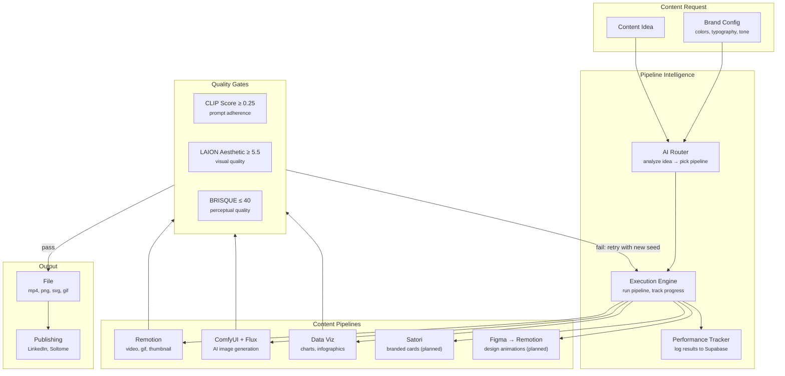
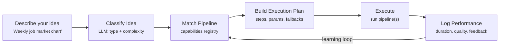
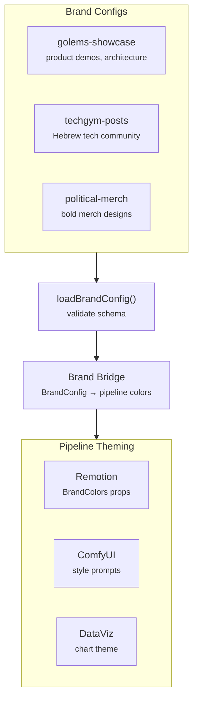
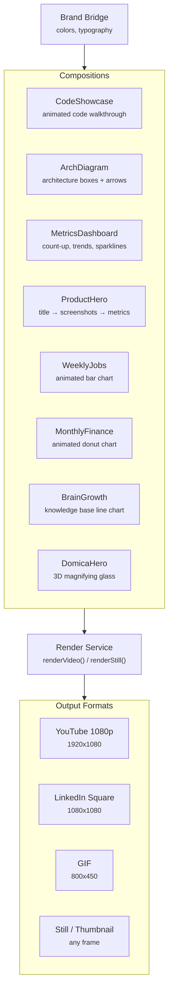
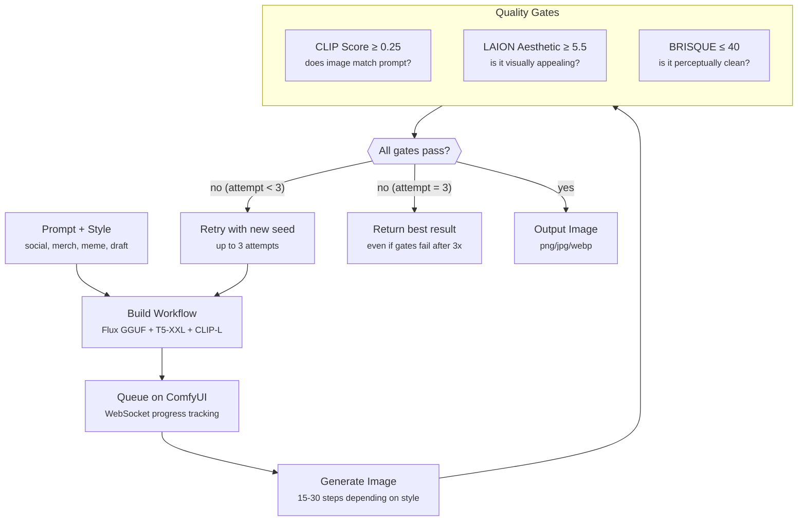
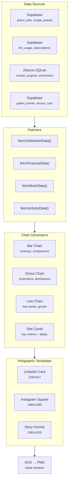
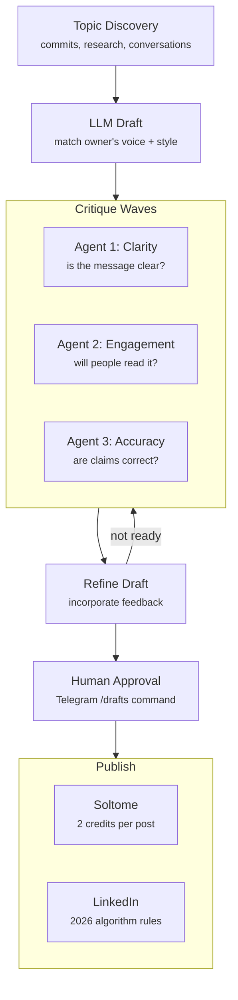

# ContentGolem

> Visual content factory + text publishing. Brand-aware, multi-pipeline, quality-gated.

ContentGolem handles **all content creation**: video animations (Remotion), AI image generation (ComfyUI + Flux), data visualizations, LinkedIn posts, Soltome publishing, and ghostwriting. An AI router automatically picks the best pipeline for any content idea.

## System Overview

## Pipeline Intelligence Router

The router analyzes a content idea and selects the best pipeline based on the idea type, available data, and past performance.

| Pipeline | Best For | Outputs |
|----------|----------|---------|
| **Remotion** | Animations, code demos, data stories | mp4, gif, png |
| **ComfyUI** | Social visuals, merch, memes | png, jpg, webp |
| **DataViz** | Charts, infographics, reports | png, svg |
| **Satori** | Branded cards, quotes | png, svg (planned) |
| **Figma → Remotion** | Design animations | mp4, gif (planned) |

Multi-pipeline combinations are supported: ComfyUI background + Remotion text overlay, or DataViz chart + Remotion animated version.

## Brand System

Every visual output is brand-aware. Per-project `brand.json` configs define colors, typography, tone, and layout rules.

## Remotion Video Pipeline

8 compositions with LinkedIn (1080x1080) variants. Compositions are brand-aware via the Brand Bridge.

### Shared Components

Remotion compositions share a library of animated building blocks:

- **AnimatedText** — typewriter, fade-in, highlight effects
- **FadeIn / SlideIn** — entrance animations with configurable timing
- **Scenes** — sequencer for multi-scene compositions
- **Audio** — background music and sound effect sync
- **Design Tokens** — spacing, breakpoints, timing curves from brand config

## ComfyUI Image Generation

Local Flux.1 Dev model via ComfyUI. Generates images with automatic quality scoring and retry.

### Image Styles

| Style | Size | Steps | Use Case |
|-------|------|-------|----------|
| `base` | 768x768 | 25 | General purpose |
| `social` | 1080x1080 | 25 | Instagram/LinkedIn square |
| `merch` | 1024x1024 | 30 | Print-quality (upscaled 4x) |
| `meme` | 1280x720 | 20 | Landscape memes |
| Quick draft | 512x512 | 15 | Fast iteration (2-4 min) |

Print-quality (`merch`) images are upscaled 4x via UltimateSDUpscale with LAION Aesthetic gate raised to 6.0.

## Data Visualization Pipeline

Fetches live data from Supabase and Zikaron, renders branded charts as SVG, converts to PNG via sharp.

Charts automatically inherit brand colors when a `BrandConfig` is provided via `themeFromBrand()`.

## Text Publishing Pipeline

Content drafting and publishing follows a critique-wave quality process:

### Writing Voice

The GolemsZikaron persona for published content:
- Casual but technically deep
- Collaborative researcher tone
- Open source evangelist
- Hebrew-English code-switching where natural

## Dependencies

- `@golems/shared` — Supabase factory, event log, LLM
- `remotion` + `@remotion/cli` — video rendering
- `sharp` — SVG to PNG conversion
- Python 3.10+ — quality scoring (CLIP, LAION Aesthetic, BRISQUE)
- ComfyUI — local Flux image generation server

## Source

[`packages/content/`](https://github.com/EtanHey/golems/tree/master/packages/content)
