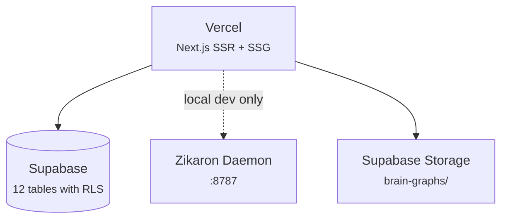

# Dashboard

The Golems Dashboard is a Next.js web application deployed on Vercel at `etanheyman.com`. It provides real-time visibility into the entire Golems ecosystem through a single interface.

## Pages

| Page | Path | Data Source |
|------|------|-------------|
| Brain View | `/` | 3D knowledge graph from Supabase Storage |
| Ops | `/ops` | `golem_events`, `service_runs`, `golem_state` |
| Notifications | `/notifications` | `golem_events` (notification types) |
| Backlog | `/backlog` | `backlog_items` (Kanban CRUD) |
| Jobs | `/jobs` | `golem_jobs`, `scrape_activity` |
| Emails | `/emails` | `emails`, `email_senders` |
| Recruiter | `/recruiter` | `outreach_contacts`, `outreach_messages`, `linkedin_connections` |
| Teller | `/teller` | `subscriptions`, `payments` |
| Coach | `/coach` | `whoop_snapshots` (recovery, sleep, strain) |
| Content | `/content` | `pipeline_runs` |
| Docs | `/docs` | Static markdown with shiki syntax highlighting |
| Enrichment | `/enrichment` | Zikaron daemon `/api/stats/enrichment` |
| Tokens | `/tokens` | `llm_usage` |
| Session | `/session` | Zikaron daemon `/api/session/:id` |
| Settings | `/settings` | Supabase Auth + Storage |

## Architecture

The dashboard queries Supabase directly for most pages (no daemon required on Vercel). Two pages (Enrichment and Session) require the local Zikaron daemon for real-time data.



## Tech Stack

- **Next.js 16** with App Router, route groups (`(auth)` and `(dashboard)`)
- **Supabase SSR** for cookie-based auth with middleware session refresh
- **react-force-graph-3d** + Three.js for the 3D Brain View
- **gray-matter** + **marked** + **shiki** for docs rendering with syntax highlighting
- **Tailwind CSS 4** with prose classes for typography

## Brain View

The 3D knowledge graph visualization built with react-force-graph-3d:

- Nodes colored by project, sized by chunk count
- Search with match counter and keyboard navigation
- 2D minimap overlay with viewport indicator
- Node panel for session details and connections
- Presentation mode (fullscreen) and PNG export
- URL params for deep-linking: `?node=<id>`

## Auth Flow

1. Middleware refreshes session on every request
2. Unauthenticated users redirect to `/login`
3. Authenticated users on auth pages redirect to `/`
4. OAuth callback at `/auth/callback` exchanges code for session
5. GitHub OAuth and email/password supported

## Docs Rendering

Documentation pages are rendered from markdown files in `content/docs/`:

- **Frontmatter** parsed with gray-matter (title, sidebar_position)
- **HTML** generated by marked with custom link renderer (.md links rewritten to dashboard routes)
- **Syntax highlighting** via shiki (github-dark theme, 17 languages)
- **Typography** via Tailwind prose classes matching the portfolio site styling
- **Table of Contents** — auto-generated from headings with scroll spy highlighting
- **Prev/Next navigation** — links between docs pages in sidebar order
- **Mermaid diagrams** — rendered as inline SVGs

## Development

```bash
cd packages/dashboard
bun dev    # http://localhost:3000
```

Requires `.env.local` with Supabase credentials. Set `ZIKARON_DAEMON_URL=http://localhost:8787` for enrichment and session pages.
