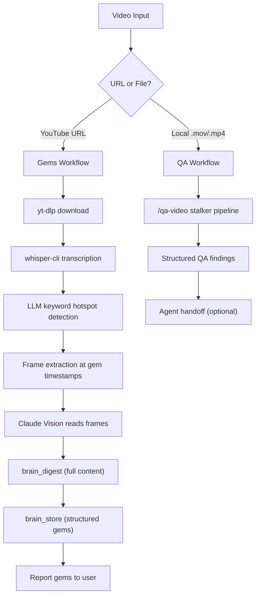

# Video Extract

> Two pipelines, one command. YouTube URLs get **gem extraction** (insights, opinions, advice). Screen recordings get **QA processing** (bugs, issues, findings).

## How It Works



## Gems Workflow (YouTube)

The gems pipeline extracts reusable knowledge from YouTube videos — the kind of insights you'd bookmark, screenshot, or reference later.

### Pipeline

1. **Download** — `yt-dlp` extracts audio + metadata from the YouTube URL
2. **Transcribe** — `whisper-cli` produces timestamped SRT + plain text
3. **Detect hotspots** — LLM reads the transcript and identifies gem moments
4. **Extract frames** — `ffmpeg` captures video frames at each gem timestamp
5. **Vision analysis** — Claude reads frames for slides, code, diagrams
6. **Store** — `brain_digest` + `brain_store` persist everything to BrainLayer
7. **Report** — Structured gems with categories, quotes, and relevance

### Gem Categories

| Category | What It Captures |
|----------|-----------------|
| 💡 Insight | Non-obvious technical or conceptual shift |
| 🔥 Opinion | Strong take, contrarian view |
| ✅ Advice | Concrete, actionable recommendation |
| 🔧 Tool | Specific technology mention with evaluation |
| 🏗️ Architecture | System design pattern or structural decision |
| ⚔️ War Story | Real production experience or post-mortem |
| 💬 Quotable | Memorable phrasing, tweetable insight |

### Example Output

```
## 🎬 T3 Code + Claude Subscriptions — Theo
Duration: 10:12 | Gems: 7 | Stored: ✅

1. 🔥 Opinion @ 3:24 — "Anthropic is massively subsidizing
   the amount of inference... $5,000 in compute for $200"
   → Reveals competitive moat strategy

2. 🏗️ Architecture @ 6:15 — "We're using the CLIs...
   we had to unbake a cake to reassemble it"
   → Event system abstraction for multi-harness support

3. ✅ Advice @ 8:42 — "5.4 is the best model for coding...
   switch to Claude for UI pass, quick tidy ups"
   → Multi-model workflow strategy
```

## QA Workflow (Screen Recordings)

Delegates to the `/qa-video` stalker pipeline for screen recordings with narration:

1. **Audio extraction** — `ffmpeg` extracts audio from the recording
2. **Transcription** — `whisper-cli` converts narration to timestamped text
3. **Hotspot detection** — LLM identifies bug reports, UX issues, feature requests
4. **Frame extraction** — Frames at hotspot timestamps + 30-second intervals
5. **Vision correlation** — Matches what was said with what's on screen
6. **Findings document** — Structured by severity (Critical → Minor → Enhancement)
7. **Agent handoff** — Sends findings to implementing agent via cmux

## Routing Logic

| Input | Routes To | Override |
|-------|-----------|---------|
| YouTube URL | Gems | Say "QA" to override |
| Local `.mov`/`.mp4` | QA | Say "gems" to override |
| "extract gems from..." | Gems | Regardless of source |
| "process QA recording" | QA | Regardless of source |

## Prerequisites

| Tool | Purpose | Install |
|------|---------|---------|
| yt-dlp | YouTube download | `pip3 install yt-dlp` |
| ffmpeg | Audio/frame extraction | `brew install ffmpeg` |
| whisper-cli | Speech-to-text | `brew install whisper-cpp` |
| whisper model | Transcription model | `whisper-cli --download-model small` |

## BrainLayer Integration

Both workflows store results in BrainLayer. Gems get `brain_digest` (full content indexing) + `brain_store` (curated gems with tags). QA findings get `brain_store` with severity counts and project tags.

If BrainLayer is unavailable, the skill **loudly flags** the failure and saves a local fallback file — it never silently skips storage.

## Eval Coverage

7 eval cases covering:
- URL routing (YouTube → gems, local → QA)
- Gem quality from real transcript (Theo fixture, 8 assertions)
- BrainLayer unavailability flagging
- Gem-mode override for local files
- With-skill vs without-skill comparison (10 assertions)
- Ambiguous input clarification

## Source

[`skills/golem-powers/video-extract/`](https://github.com/EtanHey/golems/tree/master/skills/golem-powers/video-extract)
